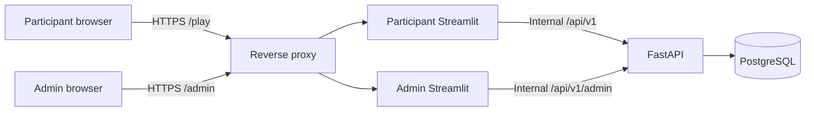

# AML Workshop Simulator

Интерактивный учебный симулятор AML/антифрода для мастер-класса. Участники собирают
цепочку финансовых действий, стараются достичь цели с ограниченными ресурсами и снизить
риск учебного классификатора. Организатор управляет раундом, анализирует цепочки,
запускает скоринг и проводит разбор факторов модели.

## Текущий MVP

Сейчас два Streamlit-интерфейса служат референсом будущего UX:

- participant хранит accounts/scenarios/results в `LocalStore` своего процесса;
- admin имеет отдельные demo players/rounds в своей Streamlit-session;
- процессы намеренно не синхронизируют in-memory data;
- restart процесса сбрасывает соответствующее автономное состояние;
- это допустимо для UI-прототипа, но не является production architecture.

### Игровая модель MVP

Reference round начинает с:

- 250 000 ₽;
- 14 energy;
- 18 time;
- 100 trust;
- 8 action slots;
- objective 150 000 ₽ расходного оборота.

Сценарий ограничивают balance, commissions, energy/time/trust, frequency, night and
anonymous operations, cash/crypto/geography quotas и dependencies. Эти числа в целевой
версии являются настройкой раунда, а не system constants.

Поля шага зависят от action type. Например, transfer запрашивает назначение и связь с
получателем, crypto — тип площадки/кошелька/актива, refund — причину и маршрут возврата.
Action details влияют на resources и explanation.

Leaderboard использует составной game score: reference formula дает 60% незаметности
для classifier и 40% resource efficiency. Admin demo позволяет выбрать игрока,
просмотреть всю chain/factors, блокировать доступ и применить ручной leaderboard
override с основанием.

## Запуск MVP

Создать окружение и установить проект:

```powershell
python -m venv .venv
.\.venv\Scripts\python.exe -m pip install -e ".[dev]"
```

Participant UI:

```powershell
.\.venv\Scripts\python.exe -m streamlit run streamlit_apps/participant_app.py --server.port 8502
```

Admin UI:

```powershell
.\.venv\Scripts\python.exe -m streamlit run streamlit_apps/admin_app.py --server.port 8503
```

В admin login screen для автономного прототипа используется действие «Открыть
демо-панель». Оба UI поддерживают light/dark/system themes через настройки Streamlit.

Если `No module named streamlit`, установка выполнялась не в том interpreter. Проверьте:

```powershell
.\.venv\Scripts\python.exe -m pip show streamlit
.\.venv\Scripts\python.exe -m streamlit --version
```

## Целевая архитектура v1



- Streamlit отвечает за pages, widgets, navigation, JWT session и local draft copy.
- FastAPI единолично владеет validation, resources, round lifecycle, scoring, ranking,
  block/adjustment semantics.
- PostgreSQL — единственный persistent source of truth.
- Browser не обращается к FastAPI/PostgreSQL напрямую.
- Participant/admin используют общий state только через API.
- Scoring v1 синхронный и атомарный для аудитории до 500 участников.
- Redis, Celery, Kubernetes и automatic LocalStore fallback не входят в v1.

### Streamlit–FastAPI boundary

- Cached resource содержит только HTTP connection pool, без JWT.
- Active round кэшируется не более 5 секунд; immutable cards — до 5 минут.
- Scenario/result/player/stats/leaderboard не кэшируются между users.
- HTTP write запускается только callback/form/явной командой, а не каждым rerun.
- Draft PUT использует expected revision и mutation ID.
- FastAPI всегда повторяет resource validation и возвращает canonical state.
- Timeout score разрешается чтением round/status, без слепого повторного POST.

## Архитектурная документация

Начальная точка: [`docs/README.md`](docs/README.md).

| Документ | Содержание |
| --- | --- |
| [`architecture.md`](docs/architecture.md) | System/container/components, responsibility, NFR |
| [`streamlit-fastapi.md`](docs/streamlit-fastapi.md) | Session state, rerun, draft sync, cache, retries, errors |
| [`data-model.md`](docs/data-model.md) | ER, snapshots, versions, constraints, retention |
| [`api.md`](docs/api.md) | `/api/v1`, DTO, examples, RBAC, admin operations |
| [`scoring-and-leaderboard.md`](docs/scoring-and-leaderboard.md) | Risk/resources/game score, factors, adjustments |
| [`workshop-flow.md`](docs/workshop-flow.md) | Use cases, state diagrams, 45-minute flow |
| [`security.md`](docs/security.md) | Threat model, JWT, PII, network/admin controls |
| [`deployment.md`](docs/deployment.md) | One VM, Compose, TLS, health, capacity, backup |
| [`operations.md`](docs/operations.md) | Metrics, preflight, incidents and fallback |
| [`migration-plan.md`](docs/migration-plan.md) | Contract-first cutover from MVP |
| [`testing-strategy.md`](docs/testing-strategy.md) | Unit/integration/UI/load/security gates |
| [`decisions.md`](docs/decisions.md) | Architectural decisions and review triggers |
| [`readiness-checklist.md`](docs/readiness-checklist.md) | Docs/implementation/tests readiness matrix |

## Текущий backend quick start

Backend существует как частичная основа и еще не соответствует всем target contracts:

```powershell
copy .env.example .env
docker compose up -d db
.\.venv\Scripts\python.exe -m backend.app.db.init_db
.\.venv\Scripts\python.exe -m uvicorn backend.app.main:app --reload
```

Не используйте этот запуск как подтверждение production readiness: отсутствующие
миграции, target `/api/v1`, proxy/TLS, full admin persistence и acceptance gates
перечислены в readiness matrix.

## Проверки текущего MVP

```powershell
.\.venv\Scripts\python.exe -m pytest
.\.venv\Scripts\python.exe -m compileall backend streamlit_apps tests
.\.venv\Scripts\python.exe tests/smoke_scoring.py
```

## Структура

```text
backend/app/
  api/          current FastAPI routers
  core/         settings and security
  db/           database session and initialization
  domain/       action parameters and enums
  models/       current SQLAlchemy models
  schemas/      current Pydantic contracts
  services/     round and scoring services
streamlit_apps/
  participant_app.py
  admin_app.py
  api_client.py
  local_store.py
  demo_admin_data.py
tests/
docs/
```

Target migration удалит production dependence on `local_store.py` and demo state, но
сохранит проверенные UI patterns и domain examples.
