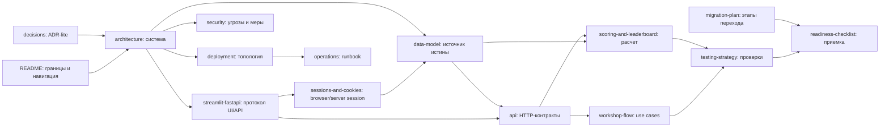

# Документация AML Workshop Simulator

Этот каталог является архитектурной спецификацией учебного AML-симулятора. Он
описывает переход от автономного Streamlit-MVP к целевой системе для одного
45-минутного мероприятия и аудитории до 500 участников.

```text
Browser -> HTTPS reverse proxy -> Streamlit -> FastAPI -> PostgreSQL
```

Документы предназначены для разработчиков, тестировщиков, оператора площадки,
администратора мастер-класса и владельца продукта. При расхождении реализации и
документации целевые контракты из этого каталога являются основанием для отдельного
решения: исправить код либо оформить изменение архитектуры в `decisions.md`.

## Текущее и целевое состояние

| Область | Текущий MVP | Целевая версия v1 |
| --- | --- | --- |
| Participant UI | Streamlit, `LocalStore` в памяти процесса | Streamlit вызывает только `/api/v1` |
| Admin UI | Отдельный Streamlit-процесс с demo state и частью старого API | Streamlit вызывает только admin-контракты `/api/v1` |
| Общие данные UI | Participant и admin намеренно не синхронизированы | Оба UI читают один PostgreSQL через FastAPI |
| Параметры действий | Динамические формы и правила MVP | Версионированные спецификации карточек из API |
| Бизнес-правила | Часть правил живет в Streamlit/`LocalStore` | Только FastAPI принимает окончательные решения |
| Состояние | Сбрасывается при перезапуске процесса | PostgreSQL является источником истины |
| Аутентификация | Только demo/local UI | route-scoped cookie через cookie controller + `sessions` в PostgreSQL |
| Скоринг | Локальный демонстрационный расчет | Синхронный пакетный скоринг раунда в FastAPI |
| Лидерборд | Локальный составной игровой балл | Канонический расчет, audit trail и admin overlay в PostgreSQL |
| Развертывание | Ручной запуск процессов | Одна VM, Docker Compose, HTTPS и внутренние сети |

Текущий MVP остается референсом интерфейса. Его независимые in-memory процессы не
считаются дефектом прототипа. В production автоматического fallback на `LocalStore`
не будет: это создало бы два несовместимых источника истины.

## Порядок чтения

### Для разработчика

1. [Архитектура](architecture.md) — цели, контейнеры, компоненты и границы доверия.
2. [Структура production-проекта](project-structure.md) — физические границы каталогов и правила зависимостей.
3. [Streamlit и FastAPI](streamlit-fastapi.md) — протокол UI/API, `session_state`,
   rerun, синхронизация черновика, кэш и ошибки.
4. [Browser cookie и серверные сессии](sessions-and-cookies.md) — cookie controller, lifecycle и ограничения безопасности.
5. [Модель данных](data-model.md) — PostgreSQL, snapshots, версии и инварианты.
6. [API](api.md) — HTTP-контракты, DTO, ошибки и идемпотентность.
7. [Скоринг и лидерборд](scoring-and-leaderboard.md) — риск, ресурсы, объяснения и
   ручные корректировки.
8. [Потоки мастер-класса](workshop-flow.md) — роли, состояния и use cases.
9. [Стратегия тестирования](testing-strategy.md) — уровни тестов и приемочные ворота.
10. [План миграции](migration-plan.md) — порядок перехода от MVP.

### Для эксплуатации и безопасности

1. [Развертывание](deployment.md) — VM, Docker-сети, маршруты, TLS и capacity.
2. [Безопасность](security.md) — аутентификация, RBAC, PII и trust boundaries.
3. [Эксплуатация](operations.md) — метрики, проверки и runbook.
4. [Матрица готовности](readiness-checklist.md) — проверяемый статус реализации.
5. [Архитектурные решения](decisions.md) — решения и условия их пересмотра.

## Карта зависимостей документов



## Глоссарий

| Термин | Определение |
| --- | --- |
| Мероприятие | Организационная сессия мастер-класса; в v1 развертывание обслуживает одно мероприятие. |
| Раунд | Игровой период с зафиксированными карточками, ресурсами и версиями правил. |
| Карточка | Версионированный тип финансового действия с общими лимитами и набором специфичных параметров. |
| Параметр действия | Поле, существующее только для определенного типа карточки, например тип площадки для криптовалюты. |
| Сценарий | Каноническая упорядоченная цепочка действий одного участника в одном раунде. |
| Шаг | Экземпляр карточки с суммой, частотой, контекстом и параметрами конкретного действия. |
| Черновик | Редактируемая серверная версия сценария со счетчиком `revision`. |
| Версия черновика | Отдельная строка истории: каждое явное сохранение добавляет новую и ничего не перезаписывает. |
| Политика раунда | Часть конфигурации, решающая, какие операции доступны и какие их параметры видит участник. |
| Пресет | Именованный набор настроек раунда, подготовленный заранее; создание раунда из него не начинает игру. |
| Структурное изменение | Добавление, удаление, перестановка или подтвержденное изменение шага, требующее `PUT` в API. |
| Отправка | Переход конкретной ревизии сценария из `draft` в `submitted`. |
| Скоринг | Детерминированный расчет риска, объяснения и ресурсной эффективности всех `submitted` сценариев. |
| Фактор модели | Объяснимый положительный или защитный вклад признака в риск. |
| Снимок ресурсов | Серверный расчет баланса, энергии, времени, доверия, комиссий, квот и достижения цели. |
| Игровой балл | Настраиваемая композиция незаметности для модели и эффективности ресурсов. |
| Лидерборд | Обезличенная ранжированная проекция опубликованных результатов. |
| Ручная корректировка | Отдельный аудируемый слой отображаемых значений; исходный результат скоринга не изменяется. |
| Rerun | Повторное исполнение Python-скрипта Streamlit после события UI. |
| Session ID | Непрозрачный browser credential; все identity/role/expiry/revoke данные находятся в PostgreSQL. |
| Источник истины | Компонент, чье состояние считается каноническим при расхождении копий. |

## Архитектурные инварианты

1. Браузер никогда не вызывает FastAPI или PostgreSQL напрямую.
2. Browser cookie хранит только непрозрачный session ID; Streamlit хранит UI-state и локальную рабочую копию
   черновика; серверный сценарий всегда канонический.
3. Команды записи выполняются только из обработчика пользовательского события или
   явного перехода состояния, но не как побочный эффект рендера страницы.
4. FastAPI повторно валидирует весь сценарий; preview — это тот же серверный расчет
   через отдельный read-only endpoint, а не вторая реализация правил в UI.
5. Активированный раунд и версии его правил неизменяемы; раунд начинается, останавливается
   и перезапускается только явной командой организатора, а перезапуск создает новый раунд
   и ничего не удаляет.
6. Исходные scoring results неизменяемы после публикации; admin correction хранится
   отдельно и всегда заметна в интерфейсе.
7. PostgreSQL является единственным постоянным хранилищем.
8. Email, raw session ID/session hash и полное содержимое сценария не попадают в технические логи.
   Ники в публичном лидерборде обезличены, пока их не раскроют явной командой.
9. Значения 250 000 ₽, 14 энергии, 18 времени, 100 доверия, 8 действий, набор из шести
   доступных операций и цель 150 000 ₽ являются конфигурацией демонстрационного раунда,
   а не константами системы: UI берет их из снимка активного раунда.
10. Учебный скоринг не позиционируется как решение реального AML-расследования.

## Соглашения документации

- Все целевые прикладные endpoints находятся под `/api/v1`.
- Идентификаторы Mermaid состоят из ASCII; пользовательские подписи заключены в кавычки.
- Время хранится и передается в UTC, UI локализует его для пользователя.
- Денежные значения в JSON передаются строками и рассчитываются через `Decimal`.
- Слова `MUST`, `SHOULD` и `MAY`, если встречаются в контрактах, означают
  обязательное требование, рекомендацию и допустимый вариант соответственно.
- Разделы «Текущий MVP» описывают существующий референс, разделы «Цель v1» — контракт
  будущей реализации.
