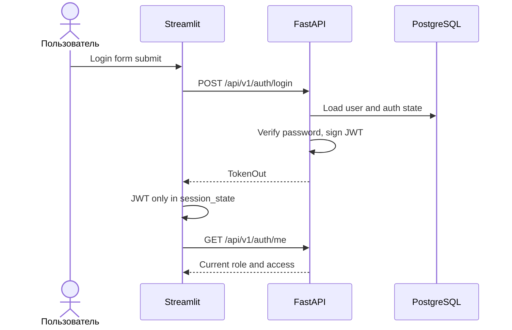
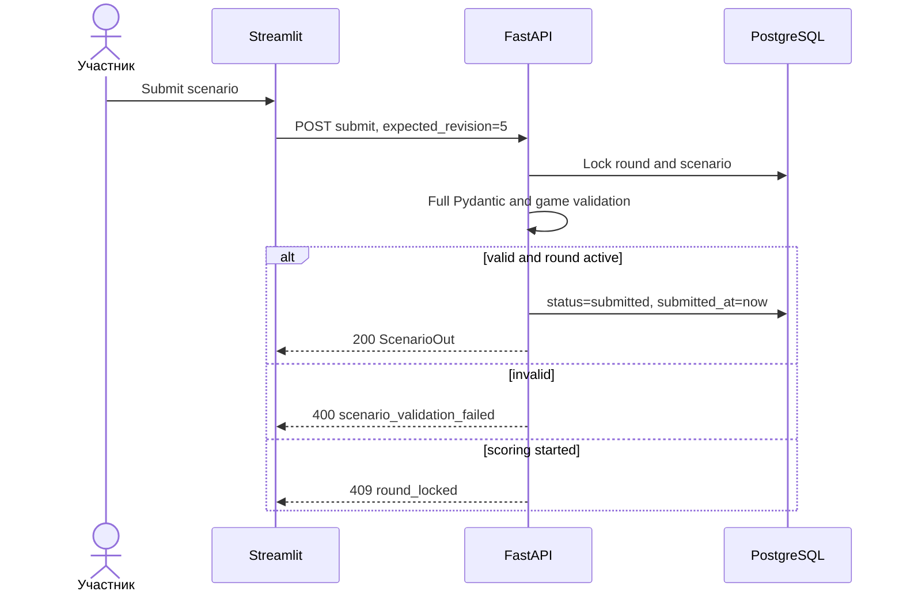
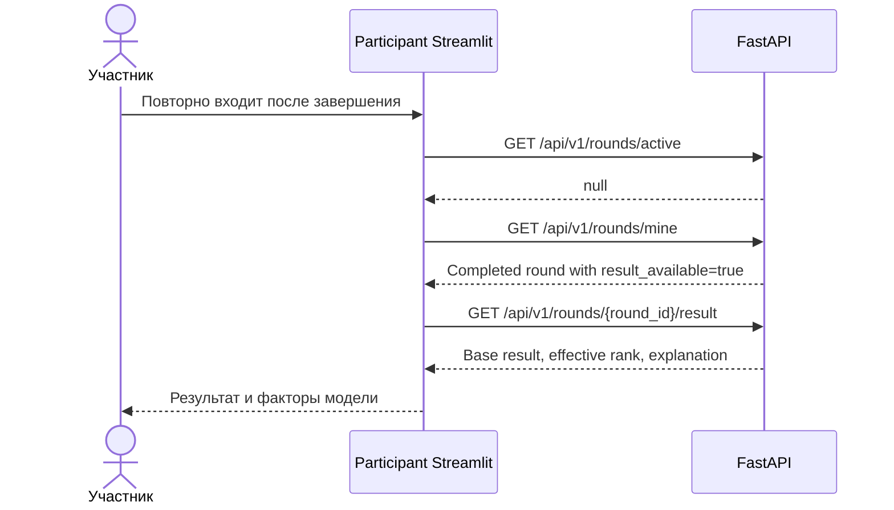
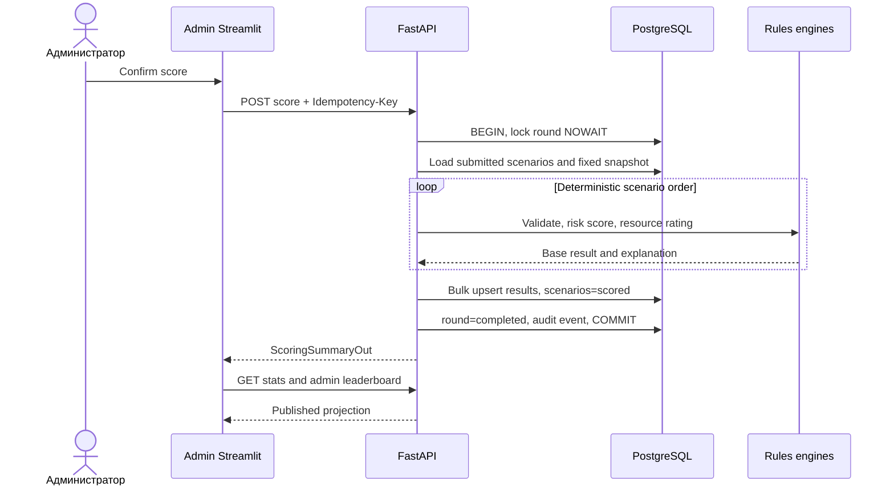
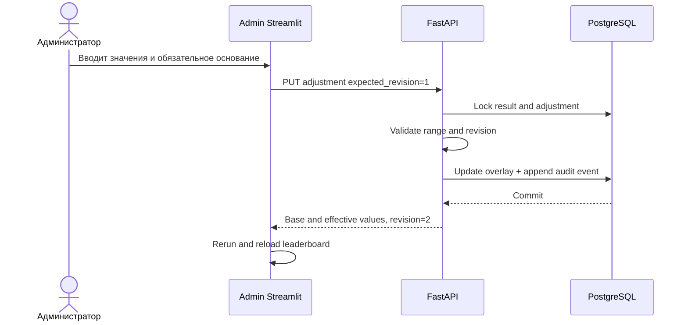

# Внутренние API-контракты v1

## 1. Назначение и граница

FastAPI доступен только Streamlit-контейнерам и оператору внутри Docker-сети. Браузер
не вызывает API напрямую. Все прикладные endpoints имеют prefix `/api/v1`; health
endpoints остаются вне версии.

```text
Participant Streamlit -> /api/v1/auth/*, /api/v1/rounds/*
Admin Streamlit       -> /api/v1/auth/*, /api/v1/admin/*
Operator/healthcheck  -> /health/live, /health/ready
```

OpenAPI является исполняемой спецификацией DTO, но этот документ дополнительно
фиксирует семантику state transitions, retry и конкурентного доступа.

## 2. Общие соглашения

| Область | Контракт |
| --- | --- |
| Encoding | JSON UTF-8 |
| Money/Decimal | Строка с фиксированной точностью, например `"250000.00"` |
| Time | ISO 8601 UTC, например `2026-10-05T08:17:02Z` |
| Authentication | `Authorization: Bearer <JWT>` |
| Request correlation | `X-Request-ID`; API генерирует ULID/UUID, если заголовка нет |
| Command identity | `Idempotency-Key` для activate/score и других указанных POST |
| Pagination | `limit` + opaque `cursor`; offset не используется на растущих списках |
| Input strictness | Pydantic `extra="forbid"` |
| Unknown enum | `422 validation_error` |
| Server headers | `X-Request-ID`, `Cache-Control`; `Retry-After` для `429/503` при наличии |

Endpoint возвращает только поля своего response DTO. ORM entities, password hashes,
internal config secrets и stack traces в JSON не сериализуются.

## 3. Единая ошибка

```json
{
  "code": "scenario_validation_failed",
  "message": "Сценарий нарушает правила раунда",
  "details": {
    "violations": [
      {
        "step_id": "4fe2d542-a810-4fd0-b63f-a43ad7ea7853",
        "field": "amount",
        "reason": "insufficient_balance",
        "message": "Недостаточно средств с учетом комиссии"
      }
    ]
  },
  "request_id": "01JAML7Q5SH2RZ8JYK6M4V3Q9T"
}
```

| HTTP | Категория | Примеры code |
| ---: | --- | --- |
| `400` | Валидный JSON, но команда бессмысленна | `scenario_validation_failed`, `no_submissions` |
| `401` | Нет/просрочен/revoked JWT | `not_authenticated`, `token_expired`, `token_revoked` |
| `403` | Роль, ownership или block | `forbidden`, `account_blocked` |
| `404` | Объект не найден в доступной области | `round_not_found`, `scenario_not_found` |
| `409` | State/revision/unique/lock conflict | `round_locked`, `scenario_revision_conflict` |
| `413` | Body выше proxy/API limit | `payload_too_large` |
| `422` | Pydantic/schema failure | `validation_error`, `unknown_action_parameter` |
| `429` | Auth/rate limit | `rate_limited`, `login_temporarily_locked` |
| `500` | Необработанная ошибка | `internal_error` |
| `503` | Обязательная зависимость не ready | `database_unavailable`, `service_unavailable` |

Для `422` middleware преобразует стандартный FastAPI payload в тот же envelope.
`message` предназначен пользователю, `code/details` — стабильной логике Streamlit.

## 4. JWT и RBAC

JWT содержит:

```json
{
  "sub": "57",
  "role": "participant",
  "token_version": 3,
  "iat": 1780646400,
  "exp": 1780660800,
  "jti": "b2b8c2c4-3f2b-4a34-b0d7-5bbef72c278f"
}
```

FastAPI на каждом защищенном запросе загружает пользователя и проверяет текущие
`role`, `is_blocked` и `token_version`. Claim ускоряет первичную проверку, но не
заменяет состояние БД.

| Scope | Разрешение |
| --- | --- |
| Public | register/login, live health |
| Internal catalog read | Active round и immutable cards без JWT, только из Docker app network |
| Participant | Только собственный scenario/result и обезличенный leaderboard |
| Admin | `/api/v1/admin/*`, включая PII detail и команды управления |
| Operator | Нет отдельной API-роли v1; health/VM доступ вне прикладного API |

Participant endpoints не принимают `participant_id`; он всегда берется из JWT user.

## 5. DTO-каталог

| DTO | Назначение | Ключевые поля |
| --- | --- | --- |
| `RegisterIn` | Регистрация | `email`, `display_name`, `password` |
| `UserRegisteredOut` | Подтверждение регистрации | `id`, `email`, `display_name`, `role`, `created_at` |
| `LoginIn` | Вход | `email`, `password` |
| `TokenOut` | JWT | `access_token`, `expires_in`, `user` |
| `UserSessionOut` | Текущий user | `id`, `display_name`, `role` |
| `RoundPublicOut` | Активный round для participant | `id`, `title`, `status`, public game config |
| `RoundSummaryOut` | История раундов participant | ID, status, scenario/result availability |
| `RoundSummaryPageOut` | Страница истории | `rows`, `next_cursor` |
| `RoundAdminOut` | Полный round для admin | Public fields + full snapshot/revisions/timestamps |
| `ActionCardOut` | Card version + dynamic field specification | Common costs/limits, `fields` |
| `ScenarioPutIn` | Полная замена draft | `expected_revision`, `client_mutation_id`, `steps` |
| `ScenarioSubmitIn` | Submit сохраненной revision | `expected_revision` |
| `ScenarioOut` | Canonical draft/status/resources | `id`, `revision`, `steps`, `resources` |
| `ResultOut` | Собственный model result | Base result, effective leaderboard, explanation |
| `LeaderboardPageOut` | Public ranking | `rows`, `next_cursor`, `generated_at` |
| `RoundStatsOut` | Admin counters | registered/blocked/draft/submitted/scored |
| `PlayerSummaryOut` | Admin player list | ID, display name, access/status/score summary |
| `PlayerDetailOut` | Полный admin view | Account, scenario chain, base/effective result, activity |
| `AccessUpdateIn` | Block/unblock | `blocked`, `reason`, `expected_token_version` |
| `LeaderboardAdjustmentIn` | Manual overlay | overrides, `reason`, `expected_revision` |
| `AuditPageOut` | Admin audit | Sanitized events + cursor |

Все request/response examples ниже являются частью contract tests.

## 6. Auth API

### `POST /api/v1/auth/register`

Request:

```json
{
  "email": "student@example.com",
  "display_name": "Финансовый детектив",
  "password": "correct-horse-42"
}
```

`201 Created`:

```json
{
  "id": 57,
  "email": "student@example.com",
  "display_name": "Финансовый детектив",
  "role": "participant",
  "created_at": "2026-10-05T08:00:00Z"
}
```

- Роль из request не принимается.
- Email нормализуется до unique check.
- Password 10–128 символов; response никогда его не повторяет.
- Повторный email: `409 email_already_registered`.
- Автоматический login после регистрации не выполняется: UI вызывает login отдельно.

### `POST /api/v1/auth/login`

```json
{"email": "student@example.com", "password": "correct-horse-42"}
```

`200 OK`:

```json
{
  "access_token": "<jwt>",
  "token_type": "bearer",
  "expires_in": 14400,
  "user": {
    "id": 57,
    "display_name": "Финансовый детектив",
    "role": "participant"
  }
}
```

Ответ на неверный email и пароль одинаков. После policy threshold endpoint возвращает
`429 login_temporarily_locked` без раскрытия наличия email.

### `GET /api/v1/auth/me`

Возвращает `UserSessionOut`. Используется после восстановления Streamlit session и для
проверки role/access state. Email возвращается только владельцу или admin detail, но не
нужен participant navigation и может быть исключен из этого DTO.



## 7. Participant round API

### `GET /api/v1/rounds/active`

`200 OK` с `RoundPublicOut` или JSON `null`, если раунд не открыт.

Endpoint не требует JWT, потому что содержит только несекретную конфигурацию учебной
игры и доступен исключительно внутри Docker app network. Это позволяет безопасный общий
Streamlit cache без token в аргументах. Participant UI все равно не открывает gameplay
до login. Все user-specific endpoints остаются авторизованными.

```json
{
  "id": 12,
  "title": "Мастер-класс AML",
  "status": "active",
  "config_version": "round-config-v2:sha256:8f4c...",
  "activated_at": "2026-10-05T08:00:00Z",
  "game_config": {
    "resources": {
      "initial_balance": "250000.00",
      "initial_energy": 14,
      "initial_time": 18,
      "initial_trust": 100
    },
    "objectives": {"target_outflow": "150000.00", "max_actions": 8},
    "constraints": {
      "max_night_operations": 2,
      "max_identical_steps": 2
    },
    "ruleset_version": "game-rules-v2"
  }
}
```

Internal card IDs и scoring thresholds можно не раскрывать здесь. `Cache-Control:
private, max-age=0`; Streamlit применяет собственный TTL до 5 секунд.

### `GET /api/v1/rounds/mine?limit=10&cursor=...`

Возвращает active round и раунды, в которых current participant имеет scenario. Endpoint
нужен после потери Streamlit session: completed round больше не является active, но
участник должен снова найти свой result.

```json
{
  "rows": [
    {
      "id": 12,
      "title": "Мастер-класс AML",
      "status": "completed",
      "scenario_status": "scored",
      "result_available": true,
      "completed_at": "2026-10-05T08:32:41Z"
    }
  ],
  "next_cursor": null
}
```

Раунды без scenario не раскрываются, кроме текущего active round. Email/чужие IDs в
response отсутствуют. `Cache-Control: no-store`.

### `GET /api/v1/rounds/{round_id}/cards`

Возвращает только card versions из round snapshot. Ответ immutable после activate.
Как и active-round read, endpoint token-free внутри app network и не проксируется
browser. Он не возвращает users, scenarios, results или admin metadata.

```json
[
  {
    "id": 18,
    "code": "crypto_exchange",
    "version": 2,
    "title": "Обменять на криптовалюту",
    "description": "Покупка цифрового актива",
    "category": "Криптовалюта",
    "flow": "debit",
    "risk_weight": "12.00",
    "costs": {"energy": 1, "time": 2, "trust": 4},
    "fee_rate": "0.010000",
    "min_amount": "1000.00",
    "max_amount": "100000.00",
    "max_frequency": 3,
    "requires_card_code": null,
    "fields": [
      {
        "key": "exchange_type",
        "label": "Тип площадки",
        "kind": "select",
        "required": true,
        "options": [
          {"value": "regulated", "label": "Регулируемая"},
          {"value": "p2p", "label": "P2P"}
        ]
      }
    ]
  }
]
```

HTTP `ETag` строится из round config version. Streamlit cache key обязан включать
`round_id` и `config_version`.

## 8. Participant scenario API

### `GET /api/v1/rounds/{round_id}/scenario`

Возвращает собственный `ScenarioOut` или `null`. Для active/completed round endpoint
доступен, чтобы восстановить draft либо показать финальную chain. `Cache-Control:
no-store`.

### `PUT /api/v1/rounds/{round_id}/scenario`

Полная идемпотентная замена steps:

```json
{
  "expected_revision": 4,
  "client_mutation_id": "55499e08-4e96-46ab-bd3a-05a3cc0e802f",
  "steps": [
    {
      "step_id": "4fe2d542-a810-4fd0-b63f-a43ad7ea7853",
      "card": {"id": 18, "code": "crypto_exchange", "version": 2},
      "amount": "50000.00",
      "frequency": 2,
      "context": {
        "country_risk": "medium",
        "time_of_day": "evening",
        "velocity": "rapid",
        "channel": "web",
        "has_documents": true
      },
      "action_details": {
        "exchange_type": "regulated",
        "wallet_owner": "self",
        "asset_profile": "stablecoin"
      }
    }
  ]
}
```

`200 OK`:

```json
{
  "id": 91,
  "round_id": 12,
  "status": "draft",
  "revision": 5,
  "steps": [],
  "resources": {
    "valid": true,
    "resources_after": {
      "balance": "149000.00",
      "energy": 12,
      "time": 14,
      "trust": 90,
      "slots": 7
    },
    "totals": {
      "gross_inflow": "0.00",
      "gross_outflow": "100000.00",
      "fees": "1000.00"
    },
    "objective": {"target_outflow": "150000.00", "reached": false},
    "limit_usage": {},
    "violations": []
  },
  "updated_at": "2026-10-05T08:17:02Z"
}
```

Для краткости example response опускает повтор steps; реальный `ScenarioOut.steps`
возвращает полный канонический массив.

Семантика:

- пустой steps разрешен;
- структурно валидный, но нарушающий игровые правила draft сохраняется с
  `resources.valid=false` и violations, чтобы работа не терялась;
- неизвестная card version, лишнее action field или неверный тип возвращают `422` и не
  изменяют server draft;
- в `active` PUT submitted scenario создает новую draft revision;
- в `scoring/completed` — `409 round_locked`;
- неверная expected revision — `409 scenario_revision_conflict` с
  `details.current_revision/current_updated_at`;
- тот же mutation ID + тот же payload возвращает прежний success;
- тот же mutation ID + другой payload — `409 mutation_id_reused`.

### `POST /api/v1/rounds/{round_id}/scenario/submit`

```json
{"expected_revision": 5}
```

FastAPI заново загружает snapshot, card versions и current steps, пересчитывает все
ресурсы и только затем меняет status на `submitted`.

`200 OK` возвращает полный `ScenarioOut` со `status="submitted"`. Повтор той же
revision возвращает тот же результат. `Idempotency-Key` рекомендуется, но
идемпотентность обеспечивается `(scenario_id, revision, status)`.



## 9. Participant result и leaderboard

### `GET /api/v1/rounds/{round_id}/result`

До completed: `200 null`. После scoring:

```json
{
  "scenario_id": 91,
  "base": {
    "risk_score": "42.50",
    "risk_label": "review",
    "stealth_score": "57.50",
    "resource_score": "78.20",
    "game_score": "65.78"
  },
  "leaderboard": {
    "effective_game_score": "68.00",
    "rank": 14,
    "is_adjusted": true
  },
  "versions": {
    "scoring": "risk-rules-v2",
    "leaderboard": "leaderboard-v1"
  },
  "explanation": {
    "top_risk_factors": [],
    "protective_factors": [],
    "sequence_factors": [],
    "resource_summary": {},
    "disclaimer": "Учебная модель; результат не является AML-решением"
  }
}
```

Participant видит, что leaderboard value скорректировано, но не admin reason/actor.
Base model result и explanation не меняются.



### `GET /api/v1/rounds/{round_id}/leaderboard?limit=50&cursor=...`

Доступен после completed. Blocked users исключаются из публичного ranking. Порядок:
`effective_game_score DESC`, затем `base.risk_score ASC`, `scenario_id ASC`.

```json
{
  "rows": [
    {
      "rank": 1,
      "display_name": "Финансовый детектив",
      "game_score": "91.20",
      "stealth_score": "94.00",
      "resource_score": "87.00",
      "risk_label": "normal",
      "is_adjusted": false,
      "is_current_user": true
    }
  ],
  "next_cursor": null,
  "generated_at": "2026-10-05T08:33:10Z"
}
```

Email, user ID, scenario ID, chain и factors в public leaderboard отсутствуют.

## 10. Admin round API

| Метод и путь | Request | Response | Семантика |
| --- | --- | --- | --- |
| `GET /api/v1/admin/action-cards` | filters | `ActionCardOut[]` | Catalog для draft config |
| `POST /api/v1/admin/rounds` | `RoundCreateIn` | `201 RoundAdminOut` | Создать draft |
| `GET /api/v1/admin/rounds` | status/cursor | Page | Список раундов |
| `GET /api/v1/admin/rounds/{round_id}` | — | `RoundAdminOut` | Full config |
| `PUT /api/v1/admin/rounds/{round_id}` | `RoundUpdateIn` | `RoundAdminOut` | Только draft + expected config revision |
| `POST /api/v1/admin/rounds/{round_id}/activate` | empty | `RoundAdminOut` | Snapshot и active |
| `POST /api/v1/admin/rounds/{round_id}/score` | empty | `ScoringSummaryOut` | Синхронный пакет |
| `GET /api/v1/admin/rounds/{round_id}/stats` | — | `RoundStatsOut` | Live counters |
| `GET /api/v1/admin/rounds/{round_id}/leaderboard` | sort/filter/cursor | Admin page | Base/effective board |

### Создание/обновление draft

```json
{
  "title": "Мастер-класс AML",
  "game_config": {
    "resources": {
      "initial_balance": "250000.00",
      "initial_energy": 14,
      "initial_time": 18,
      "initial_trust": 100
    },
    "objectives": {"target_outflow": "150000.00", "max_actions": 8},
    "constraints": {},
    "card_versions": [{"id": 18, "code": "crypto_exchange", "version": 2}],
    "ruleset_version": "game-rules-v2",
    "scoring": {"version": "risk-rules-v2"},
    "leaderboard": {"version": "leaderboard-v1"}
  }
}
```

Update дополнительно принимает `expected_config_revision`. После activate:
`409 round_config_locked`.

### Активация

`POST /api/v1/admin/rounds/{round_id}/activate` требует `Idempotency-Key`.

- draft + валидный snapshot -> active;
- тот же round уже active -> вернуть current `200`;
- другой active/scoring -> `409 active_round_exists`;
- unknown ruleset/card version -> `409 round_configuration_invalid`.

### Скоринг

`POST /api/v1/admin/rounds/{round_id}/score` требует `Idempotency-Key` и имеет read timeout
30 секунд на Streamlit стороне.

```json
{
  "round_id": 12,
  "status": "completed",
  "submitted_count": 487,
  "scored_count": 487,
  "excluded_draft_count": 8,
  "duration_ms": 842,
  "scoring_version": "risk-rules-v2",
  "leaderboard_version": "leaderboard-v1",
  "completed_at": "2026-10-05T08:32:41Z"
}
```

- `active` без submissions -> `400 no_submissions`;
- row lock занят -> `409 scoring_in_progress` без ожидания долгой блокировки;
- completed -> вернуть сохраненную summary, не пересчитывать;
- любое исключение -> rollback, round остается active, partial results не видны.



## 11. Admin participant API

### Список

`GET /api/v1/admin/rounds/{round_id}/participants`

Query:

- `query`: display name or exact normalized email search;
- `access`: `all|active|blocked`;
- `scenario_status`: `none|draft|submitted|scored`;
- `limit`: 1–100;
- `cursor`: opaque.

Response summary не включает steps/explanation, чтобы список оставался компактным.

### Полный профиль и цепочка

`GET /api/v1/admin/rounds/{round_id}/participants/{participant_id}` возвращает:

```json
{
  "user": {
    "id": 57,
    "email": "student@example.com",
    "display_name": "Финансовый детектив",
    "is_blocked": false,
    "token_version": 3,
    "created_at": "2026-10-05T08:00:00Z",
    "last_login_at": "2026-10-05T08:05:00Z"
  },
  "scenario": {
    "id": 91,
    "status": "scored",
    "revision": 5,
    "steps": [],
    "resources": {}
  },
  "result": {
    "base": {},
    "effective": {},
    "explanation": {},
    "adjustment": null
  },
  "recent_activity": []
}
```

Реальный response содержит полную chain для выбранного игрока. Endpoint
`Cache-Control: no-store`; доступ и чтение PII логируются как безопасный audit event,
если этого требует политика организатора.

### Блокировка/разблокировка

`PUT /api/v1/admin/rounds/{round_id}/participants/{participant_id}/access`

```json
{
  "blocked": true,
  "reason": "Проверка учетной записи по запросу организатора",
  "expected_token_version": 3
}
```

Успех возвращает обновленный user summary. API в одной транзакции:

1. проверяет admin role и запрещает self-block;
2. сравнивает token version;
3. меняет access state и увеличивает token version;
4. создает audit event;
5. commit.

Повтор идентичного desired state возвращает `200`. Другая concurrent change —
`409 participant_access_conflict`.

## 12. Admin leaderboard adjustment API

### Создать/заменить overlay

`PUT /api/v1/admin/rounds/{round_id}/participants/{participant_id}/leaderboard-adjustment`

```json
{
  "expected_revision": 0,
  "risk_score_override": null,
  "resource_score_override": "82.00",
  "game_score_override": "74.00",
  "reason": "Коррекция после подтвержденной технической ошибки"
}
```

`expected_revision=0` означает отсутствие текущего overlay. Response содержит base,
effective, adjustment revision, actor и timestamp. Если result отсутствует:
`409 result_not_available`.

### Очистить overlay

`DELETE /api/v1/admin/rounds/{round_id}/participants/{participant_id}/leaderboard-adjustment?expected_revision=2`

Возвращает `204 No Content`. Base result становится effective, а прежние значения и
reason фиксируются в audit event.



## 13. Admin audit API

`GET /api/v1/admin/rounds/{round_id}/audit-events?event_type=...&limit=50&cursor=...`

Возвращает sanitized append-only events. Полные scenario steps, password/JWT/email и
Authorization headers отсутствуют. Доступен только admin.

## 14. Stats

`GET /api/v1/admin/rounds/{round_id}/stats`:

```json
{
  "registered_users": 500,
  "active_users": 493,
  "blocked_users": 7,
  "without_scenario": 5,
  "draft_scenarios": 8,
  "submitted_scenarios": 487,
  "scored_scenarios": 0,
  "public_leaderboard_rows": 0,
  "last_scenario_update_at": "2026-10-05T08:29:50Z"
}
```

Stats — моментальный серверный snapshot. Admin Streamlit не кэширует его между users.

## 15. Идемпотентность и повторные запросы

| Endpoint | Механизм | Безопасный retry |
| --- | --- | --- |
| Все GET | HTTP read | Да, до 2 раз |
| PUT scenario | expected revision + mutation ID + payload hash | Да, тем же request body |
| POST submit | scenario revision + state | После GET scenario или тем же key |
| PUT round draft | config revision + desired full config | Да при идентичном desired state |
| POST activate | row lock + current state + `Idempotency-Key` | После GET round |
| POST score | row lock NOWAIT + completed summary + `Idempotency-Key` | Только после GET round/stats |
| PUT access | token version + desired state | Да при идентичном desired state |
| PUT adjustment | adjustment revision + desired overlay | Да при идентичном desired state |
| DELETE adjustment | expected revision + absent state | Да; absent returns `204` |

`Idempotency-Key` действует в scope authenticated actor + route + aggregate ID. API
хранит его hash в audit event для admin-команд; сырой ключ не логируется.

## 16. Таймауты Streamlit client

| Запрос | Connect | Read | Поведение при timeout |
| --- | ---: | ---: | --- |
| GET | 3 с | 10 с | До 2 retry с jitter |
| PUT draft/access/adjustment | 3 с | 15 с | Retry только с тем же mutation/desired state |
| Login/register | 3 с | 10 с | Не повторять автоматически |
| Submit/activate | 3 с | 15 с | GET canonical state |
| Score | 3 с | 30 с | GET round + stats, не повторять вслепую |

API устанавливает statement/lock timeouts ниже общего infrastructure timeout и
преобразует ожидаемые lock conflicts в `409`, а не в `500`.

## 17. Health endpoints

### `GET /health/live`

Проверяет только, что process/event loop способен ответить. Не обращается к БД.

```json
{"status": "ok", "service": "api", "version": "1.0.0"}
```

### `GET /health/ready`

Проверяет:

- короткий `SELECT 1`;
- соответствие Alembic head;
- наличие требуемых ruleset implementations;
- доступность обязательной конфигурации.

При ошибке `503`, без DSN и внутренних stack traces.

## 18. Endpoint-to-use-case matrix

| Use case | Endpoints |
| --- | --- |
| Регистрация/вход | `POST auth/register`, `POST auth/login`, `GET auth/me` |
| Открытие игры | `GET rounds/active`, `GET rounds/mine`, `GET rounds/{round_id}/cards`, `GET rounds/{round_id}/scenario` |
| Редактирование | `PUT rounds/{round_id}/scenario` |
| Финальная отправка | `POST rounds/{round_id}/scenario/submit` |
| Результат игрока | `GET rounds/{round_id}/result` |
| Public leaderboard | `GET rounds/{round_id}/leaderboard` |
| Настройка раунда | Admin cards/list/create/get/update |
| Активация | `POST admin/rounds/{round_id}/activate` |
| Контроль готовности | `GET admin/rounds/{round_id}/stats`, participants list |
| Просмотр цепочки | Admin participant detail |
| Блокировка | Admin participant access PUT |
| Скоринг | `POST admin/rounds/{round_id}/score` |
| Разбор/доска | Admin leaderboard + participant detail |
| Ручная корректировка | Admin adjustment PUT/DELETE |
| Аудит | Admin audit events GET |

## 19. Полная endpoint-to-Pydantic matrix

| Method/path | Input model | Output model | Role |
| --- | --- | --- | --- |
| `POST /api/v1/auth/register` | `RegisterIn` | `UserRegisteredOut` | Public |
| `POST /api/v1/auth/login` | `LoginIn` | `TokenOut` | Public |
| `GET /api/v1/auth/me` | — | `UserSessionOut` | Any authenticated |
| `GET /api/v1/rounds/active` | — | `Optional[RoundPublicOut]` | Internal UI read |
| `GET /api/v1/rounds/mine` | `RoundHistoryQuery` | `RoundSummaryPageOut` | Participant |
| `GET /api/v1/rounds/{round_id}/cards` | `RoundPath` | `list[ActionCardOut]` | Internal UI read |
| `GET /api/v1/rounds/{round_id}/scenario` | `RoundPath` | `Optional[ScenarioOut]` | Participant |
| `PUT /api/v1/rounds/{round_id}/scenario` | `ScenarioPutIn` | `ScenarioOut` | Participant |
| `POST /api/v1/rounds/{round_id}/scenario/submit` | `ScenarioSubmitIn` | `ScenarioOut` | Participant |
| `GET /api/v1/rounds/{round_id}/result` | `RoundPath` | `Optional[ResultOut]` | Participant |
| `GET /api/v1/rounds/{round_id}/leaderboard` | `LeaderboardQuery` | `LeaderboardPageOut` | Participant |
| `GET /api/v1/admin/action-cards` | `CardCatalogQuery` | `list[ActionCardOut]` | Admin |
| `POST /api/v1/admin/rounds` | `RoundCreateIn` | `RoundAdminOut` | Admin |
| `GET /api/v1/admin/rounds` | `RoundListQuery` | `RoundAdminPageOut` | Admin |
| `GET /api/v1/admin/rounds/{round_id}` | `RoundPath` | `RoundAdminOut` | Admin |
| `PUT /api/v1/admin/rounds/{round_id}` | `RoundUpdateIn` | `RoundAdminOut` | Admin |
| `POST /api/v1/admin/rounds/{round_id}/activate` | — | `RoundAdminOut` | Admin |
| `POST /api/v1/admin/rounds/{round_id}/score` | — | `ScoringSummaryOut` | Admin |
| `GET /api/v1/admin/rounds/{round_id}/stats` | `RoundPath` | `RoundStatsOut` | Admin |
| `GET /api/v1/admin/rounds/{round_id}/leaderboard` | `AdminLeaderboardQuery` | `AdminLeaderboardPageOut` | Admin |
| `GET /api/v1/admin/rounds/{round_id}/participants` | `ParticipantListQuery` | `PlayerSummaryPageOut` | Admin |
| `GET /api/v1/admin/rounds/{round_id}/participants/{participant_id}` | `PlayerPath` | `PlayerDetailOut` | Admin |
| `PUT /api/v1/admin/rounds/{round_id}/participants/{participant_id}/access` | `AccessUpdateIn` | `PlayerSummaryOut` | Admin |
| `PUT /api/v1/admin/rounds/{round_id}/participants/{participant_id}/leaderboard-adjustment` | `LeaderboardAdjustmentIn` | `LeaderboardAdjustmentOut` | Admin |
| `DELETE /api/v1/admin/rounds/{round_id}/participants/{participant_id}/leaderboard-adjustment` | `AdjustmentDeleteQuery` | `204 No Content` | Admin |
| `GET /api/v1/admin/rounds/{round_id}/audit-events` | `AuditQuery` | `AuditPageOut` | Admin |
| `GET /health/live` | — | `HealthLiveOut` | Internal/operator |
| `GET /health/ready` | — | `HealthReadyOut` | Internal/operator |

Path/query/header parameters также оформляются типизированными FastAPI dependency
models. `Idempotency-Key` и `X-Request-ID` валидируются отдельными header schemas; они
не прячутся в untyped `Request` access внутри application services.
