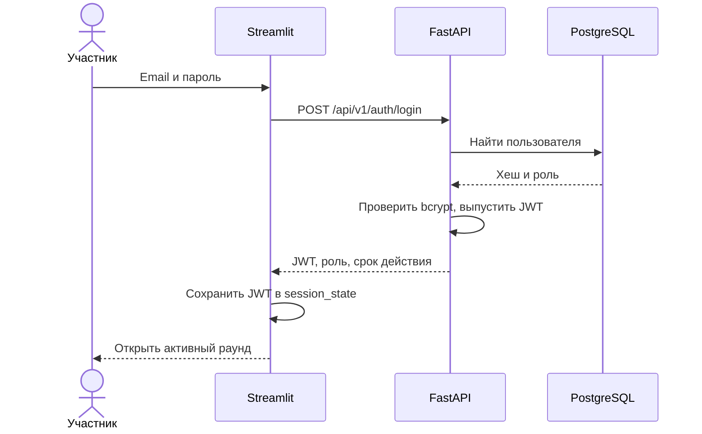
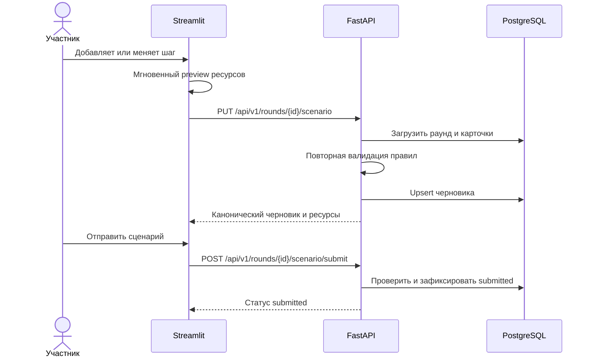

# Внутренние API-контракты

## Общие соглашения

FastAPI доступен только контейнерам Streamlit во внутренней Docker-сети. Все
прикладные маршруты имеют префикс `/api/v1`; health endpoints остаются вне версии.

- Формат: JSON, UTF-8.
- Денежные значения передаются строками с двумя десятичными знаками.
- Время передается в ISO 8601 с часовым поясом UTC.
- Защищенные запросы содержат `Authorization: Bearer <JWT>`.
- Каждый ответ содержит `X-Request-ID`; входящий корректный ID может быть продолжен.
- Participant endpoints требуют роль `participant`, admin endpoints — `admin`.
- OpenAPI/Swagger отключены во внешнем профиле и доступны только оператору внутри VM.

## Ошибки

Единый формат ошибки:

```json
{
  "code": "scenario_validation_failed",
  "message": "Сценарий нарушает правила раунда",
  "details": {
    "violations": [
      {"step": 3, "field": "amount", "reason": "insufficient_balance"}
    ]
  },
  "request_id": "01JAML7Q5SH2RZ8JYK6M4V3Q9T"
}
```

| HTTP | Когда применяется |
| --- | --- |
| `400` | Некорректный переход состояния или нарушенные игровые правила |
| `401` | Нет JWT, токен просрочен или недействителен |
| `403` | Недостаточная роль или доступ к чужому сценарию |
| `404` | Сущность не существует в доступной пользователю области |
| `409` | Конфликт статуса, email, повторный скоринг или версия черновика |
| `422` | Тело запроса не соответствует Pydantic-схеме |
| `429` | Превышен лимит аутентификационных попыток |
| `500` | Необработанная серверная ошибка без внутренних деталей в ответе |
| `503` | PostgreSQL или обязательная зависимость не готовы |

## Аутентификация

### `POST /api/v1/auth/register`

```json
{
  "email": "student@example.com",
  "display_name": "Финансовый детектив",
  "password": "correct-horse-42"
}
```

Ответ `201 Created`:

```json
{
  "id": 57,
  "email": "student@example.com",
  "display_name": "Финансовый детектив",
  "role": "participant"
}
```

Email нормализуется. Повторный email возвращает `409 email_already_registered`.
Регистрация никогда не позволяет выбрать роль.

### `POST /api/v1/auth/login`

```json
{"email": "student@example.com", "password": "correct-horse-42"}
```

Ответ `200 OK`:

```json
{
  "access_token": "<jwt>",
  "token_type": "bearer",
  "expires_in": 14400,
  "role": "participant",
  "display_name": "Финансовый детектив"
}
```

JWT действует четыре часа по умолчанию. Refresh token в v1 отсутствует; после
истечения срока пользователь входит повторно.



## Participant API

### `GET /api/v1/rounds/active`

Возвращает `200` с активным раундом или `200` с `null`, если раунд не открыт.

```json
{
  "id": 12,
  "title": "Мастер-класс AML",
  "status": "active",
  "started_at": "2026-10-05T08:00:00Z",
  "game_config": {
    "schema_version": 1,
    "initial_balance": "250000.00",
    "initial_energy": 14,
    "max_actions": 8,
    "target_outflow": "150000.00",
    "scoring_version": "rules-v1"
  }
}
```

Список внутренних `card_ids` не обязан возвращаться этим endpoint: карточки
загружаются отдельным запросом.

### `GET /api/v1/rounds/{round_id}/cards`

Возвращает только версии карточек из снимка данного раунда. Для активированного
раунда ответ неизменяем и может кэшироваться Streamlit по `round_id`.

```json
[
  {
    "id": 13,
    "code": "card_transfer",
    "version": 1,
    "title": "Перевести по карте",
    "description": "Перевод другому клиенту банка",
    "category": "Перевод",
    "flow": "debit",
    "risk_weight": "5.00",
    "energy_cost": 1,
    "fee_rate": "0.005000",
    "min_amount": "1000.00",
    "max_amount": "500000.00",
    "max_frequency": 5,
    "requires_card_code": null
  }
]
```

### `GET /api/v1/rounds/{round_id}/scenario`

Возвращает собственный сценарий текущего пользователя или `null`. Чужой сценарий
невозможно выбрать параметром запроса.

### `PUT /api/v1/rounds/{round_id}/scenario`

Идемпотентно создает или заменяет черновик при структурном изменении цепочки.

```json
{
  "steps": [
    {
      "card_id": 13,
      "card_code": "card_transfer",
      "card_version": 1,
      "amount": "50000.00",
      "frequency": 3,
      "recipient_type": "new_counterparty",
      "country_risk": "medium"
    }
  ]
}
```

Ответ содержит серверный preview ресурсов независимо от того, выполнял ли его UI:

```json
{
  "id": 91,
  "round_id": 12,
  "status": "draft",
  "revision": 4,
  "steps": [
    {
      "card_id": 13,
      "card_code": "card_transfer",
      "card_version": 1,
      "amount": "50000.00",
      "frequency": 3,
      "recipient_type": "new_counterparty",
      "country_risk": "medium"
    }
  ],
  "resources": {
    "balance": "99250.00",
    "energy": 11,
    "slots": 7,
    "outflow": "150000.00",
    "fees": "750.00",
    "goal_reached": true,
    "valid": true,
    "violations": []
  },
  "updated_at": "2026-10-05T08:17:02Z"
}
```

Пустой массив разрешен для черновика. Одинаковое тело повторного `PUT` не создает
новую строку. При `scoring` или `completed` возвращается `409 round_locked`.

### `POST /api/v1/rounds/{round_id}/scenario/submit`

Тело не требуется. FastAPI загружает сохраненный черновик, повторно валидирует все
шаги и меняет статус на `submitted`. Повторная отправка в активном раунде разрешена:
после следующего `PUT` статус снова становится `draft`, затем участник отправляет новую
ревизию. В `scoring` и `completed` изменения запрещены.

### `GET /api/v1/rounds/{round_id}/result`

До скоринга возвращает `200 null`. После скоринга:

```json
{
  "scenario_id": 91,
  "risk_score": "42.50",
  "label": "review",
  "scoring_version": "rules-v1",
  "explanation": {
    "top_factors": [
      {"step": 1, "name": "country_risk:medium", "points": "10.00"}
    ],
    "all_factors": [],
    "resource_summary": {},
    "note": "Учебная модель, не решение реальной AML-системы"
  }
}
```



## Admin API

| Метод и путь | Назначение |
| --- | --- |
| `POST /api/v1/admin/rounds` | Создать `draft` с конфигурацией |
| `GET /api/v1/admin/rounds` | Получить список раундов |
| `GET /api/v1/admin/rounds/{id}` | Получить раунд и полную конфигурацию |
| `PUT /api/v1/admin/rounds/{id}` | Изменить только `draft` |
| `POST /api/v1/admin/rounds/{id}/activate` | Проверить и активировать |
| `POST /api/v1/admin/rounds/{id}/score` | Синхронно просчитать отправленные сценарии |
| `GET /api/v1/admin/rounds/{id}/stats` | Счетчики раунда |
| `GET /api/v1/admin/rounds/{id}/board` | Отсортированная доска результатов |

Создание раунда принимает `title` и полный `game_config`. Активация атомарно завершает
ранее активный раунд, если в нем нет незавершенного скоринга.

Ответ скоринга:

```json
{
  "round_id": 12,
  "status": "completed",
  "submitted_count": 487,
  "scored_count": 487,
  "duration_ms": 842,
  "scoring_version": "rules-v1"
}
```

Если раунд уже `completed`, повторный запрос возвращает сохраненную сводку без нового
набора результатов. Если другой запрос удерживает раунд в `scoring`, возвращается
`409 scoring_in_progress`.

Статистика содержит `registered_users`, `draft_scenarios`, `submitted_scenarios`,
`scored_scenarios`. Доска не возвращает email и по умолчанию сортируется по
`risk_score DESC, scenario_id ASC`.

## Таймауты и повторы

- Streamlit использует connect timeout 3 с и read timeout 15 с для обычных запросов.
- Для синхронного admin scoring read timeout составляет 30 с.
- Автоматически повторяются только `GET` и идемпотентный `PUT`: не более двух retry с
  короткой экспоненциальной задержкой.
- `POST register`, `POST activate` и `POST score` не повторяются библиотекой вслепую.
- После неопределенного результата `score` admin UI читает статус и статистику раунда.
- Любой retry сохраняет исходный `X-Request-ID` для корреляции.

## Health endpoints

- `GET /health/live` — процесс FastAPI способен отвечать, без обращения к БД.
- `GET /health/ready` — выполняется короткий `SELECT 1` и проверяется примененная версия
  миграций. При ошибке возвращается `503`.
