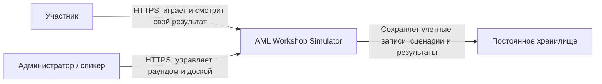
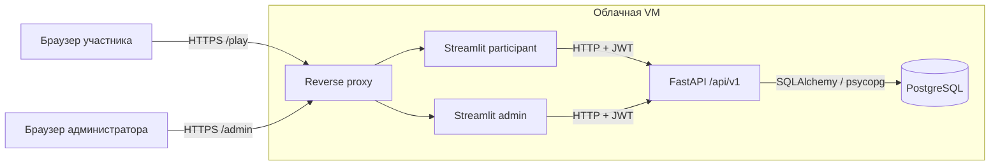
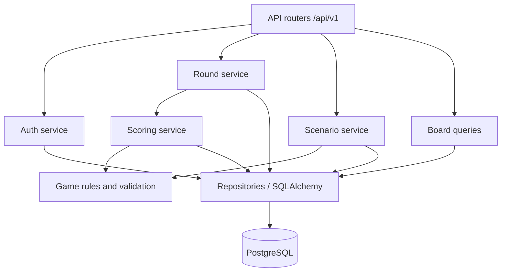

# Архитектура AML Workshop Simulator

## Назначение и границы

Система проводит интерактивный AML-мастер-класс: участник собирает финансовый
сценарий, администратор запускает общий скоринг, после чего интерфейсы показывают
результат и объяснимые факторы. Первая версия рассчитана на одно мероприятие, один
активный раунд и до 500 зарегистрированных участников.

В v1 не входят тяжелая ML-модель, очередь задач, Redis, Celery, Kubernetes,
автоматический offline fallback и прямой доступ браузера к API.

## Архитектурные цели

- единая реализация игровых правил в FastAPI;
- воспроизводимый скоринг по зафиксированной конфигурации раунда;
- сохранность отправленных сценариев при перезапуске UI или API;
- понятная эксплуатация на одной облачной VM;
- контролируемая работа при одновременной отправке сценариев;
- минимальная обработка персональных данных школьников;
- объяснимость каждого результата для учебного разбора.

## Нефункциональные требования

| Характеристика | Требование v1 |
| --- | --- |
| Нагрузка | До 500 пользователей и не более 8 действий в сценарии по умолчанию |
| Доступность | Интерфейсы доступны на протяжении 45-минутного мероприятия |
| Производительность | p95 обычного API-запроса до 500 мс; пакетный скоринг до 10 с |
| Целостность | Не более одного сценария участника на раунд; один активный раунд |
| Безопасность | HTTPS, bcrypt, JWT, RBAC, закрытые API и PostgreSQL |
| Восстановление | RPO до 24 часов до события и ручной backup непосредственно перед событием; RTO до 30 минут |
| Наблюдаемость | Структурные логи, request ID, readiness/liveness и метрики раунда |

Показатели являются приемочными целями. Фактическая емкость подтверждается нагрузочным
тестом на конфигурации VM, выбранной для мероприятия.

## Контекст системы

`Постоянное хранилище` является внутренней частью развертывания, а не внешней
интеграцией. На контекстной схеме оно выделено только для демонстрации назначения
данных.

## Контейнеры

Reverse proxy публикует только два Streamlit-интерфейса. API слушает внутренний
Docker-интерфейс, PostgreSQL не публикует порт на внешнем интерфейсе VM.

## Компоненты FastAPI

- **Routers** проверяют HTTP-контракт, авторизацию и преобразуют ошибки.
- **Auth service** регистрирует пользователей, проверяет пароль и выпускает JWT.
- **Round service** управляет конфигурацией и допустимыми переходами статусов.
- **Scenario service** сохраняет черновик, повторно валидирует и отправляет сценарий.
- **Game rules** рассчитывают деньги, энергию, комиссии, цель и нарушения.
- **Scoring service** детерминированно вычисляет риск и объяснение.
- **Repositories** инкапсулируют запросы, блокировки и транзакции PostgreSQL.

## Ответственность и источники истины

| Область | Streamlit | FastAPI | PostgreSQL |
| --- | --- | --- | --- |
| JWT | Хранит в пользовательской `session_state` | Выпускает и проверяет | Хранит пользователя и роль |
| Черновик | Держит UI-копию для быстрых rerun | Валидирует и сохраняет | Каноническая версия |
| Карточки | Показывает и локально preview-ит | Отдает конфигурацию раунда | Канонический каталог и версии |
| Деньги и энергия | Предварительный расчет для UX | Окончательный расчет | Сохраняет валидный сценарий и конфиг |
| Статус раунда | Отображает | Разрешает переходы | Канонический статус |
| Скоринг | Запускает или показывает | Выполняет | Сохраняет результат и объяснение |
| Доска | Форматирует | Фильтрует и сортирует | Источник результатов |

Любое расхождение между preview Streamlit и ответом API разрешается в пользу API.
Streamlit показывает пользователю полученную серверную ошибку и обновляет черновик
данными сервера.

## Основные потоки данных

1. Браузер устанавливает WebSocket-сессию со Streamlit через reverse proxy.
2. Streamlit передает учетные данные в FastAPI по внутренней сети и получает JWT.
3. JWT хранится только в `st.session_state` конкретной пользовательской сессии.
4. При структурном изменении цепочки Streamlit сохраняет черновик через идемпотентный
   `PUT`.
5. При отправке FastAPI заново загружает карточки и конфигурацию раунда, вычисляет
   ресурсы и только после успешной проверки меняет статус сценария.
6. При скоринге FastAPI блокирует строку раунда, рассчитывает все отправленные
   сценарии в одной транзакции и публикует результаты после commit.

## Конкурентный доступ

- Ограничение `UNIQUE(round_id, participant_id)` предотвращает дубли сценариев.
- Сохранение черновика выполняется как upsert и не создает новую сущность при retry.
- Активация раунда блокирует участвующие строки и завершает ранее активный раунд.
- Скоринг использует `SELECT ... FOR UPDATE` для строки раунда. Повторный запрос к
  `scoring` отклоняется конфликтом, запрос к `completed` возвращает существующий итог.
- Результат сценария обновляется по уникальному `scenario_id`, поэтому повторный
  безопасный пересчет не создает дубль.

## Отказы и восстановление

| Сбой | Поведение | Восстановление |
| --- | --- | --- |
| Streamlit перезапущен | UI-сессии и JWT потеряны, данные остаются в PG | Пользователь входит повторно и получает черновик |
| FastAPI недоступен | UI показывает временную ошибку, отправка не считается успешной | Retry только для безопасных GET/PUT |
| PostgreSQL недоступен | Readiness API становится failed, запись запрещена | Восстановить БД, проверить транзакции |
| Скоринг завершился исключением | Транзакция откатывается, результаты не публикуются частично | Исправить причину и повторить запуск |
| Reverse proxy недоступен | Внешние UI недоступны | Перезапустить proxy, проверить сертификат и DNS |

## Кэширование Streamlit

`st.cache_resource` применяется только для общего HTTP-клиента с connection pooling.
Кэшированный клиент не содержит JWT: токен передается аргументом каждого запроса.

`st.cache_data` разрешен для:

- карточек активированного раунда по ключу `round_id`, TTL 300 секунд;
- активного раунда, TTL не более 5 секунд;
- статических справочников интерфейса, не содержащих пользовательских данных.

Не кэшируются сценарии, результаты, статистика администратора, доска и ответы с
персональными данными. После создания, активации или скоринга раунда admin UI очищает
соответствующий кэш и вызывает `st.rerun()`.

Streamlit не создает SQLAlchemy-сессии, не подключается к PostgreSQL и не использует
`st.cache_resource` как бизнес-хранилище.

## Масштабирование

Для v1 используются по одному процессу participant UI и admin UI и 2–4 Uvicorn
worker на одной VM. PostgreSQL pool каждого worker ограничивается так, чтобы сумма
подключений оставалась ниже `max_connections` с запасом для обслуживания.

Вертикальное масштабирование VM является первым шагом. При дальнейшем росте:

1. PostgreSQL выносится в managed service без изменения HTTP-контрактов.
2. FastAPI масштабируется горизонтально, так как пользовательское состояние хранится
   в PostgreSQL и JWT.
3. Для нескольких Streamlit-реплик reverse proxy должен обеспечить sticky sessions,
   поскольку Streamlit использует долгоживущие WebSocket-сессии.
4. Тяжелый скоринг выносится в очередь только после превышения целевого времени 10 с.

