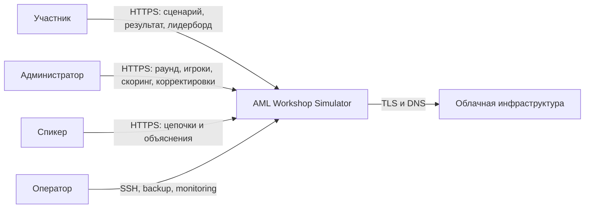
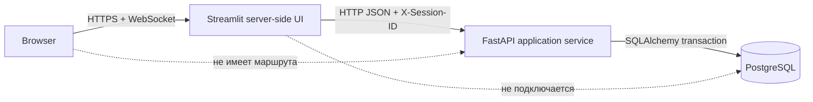
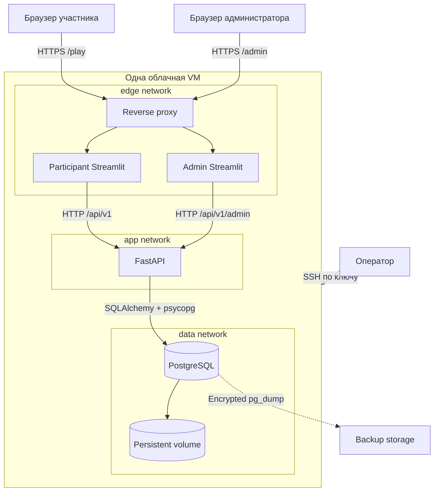
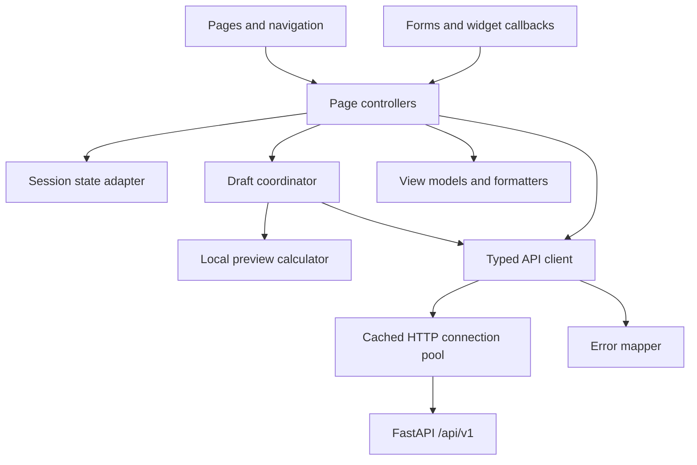
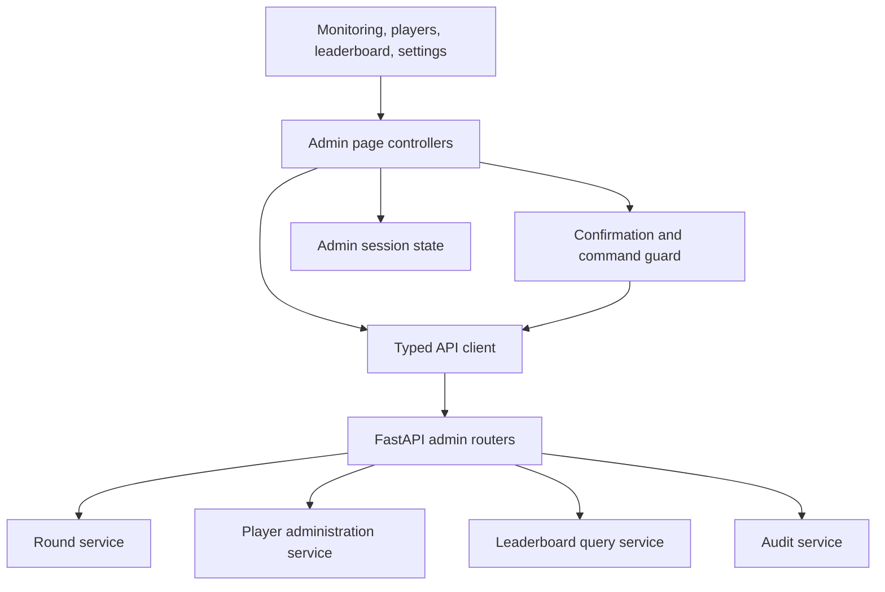
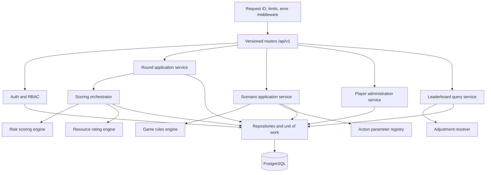
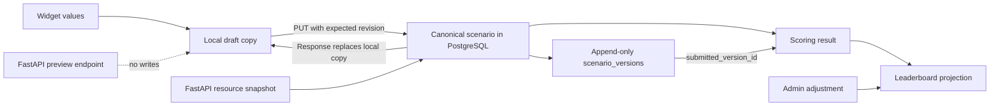
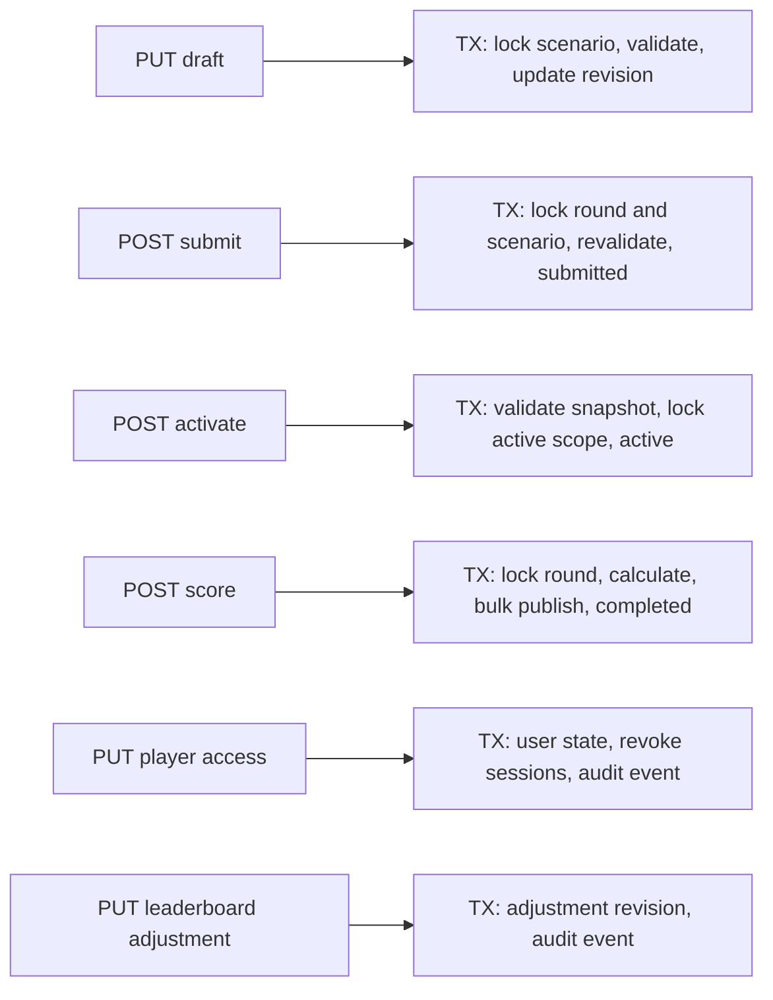
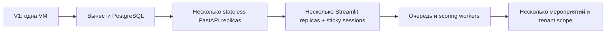

# Архитектура AML Workshop Simulator

## 1. Назначение и scope

Система поддерживает интерактивный мастер-класс: участник собирает цепочку
финансовых действий, стараясь выполнить игровую цель с ограниченными ресурсами и не
получить высокий риск; администратор управляет раундом, контролирует участников,
запускает общий скоринг и проводит разбор результатов.

Целевая v1 рассчитана на:

- одно мероприятие и один раунд в `active` или `scoring` одновременно;
- до 500 зарегистрированных участников;
- сценарий до настраиваемого числа шагов, по умолчанию 8;
- одну облачную VM и Docker Compose;
- легкий детерминированный scoring ruleset без тяжелой ML-модели;
- два независимых Streamlit-интерфейса, использующих общий FastAPI и PostgreSQL.

В v1 не входят Redis, Celery, Kafka, Kubernetes, публичный API, мобильный клиент,
мультитенантность, несколько одновременных мероприятий и offline fallback.

## 2. Архитектурные цели

| Цель | Архитектурное следствие |
| --- | --- |
| Воспроизводимость | Раунд фиксирует версии карточек, правил, скоринга и лидерборда |
| Целостность | FastAPI единолично валидирует команды; PostgreSQL обеспечивает constraints и транзакции |
| Отзывчивый UX | Streamlit делает локальный preview, но синхронизирует структурные изменения с API |
| Устойчивость к rerun | Запись не выполняется во время обычного рендера; команды имеют revision/idempotency guard |
| Объяснимость | Каждый результат содержит факторы, ресурсный итог и версию ruleset |
| Управляемость | Администратор видит профили, цепочки, блокировки, корректировки и audit trail |
| Минимальная инфраструктура | Одна VM, внутренние Docker-сети, синхронный scoring |
| Эволюция | Контракт Streamlit не зависит от размещения PostgreSQL или способа запуска scoring |

## 3. Нефункциональные требования

| Характеристика | Цель v1 | Как проверяется |
| --- | --- | --- |
| Нагрузка | 500 одновременных Streamlit-сессий | Load test через реальный WebSocket/UI профиль |
| API latency | p95 GET/PUT/submit до 500 мс без учета сети пользователя | API metrics под целевой нагрузкой |
| Скоринг | 500 сценариев до 10 с, hard timeout 30 с | Пакетный benchmark на release image |
| Ошибки | Менее 1% 5xx во время сценария нагрузки | Метрики и отчет теста |
| Целостность | Нет потерянных обновлений и частично опубликованной доски | Concurrency/integration tests с PostgreSQL |
| Восстановление | RTO до 30 минут; backup до события | Restore drill |
| Конфиденциальность | Нет email/session ID/сценариев в логах и leaderboard | Security tests и log scan |
| Доступность | Все 45 минут мероприятия без планового deploy | Preflight и change freeze |
| Доступность интерфейса | Desktop, планшет и мобильный экран; light/dark theme | Playwright visual matrix |

Цели принимаются только на фактическом профиле VM и Wi-Fi площадки. Числа не являются
гарантией без нагрузочного прогона.

## 4. System context

Администратор и спикер используют одну техническую роль `admin`, но разные use cases.
Оператор VM не получает прикладную роль автоматически.

## 5. Архитектурный стиль

Streamlit является **server-side UI**: браузер поддерживает Streamlit WebSocket, а
Python-процесс Streamlit сам вызывает внутренний FastAPI. Это BFF-подобная граница,
но Streamlit не владеет бизнес-правилами и не формирует отдельный доменный API.

Следствия:

1. Browser cookie хранит только непрозрачный session ID; Streamlit читает его через `streamlit-cookies-controller`, а FastAPI проверяет server-side сессию в PostgreSQL.
2. CORS для прикладного API не нужен, поскольку браузер к нему не обращается.
3. Любая бизнес-проверка в Streamlit является только UX-preview.
4. При нескольких репликах Streamlit потребуется sticky session или вынос UI-state.
5. Потеря Streamlit-сессии не должна приводить к потере серверного черновика.

## 6. Container diagram

Публичны только reverse proxy и два UI-маршрута. FastAPI, OpenAPI и PostgreSQL не
публикуют host ports.

## 7. Компоненты Participant Streamlit

- **Pages** содержат вход, обзор раунда, конструктор, результат и leaderboard.
- **Callbacks/forms** создают намерение пользователя; HTTP-запись не вызывается из
  безусловного top-level render.
- **Draft coordinator** хранит local copy, `server_revision`, dirty state и
  `client_mutation_id`.
- **Preview** — не вторая реализация правил, а вызов
  `POST /rounds/{id}/scenario/preview`: тот же серверный код считает ресурсы для
  несохраненной цепочки и ничего не пишет в базу. Поэтому число на экране и число в
  снимке совпадают по построению, а не по договоренности, а участник видит изменение
  баланса, энергии, времени, доступных шагов, квот и прогресса цели сразу после правки шага —
  до ручного сохранения. Ответы кэшируются по содержимому цепочки, чтобы rerun не
  превращался в шквал запросов.
- **История версий** живет на сервере: список сохранений, выбор версии и «продолжить с
  этой версии» работают через API, а не через `st.session_state`.
- **API client** добавляет timeout, session ID per request, request ID, retry policy и преобразует error
  envelope в типизированную ошибку UI.
- **View models** не меняют доменные значения, а только локализуют и форматируют их.

## 8. Компоненты Admin Streamlit

Admin UI не изменяет локальные копии до подтвержденного ответа API. Для start/stop/
restart, score, block/unblock и leaderboard adjustment используются подтверждение,
reason и защита от повторной отправки команды после rerun.

Конфигурация раунда редактируется структурной формой (`ui/admin/config_editor.py`), а не
вводом JSON: ресурсы, цель, лимиты, квоты, набор доступных операций, видимые параметры
каждой операции, числовые переопределения карточек, пороги скоринга и веса лидерборда.
Каждое поле действительно влияет на API, валидацию, UI или скоринг; JSON остается только
как диагностический просмотр. После старта раунда конфигурация становится неизменяемым
снимком.

## 9. Компоненты FastAPI

### Слои

| Слой | Ответственность | Не делает |
| --- | --- | --- |
| Router | HTTP schema, dependency injection, status code, RBAC | Не содержит игровых формул |
| Application service | Use case, транзакционная граница, state transition | Не форматирует Streamlit UI |
| Domain rules | Детерминированные ресурсы, риск, ranking | Не выполняет SQL/HTTP |
| Repository/unit of work | Query, lock, constraint mapping, commit/rollback | Не решает, разрешен ли use case |
| Middleware | request ID, error envelope, безопасное логирование | Не скрывает доменные ошибки как 500 |

## 10. Матрица ответственности

| Область | Streamlit | FastAPI | PostgreSQL |
| --- | --- | --- | --- |
| Навигация и виджеты | Владелец | Нет | Нет |
| Сессия | Cookie controller читает/удаляет browser cookie и передает ID per request | Создает, проверяет, отзывает и авторизует | Хранит `sessions` и актуальные role/block пользователя |
| Динамическая форма шага | Рендерит по card specification | Формирует спецификацию и строго валидирует | Хранит версию карточки и metadata |
| Черновик | Локальная рабочая копия | Координирует GET/PUT/submit | Канонические steps и revision |
| Ресурсный preview | Может считать приблизительно | Канонический расчет | Хранит принятый snapshot/result |
| Статус раунда | Показывает | Разрешает переход | Канонический status |
| Скоринг | Инициирует/показывает | Оркестрирует и рассчитывает | Атомарно публикует результаты |
| Лидерборд | Отображает и фильтрует локально | Собирает effective projection | Base result, adjustment, audit |
| Блокировка игрока | Запрашивает команду | Проверяет RBAC и применяет | Канонический access state |
| Логи | UI event без PII | Request/domain event без PII | Не используется как application log |

## 11. Источники истины и копии состояния

Черновик участника не перезаписывается: каждое явное сохранение добавляет версию, а
`scenarios.current_version_id` и `scenarios.submitted_version_id` указывают, с чем
участник работает и что ушло на скоринг. Восстановление старой версии — новая версия, а
не откат.

При конфликте локальная копия не побеждает автоматически. UI получает `409`, загружает
каноническую ревизию и предлагает пользователю повторить осознанное изменение.

## 12. Основные потоки данных

### Открытие страницы конструктора

1. Streamlit дожидается cookie bootstrap, читает route-scoped session cookie и проверяет сессию через FastAPI.
2. Получает активный раунд с TTL не более 5 секунд.
3. Получает карточки; неизменяемые карточки активированного раунда кэшируются по
   `round_id + config_version` до 5 минут.
4. Получает собственный сценарий без межпользовательского кэша.
5. Серверный сценарий гидратирует local draft и его revision.
6. Если active round отсутствует после reconnect, `GET /rounds/mine` находит собственный
   completed round и result.
7. Рендер выполняется без HTTP-команд записи.

### Изменение сценария

1. Callback/form изменяет local draft и отмечает его dirty.
2. Streamlit запрашивает preview у API и показывает пересчитанные ресурсы, лимиты,
   влияние шага и причину, по которой операцию нельзя добавить.
3. При структурном изменении Draft coordinator отправляет `PUT` с ожидаемой revision и
   уникальным mutation ID.
4. FastAPI блокирует строку сценария, проверяет revision, раунд, карточки и ресурсы.
5. Ответ API полностью заменяет локальную копию и server preview.

### Скоринг

1. Admin UI подтверждает команду и передает idempotency key.
2. FastAPI берет `FOR UPDATE NOWAIT` на строке раунда.
3. В одной транзакции проверяет status, временно переводит его в `scoring`, загружает
   submitted scenarios и фиксированный snapshot.
4. Детерминированно рассчитывает результаты, bulk-upsert выполняется в той же
   транзакции.
5. Сценарии переходят в `scored`, раунд — в `completed`, затем commit публикует все
   результаты одновременно.
6. При исключении соединение откатывает всю транзакцию; round остается `active`.

Статус `scoring` в v1 является транзакционным: другие команды либо получают lock
conflict, либо после commit видят `completed`. Admin UI показывает локальный pending
state и после неопределенного timeout читает серверный статус, а не повторяет POST
вслепую.

## 13. Конкурентный доступ

| Риск | Механизм |
| --- | --- |
| Два окна игрока перезаписывают шаги | `expected_revision`, row lock, `409 scenario_revision_conflict` |
| Rerun повторяет тот же PUT | `client_mutation_id` и сравнение payload hash |
| Два сценария игрока в раунде | `UNIQUE(round_id, participant_id)` |
| Два активных раунда | Partial unique index и блокировка при activate |
| Активация при существующем active | `409 active_round_exists`; скрытого завершения нет |
| Submit одновременно со score | Обе команды блокируют round row; после начала score submit отклоняется |
| Два запуска score | `FOR UPDATE NOWAIT`, idempotency key, результат completed возвращается повторно |
| Две admin-корректировки | Optimistic revision adjustment и immutable audit event |

## 14. Транзакционные границы

Транзакции коротких UI-команд не включают сетевые вызовы. Исключение — синхронный
scoring v1, допустимый только пока benchmark подтверждает верхнюю границу 10 секунд.

## 15. Отказоустойчивость

| Сбой | Состояние данных | Поведение UI | Восстановление |
| --- | --- | --- | --- |
| Перезапуск Streamlit | PG/session row не затронуты | UI-state потерян | Cookie повторно гидратирует server-side сессию и GET сценария |
| Timeout GET | Нет изменения | Inline retry/error | Автоматически до 2 retry |
| Timeout PUT | Результат неизвестен | Повтор с тем же mutation ID | API возвращает уже примененную ревизию |
| Timeout POST submit | Результат неизвестен | GET scenario, затем решение | Не повторять без проверки статуса |
| Timeout POST score | Результат неизвестен | GET round/stats | Повтор только после подтвержденного `active` |
| Crash API во время score | TX откатывается | Admin видит временную ошибку | API restart, status остается `active` |
| Недоступна БД | Запись невозможна | Service unavailable без локального fallback | Restore DB/readiness |
| Поврежден UI cache | Канонические данные не затронуты | Cache clear и rerun | Повторное чтение API |

## 16. Кэширование

Кэширование не меняет владение данными.

| Данные | Механизм | TTL/ключ | Инвалидация |
| --- | --- | --- | --- |
| HTTP connection pool | `st.cache_resource` | На процесс UI | Перезапуск/явный clear |
| Active round | `st.cache_data` | До 5 с; без session ID в ключе/значении | Admin-local clear; participant TTL |
| Round cards | `st.cache_data` | `round_id`, `config_version`, до 300 с | Новый config key; admin-local clear |
| UI static dictionaries | `st.cache_data` | Версия UI | Deploy |
| Scenario/result/profile/stats/leaderboard | Не кэшировать между сессиями | Нет | Всегда API |

Session ID не встраивается в cached client и передается только локальным заголовком конкретного запроса. SQLAlchemy session и соединение PostgreSQL никогда
не создаются в Streamlit. Полная политика описана в
[Streamlit и FastAPI](streamlit-fastapi.md#11-кэширование-streamlit).

Active-round/cards endpoints являются auth-free только во внутренней app network и не
содержат PII. Это осознанное исключение устраняет передачу session ID в process-wide cache;
user-specific reads всегда авторизованы и не кэшируются глобально.

Participant/admin Streamlit работают в разных процессах, поэтому `cache.clear()` в
admin UI не очищает participant cache. Видимость admin-команд обеспечивают TTL active
round до 5 секунд и новый `config_version` в card cache key. Event bus для invalidation
в v1 не нужен.

## 17. Масштабирование

### V1

- вертикальное масштабирование одной VM;
- один participant Streamlit process, один admin Streamlit process;
- 2–4 Uvicorn worker при рассчитанном общем DB pool;
- PostgreSQL на той же VM с persistent volume;
- один синхронный scoring request.

### Путь развития

Переход к очереди нужен, если scoring стабильно превышает 10 секунд, использует
тяжелую модель или требует progress. Публичные Streamlit-контракты при этом не меняются:
синхронный ответ score заменяется ресурсом job и polling, а participant API остается
прежним.

## 18. Архитектурные запреты

- Не импортировать repository/SQLAlchemy из Streamlit.
- Не считать локальный preview подтвержденным сохранением.
- Не выполнять POST/PUT без пользовательского события при каждом rerun.
- Не помещать session ID, cookie map, user object, scenario или result в `st.cache_data`.
- Не редактировать исходный scoring result при ручной корректировке leaderboard.
- Не завершать существующий active round неявно при активации нового.
- Не включать LocalStore как production fallback.
- Не публиковать FastAPI/Swagger/PostgreSQL наружу.
- Не добавлять Redis/Celery до измеренной потребности.
