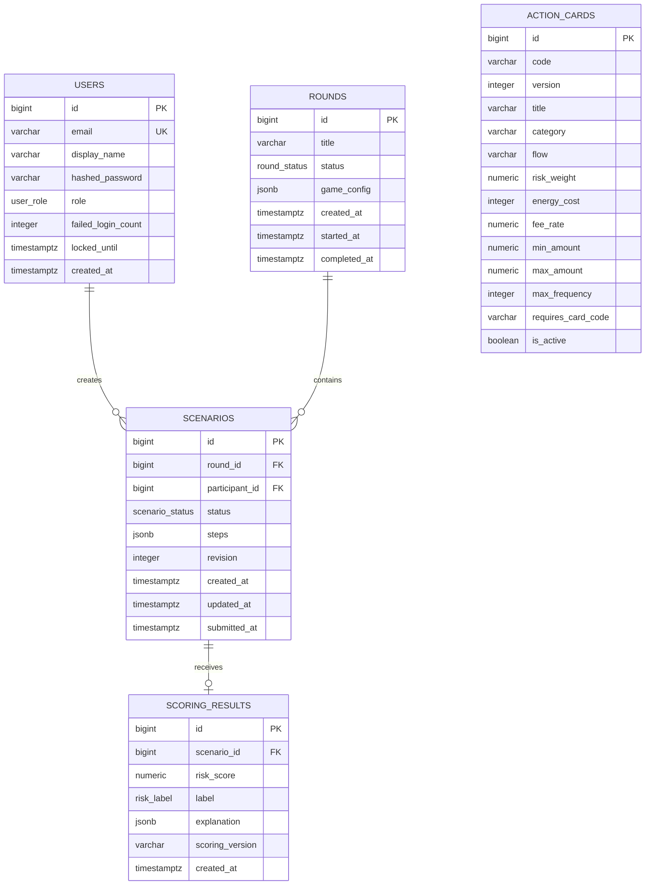

# Целевая модель данных

## Общие правила

PostgreSQL хранит все постоянное состояние. Денежные значения хранятся как
`NUMERIC`, время — как timezone-aware `TIMESTAMPTZ`, структурированные игровые данные
— как JSONB со строгой проверкой Pydantic на входе и выходе API.

В v1 используются пять основных таблиц. Карточка с опубликованной версией не
редактируется: изменение правил создает новую версию. Активированный раунд содержит
снимок идентификаторов карточек и игровой конфигурации.

## ER-диаграмма



`ROUNDS.game_config.card_ids` логически связывает раунд с версиями `ACTION_CARDS`.
Отдельная mapping-таблица не нужна для v1, поскольку список мал, целиком читается при
валидации и после активации неизменяем.

## `users`

| Поле | Тип | Правило |
| --- | --- | --- |
| `id` | `BIGINT` | Первичный ключ |
| `email` | `VARCHAR(320)` | Нормализованный lowercase, unique |
| `display_name` | `VARCHAR(120)` | Имя на доске, 2–120 символов |
| `hashed_password` | `VARCHAR(255)` | Только bcrypt-хеш |
| `role` | enum | `participant` или `admin` |
| `failed_login_count` | `INTEGER` | Счетчик неудачных входов, по умолчанию 0 |
| `locked_until` | `TIMESTAMPTZ`, nullable | Окончание временной блокировки |
| `created_at` | `TIMESTAMPTZ` | Время регистрации в UTC |

Email никогда не возвращается в строках общей доски. Удаление пользователя должно
каскадно или отдельной процедурой удалить его сценарии и результаты.

## `action_cards`

| Поле | Тип | Назначение |
| --- | --- | --- |
| `code` | `VARCHAR(80)` | Стабильный машинный код операции |
| `version` | `INTEGER` | Версия правил карточки, начиная с 1 |
| `title`, `description`, `category` | text | Представление в UI |
| `flow` | enum/text | `credit` или `debit` |
| `risk_weight` | `NUMERIC(8,2)` | Базовый вклад в скоринг |
| `energy_cost` | `INTEGER` | Энергия на один повтор |
| `fee_rate` | `NUMERIC(8,6)` | Комиссия от 0 до 1 |
| `min_amount`, `max_amount` | `NUMERIC(14,2)` | Допустимая сумма одного повтора |
| `max_frequency` | `INTEGER` | Максимальное число повторов шага |
| `requires_card_code` | nullable text | Код обязательной предшествующей операции |
| `is_active` | `BOOLEAN` | Доступность для будущих раундов |

Ограничения: `UNIQUE(code, version)`, положительные лимиты, `min_amount <= max_amount`,
`0 <= fee_rate <= 1`. Деактивация не влияет на уже активированный или завершенный
раунд.

## `rounds`

Статусы: `draft`, `active`, `scoring`, `completed`. Допускается не более одного
`active` или `scoring` раунда одновременно. Это обеспечивается partial unique index
по константному выражению для соответствующих статусов и транзакционной активацией.

Пример `game_config`:

```json
{
  "schema_version": 1,
  "initial_balance": 250000,
  "initial_energy": 14,
  "max_actions": 8,
  "target_outflow": 150000,
  "card_ids": [11, 12, 13, 14, 15, 16, 17, 18],
  "scoring": {
    "version": "rules-v1",
    "review_threshold": 35,
    "suspicious_threshold": 65
  }
}
```

До активации администратор может менять `game_config`. При переходе в `active` API:

1. проверяет схему, диапазоны и существование всех `card_ids`;
2. проверяет, что версии карточек активны для новых раундов;
3. сохраняет окончательный JSONB-снимок;
4. запрещает дальнейшие изменения конфигурации.

## `scenarios`

`UNIQUE(round_id, participant_id)` гарантирует один сценарий участника в раунде.
Поле `revision` увеличивается при каждом материальном изменении и возвращается API для
диагностики повторных запросов. Повтор идентичного `PUT` не меняет revision.

Целевой Pydantic-контракт элемента `steps`:

```python
class ScenarioStep(BaseModel):
    card_id: int
    card_code: str
    card_version: int = Field(ge=1)
    amount: Decimal = Field(gt=0, max_digits=14, decimal_places=2)
    frequency: int = Field(ge=1, le=20)
    recipient_type: Literal[
        "known_counterparty", "new_counterparty", "anonymous_wallet"
    ]
    country_risk: Literal["low", "medium", "high"]
```

В JSONB сохраняются `card_code` и `card_version` для прозрачного аудита, но API
проверяет их соответствие `card_id` и конфигурации раунда. Длина массива — от 1 до
`game_config.max_actions` при отправке; пустой черновик разрешен.

Пример:

```json
[
  {
    "card_id": 13,
    "card_code": "card_transfer",
    "card_version": 1,
    "amount": "50000.00",
    "frequency": 3,
    "recipient_type": "new_counterparty",
    "country_risk": "medium"
  }
]
```

## `scoring_results`

Результат однозначно связан со сценарием через `UNIQUE(scenario_id)`. `risk_score`
лежит в диапазоне 0–100, `label` принимает `normal`, `review` или `suspicious`.

Пример `explanation`:

```json
{
  "schema_version": 1,
  "top_factors": [
    {"step": 1, "name": "frequency", "points": 6.0},
    {"step": 1, "name": "country_risk:medium", "points": 10.0}
  ],
  "all_factors": [],
  "resource_summary": {
    "balance": "99250.00",
    "energy": 11,
    "outflow": "150000.00",
    "fees": "750.00"
  },
  "note": "Учебная модель, не решение реальной AML-системы"
}
```

`scoring_version` дублируется отдельным полем для фильтрации и одновременно входит
в конфигурацию раунда для воспроизводимости.

## Индексы

- `users(email)` — unique.
- `action_cards(code, version)` — unique.
- `rounds(status, created_at DESC)` — поиск активного и последних раундов.
- partial unique index, запрещающий два раунда в `active`/`scoring`.
- `scenarios(round_id, participant_id)` — unique.
- `scenarios(round_id, status)` — статистика и пакетный скоринг.
- `scenarios(participant_id, updated_at DESC)` — восстановление пользовательского состояния.
- `scoring_results(scenario_id)` — unique.
- `scoring_results(label, risk_score DESC)` — доска и агрегация.

GIN-индексы по JSONB в v1 не нужны: игровые правила читают сценарии пакетно по
`round_id`, а не выполняют произвольный поиск по отдельным шагам.

## Инварианты и транзакции

- Только участник с ролью `participant` может владеть сценарием.
- Черновик можно менять только пока раунд `active`.
- Повторная отправка разрешена в `active` и заменяет предыдущую версию.
- В `scoring` и `completed` сценарий неизменяем.
- Результат создается только для `submitted`/`scored` сценария.
- Публикация всех результатов и перевод раунда в `completed` происходят одной
  транзакцией; частично готовая доска не видна.
- Все серверные даты записываются в UTC.

## Хранение и удаление

- До мероприятия выполняется резервная копия конфигурации, карточек и тестового раунда.
- После мероприятия данные хранятся только согласованный организацией срок; рекомендуемый
  срок для учебного запуска — не более 30 дней.
- При удалении персональных данных удаляются email, учетная запись, сценарии и результаты,
  либо сценарии предварительно необратимо обезличиваются по утвержденной процедуре.
- Backup с персональными данными имеет тот же срок хранения и доступ только у оператора.
