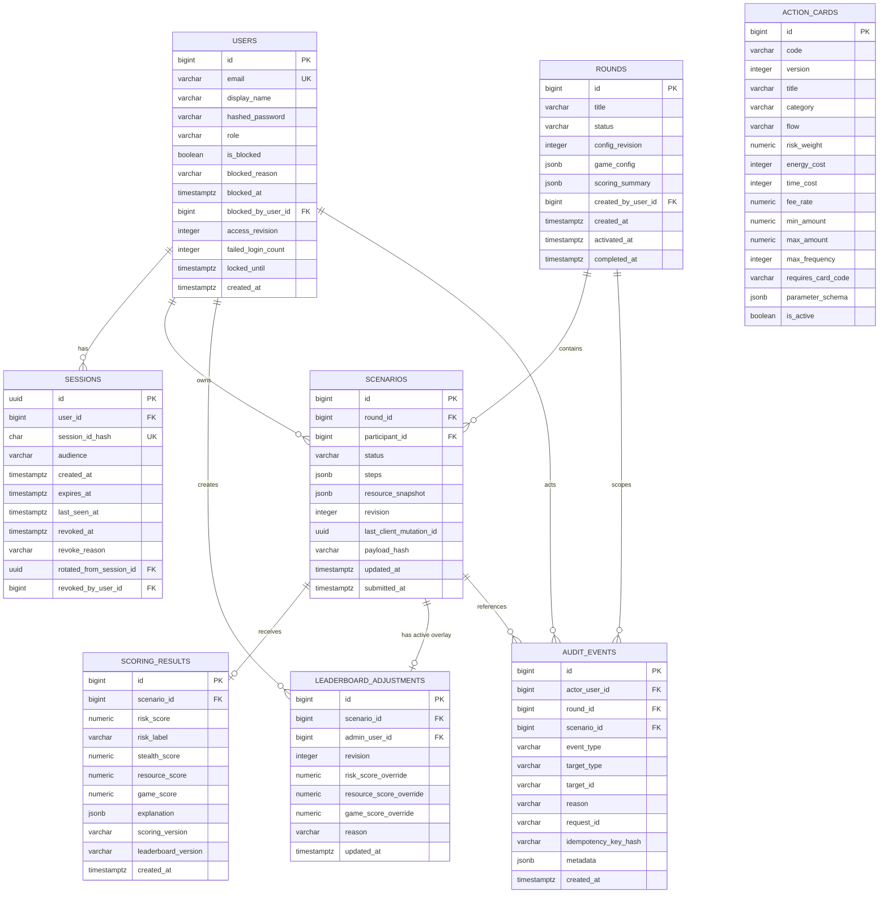
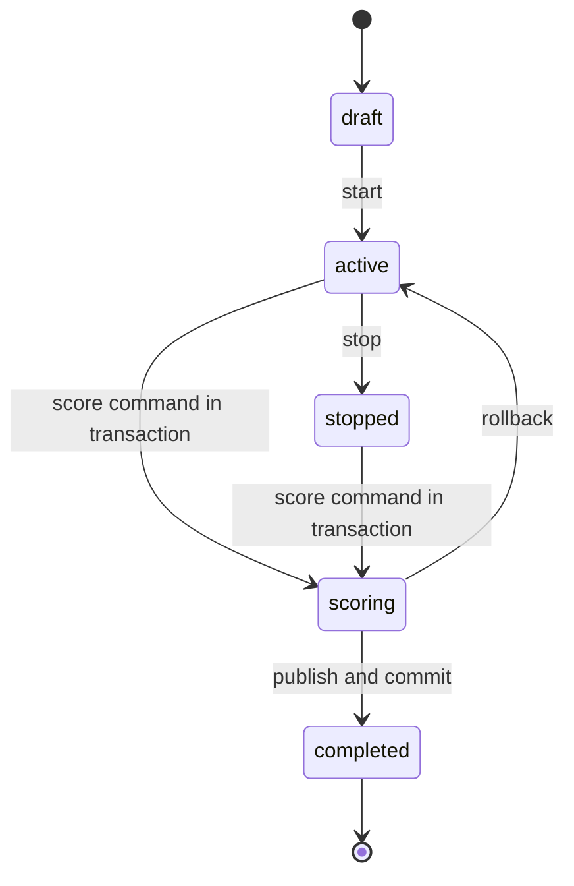
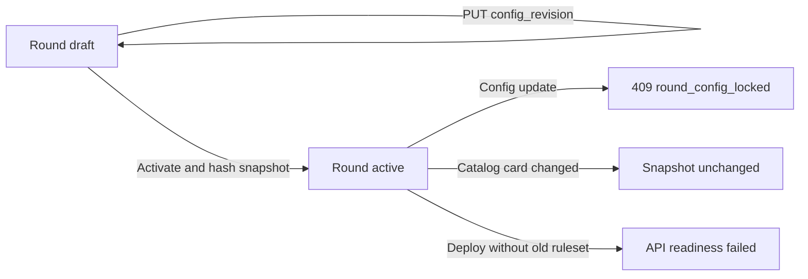

# Целевая модель данных PostgreSQL

## 1. Принципы

PostgreSQL хранит все постоянное состояние. FastAPI является единственным компонентом,
который читает и изменяет эти данные. Streamlit не знает схему БД и работает только с
DTO `/api/v1`.

- Деньги: `NUMERIC(14,2)` в SQL и `Decimal` в Python.
- Веса и коэффициенты: `NUMERIC`, без binary float в канонических расчетах.
- Время: `TIMESTAMPTZ` в UTC.
- Статусы и роли: PostgreSQL enum либо `VARCHAR + CHECK`, единообразно во всей схеме.
- Сложные snapshots: JSONB, прошедший строгую Pydantic-валидацию.
- Все ID, попадающие в URL, непрозрачны для клиента; v1 может использовать `BIGINT`.
- Все mutable сущности имеют `created_at`/`updated_at`; admin history — append-only.

## 2. Группы сущностей

| Группа | Таблицы | Назначение |
| --- | --- | --- |
| Identity | `users`, `sessions` | Учетная запись, роль, блокировка и server-side сессии |
| Game configuration | `action_cards`, `rounds` | Версии карточек и snapshot правил раунда |
| Gameplay | `scenarios`, `scoring_results` | Цепочка, ресурсы, модельный и игровой результат |
| Administration | `leaderboard_adjustments`, `audit_events` | Неизменяемый base result, ручной overlay и аудит |

## 3. ER-диаграмма



`rounds.game_config.card_versions` логически связывает активированный раунд с
конкретными immutable строками `action_cards`. В v1 набор мал и целиком загружается
при валидации. Если карточки получат независимый workflow публикации или SQL-запросы по
составу раунда, вводится `round_action_cards` без изменения API.

## 4. `users`

| Поле | Тип | Правило |
| --- | --- | --- |
| `id` | `BIGINT` | PK |
| `email` | `VARCHAR(320)` | Lowercase/trim normalized, unique |
| `display_name` | `VARCHAR(120)` | 2–120 символов; рекомендуется псевдоним |
| `hashed_password` | `VARCHAR(255)` | Argon2id или bcrypt hash; не возвращается API |
| `role` | enum | `participant`, `admin` |
| `is_blocked` | `BOOLEAN` | Запрещает все participant actions |
| `blocked_reason` | `VARCHAR(500)`, nullable | Обязателен при `is_blocked=true` |
| `blocked_at` | `TIMESTAMPTZ`, nullable | Время admin-команды |
| `blocked_by_user_id` | self FK, nullable | Только admin |
| `access_revision` | `INTEGER` | Optimistic guard для admin block/unblock; увеличивается при изменении доступа |
| `failed_login_count` | `INTEGER` | Неотрицательный, default 0 |
| `locked_until` | `TIMESTAMPTZ`, nullable | Временная auth-блокировка |
| `created_at`, `updated_at` | `TIMESTAMPTZ` | UTC |
| `first_login_at` | `TIMESTAMPTZ`, nullable | Первый успешный вход; ставится один раз |
| `last_login_at` | `TIMESTAMPTZ`, nullable | Не отображается leaderboard |

`is_blocked` — административная блокировка, `locked_until` — автоматическая защита от
подбора пароля. Они имеют разные error codes и audit semantics.

Удаление participant выполняется контролируемой процедурой. FK на admin actor по
умолчанию `SET NULL`, чтобы аудит сохранял факт действия без удержания лишней PII.

## 4.1. `sessions`

`session_id`, возвращаемый после login, является секретным browser credential. FastAPI генерирует 32
случайных байта, отдает raw значение Streamlit ровно один раз и сохраняет только
`SHA-256(session_id)`.

| Поле | Тип | Правило |
| --- | --- | --- |
| `id` | `UUID` | Внутренний PK; не является browser credential |
| `user_id` | `BIGINT` FK | Владелец; `ON DELETE CASCADE` |
| `session_id_hash` | `CHAR(64)` | Hex SHA-256, unique; raw ID запрещен |
| `audience` | enum | `play` или `admin`; проверяется на каждом request |
| `created_at` | `TIMESTAMPTZ` | Время успешного login |
| `expires_at` | `TIMESTAMPTZ` | Абсолютный срок, default 4 часа |
| `last_seen_at` | `TIMESTAMPTZ` | Throttled update не чаще одного раза в 5 минут |
| `revoked_at` | `TIMESTAMPTZ`, nullable | Немедленный server-side revoke |
| `revoke_reason` | `VARCHAR(100)`, nullable | `logout`, `blocked`, `password_reset`, `admin`, `rotated` |
| `rotated_from_session_id` | self FK, nullable | Аудируемая ротация без хранения raw session ID |
| `revoked_by_user_id` | `BIGINT` FK, nullable | Admin/user actor; `SET NULL` |
| `ip_address` | `INET`, nullable | Адрес клиента, IPv4 и IPv6 |
| `user_agent` | `VARCHAR(512)`, nullable | Строка браузера как есть, без разбора |
| `accept_language` | `VARCHAR(120)`, nullable | Заголовок языка, если браузер его прислал |

Технические поля нужны организатору, чтобы понять, с какого устройства заходил
участник. Они не расширяют fingerprinting: ни пароля, ни raw session ID, ни canvas/
device-hash в базе нет, а `ip_address` хранится как `INET`, а не как свободный текст.

Адрес берется из сокета. `X-Forwarded-For` учитывается **только** если непосредственный
клиент перечислен в `TRUSTED_PROXY_IPS` (CIDR через запятую): без этой настройки любой
участник мог бы продиктовать серверу произвольный адрес. Streamlit — тоже HTTP-клиент,
поэтому UI пересылает браузерные `User-Agent`, `Accept-Language` и адрес, а API решает,
верить ли пересланному адресу, по тому же правилу.

Индексы: unique по `session_id_hash` для auth lookup; `(user_id, expires_at)` для активных сессий;
`expires_at` и `revoked_at` для cleanup. Active определяется запросом, а не отдельным
mutable flag: `revoked_at IS NULL AND expires_at > now()`.

Block и password reset в одной транзакции меняют user state и ставят `revoked_at` всем
активным сессиям пользователя. Logout отзывает только текущую строку. Expired/revoked
строки удаляются после короткого retention window, по умолчанию 7 дней.

## 5. `action_cards`

Каждая строка — неизменяемая опубликованная версия типа действия.

| Поле | Тип | Назначение |
| --- | --- | --- |
| `id` | `BIGINT` | Уникальная версия карточки |
| `code` | `VARCHAR(80)` | Стабильный code, например `cash_deposit` |
| `version` | `INTEGER` | Версия начиная с 1 |
| `title`, `description`, `category` | text | UI metadata |
| `flow` | enum | `credit`, `debit`, `neutral` |
| `risk_weight` | `NUMERIC(8,2)` | Базовый вклад ruleset |
| `energy_cost`, `time_cost` | `INTEGER` | Базовая стоимость одного повтора |
| `fee_rate` | `NUMERIC(8,6)` | Доля комиссии от 0 до 1 |
| `min_amount`, `max_amount` | `NUMERIC(14,2)` | Сумма одного повтора |
| `max_frequency` | `INTEGER` | Лимит повторов шага |
| `requires_card_code` | nullable code | Зарезервировано; в текущем каталоге всегда `null` |
| `parameter_schema` | `JSONB` | Декларативные специфичные поля для UI и schema validation |
| `is_active` | `BOOLEAN` | Можно ли выбирать версию для нового draft-round |
| `created_at` | `TIMESTAMPTZ` | Audit timestamp |

Ограничения:

- `UNIQUE(code, version)`;
- `version > 0`, затраты неотрицательны;
- `min_amount > 0`, `min_amount <= max_amount`;
- `0 <= fee_rate <= 1`;
- `max_frequency >= 1`;
- `requires_card_code != code`;
- published row не обновляется, кроме `is_active`; новая семантика создает новую version.

### `parameter_schema`

```json
{
  "schema_version": 1,
  "fields": [
    {
      "key": "funds_source",
      "label": "Источник средств",
      "kind": "select",
      "required": true,
      "options": [
        {"value": "salary", "label": "Зарплата"},
        {"value": "third_party", "label": "Третье лицо"}
      ]
    }
  ]
}
```

Разрешенные `kind` v1: `select`, `multiselect`, `boolean`, `integer`, `decimal`,
`short_text`. Для каждого kind Pydantic проверяет допустимые keys, ranges и размер.
`parameter_schema` не содержит исполняемого кода. Эффекты значений реализуются
версионированным FastAPI ruleset, указанным в snapshot раунда.

## 6. `rounds`

Статусы: `draft`, `active`, `stopped`, `scoring`, `completed`.



Не более одного раунда может находиться в `active` или `scoring`. Инвариант держит
частичный уникальный индекс `uq_rounds_single_active`, а не только код: активация
второго раунда возвращает `409 active_round_exists`, и API никогда не завершает прежний
раунд скрыто.

Дополнительные поля жизненного цикла:

| Поле | Тип | Правило |
| --- | --- | --- |
| `stopped_at` | `TIMESTAMPTZ`, nullable | Время команды «Остановить раунд» |
| `restarted_from_round_id` | self FK, nullable | Раунд, вместо которого создан этот |
| `preset_id` | FK на `round_presets`, nullable | Откуда взята конфигурация; `SET NULL` |

`stopped` — рабочее состояние, а не удаление: сценарии, версии черновиков, результаты и
журнал сохраняются, но любая запись участника получает `409 round_locked`. Перезапуск
создает новую строку раунда с копией конфигурации и ссылкой `restarted_from_round_id`;
повторный запрос находит уже созданную замену по этой ссылке и не создает вторую.

## 6.1. `round_presets`

Именованный набор настроек, подготовленный до мастер-класса.

| Поле | Тип | Правило |
| --- | --- | --- |
| `id` | `BIGINT` | PK |
| `name` | `VARCHAR(120)` | Unique, обязателен |
| `description` | `VARCHAR(500)`, nullable | Свободный комментарий организатора |
| `game_config` | `JSONB` | Проходит ту же валидацию, что и конфигурация раунда |
| `revision` | `INTEGER` | Optimistic guard для `PUT` |
| `created_by_user_id`, `updated_by_user_id` | FK на `users` | Автор и последний редактор |
| `created_at`, `updated_at` | `TIMESTAMPTZ` | UTC |

Раунд, созданный из пресета, копирует конфигурацию в собственный снимок. Поэтому правка
пресета никогда не меняет уже созданный раунд, а удаление пресета обнуляет
`rounds.preset_id`, не трогая сам раунд.

### `game_config` snapshot

```json
{
  "schema_version": 4,
  "config_version": "round-config-v4:sha256:8f4c...",
  "resources": {
    "initial_balance": "250000.00",
    "initial_energy": 14,
    "initial_time": 18
  },
  "objectives": {
    "target_outflow": "150000.00",
    "max_actions": 8
  },
  "constraints": {
    "max_identical_steps": 2,
    "max_night_operations": 2,
    "max_anonymous_operations": 1,
    "category_limits": {
      "cash": "120000.00",
      "anonymous": "75000.00"
    }
  },
  "card_versions": [
    {"id": 11, "code": "salary", "version": 1},
    {"id": 12, "code": "cash_deposit", "version": 1}
  ],
  "ruleset_version": "game-rules-v3",
  "scoring": {
    "version": "risk-rules-v2",
    "review_threshold": "35.00",
    "suspicious_threshold": "65.00"
  },
  "leaderboard": {
    "version": "leaderboard-v2",
    "weights": {"stealth": "0.60", "resources": "0.40"},
    "resource_weights": {
      "balance": "0.27",
      "energy": "0.20",
      "time": "0.20",
      "fees": "0.20",
      "available_steps": "0.13"
    }
  }
}
```

Значения выше — конфигурация референсного раунда. Admin может менять их в `draft` в
валидных диапазонах. При активации FastAPI:

1. берет lock на scope активного раунда;
2. убеждается, что другого `active/scoring` нет;
3. валидирует JSON schema и сумму весов;
4. разрешает card references в immutable versions;
5. проверяет наличие реализаций `ruleset_version`, `scoring.version` и
   `leaderboard.version` в release image;
6. рассчитывает `config_version` как hash canonical JSON;
7. переводит раунд в `active` и запрещает дальнейший update.

`config_revision` используется только при редактировании draft admin-формой. После
активации он фиксируется.

`scoring_summary` остается `NULL` до completed и затем хранит counts, duration,
scoring/leaderboard versions и completed timestamp. Благодаря этому повторный score
completed round возвращает исходную summary без пересчета и без изменения результатов.

## 7. `scenarios`

`UNIQUE(round_id, participant_id)` обеспечивает один сценарий на участника и раунд.

### Строгая схема шага

```python
class CardRef(BaseModel):
    id: int
    code: str
    version: int = Field(ge=1)

class OperationContext(BaseModel):
    recipient_type: Literal["known_counterparty", "new_counterparty", "anonymous_wallet"]
    time_of_day: Literal["day", "evening", "night"] = "day"
    velocity: Literal["spaced", "normal", "rapid"] = "normal"
    channel: Literal["mobile", "web", "branch", "atm"]
    has_documents: bool = False

class ScenarioStep(BaseModel):
    model_config = ConfigDict(extra="forbid")
    step_id: UUID
    card: CardRef
    amount: Decimal = Field(gt=0, max_digits=14, decimal_places=2)
    frequency: int = Field(ge=1, le=20)
    context: OperationContext
    action_details: dict[str, StrictValue]
```

`action_details` получает строгую модель из registry по `card.code + card.version`.
Неизвестное поле запрещено. `step_id` уникален внутри сценария и сохраняется при reorder.

Пример шага:

```json
{
  "step_id": "4fe2d542-a810-4fd0-b63f-a43ad7ea7853",
  "card": {"id": 12, "code": "cash_deposit", "version": 1},
  "amount": "50000.00",
  "frequency": 2,
  "context": {
    "recipient_type": "known_counterparty",
    "time_of_day": "evening",
    "velocity": "rapid",
    "channel": "atm",
    "has_documents": true
  },
  "action_details": {
    "funds_source": "documented_savings",
    "deposit_pattern": "single_location"
  }
}
```

### Revision и идемпотентность

- `revision = 0` означает отсутствующий/пустой server draft в request contract.
- Первый material PUT создает row с `revision = 1`.
- Material PUT увеличивает revision на 1.
- Повтор с тем же `client_mutation_id` и payload возвращает текущую revision.
- Тот же mutation ID с другим payload возвращает `409 mutation_id_reused`.
- Идентичный payload с новым mutation ID может вернуть текущую revision без update.
- Submit меняет status, но не content revision.

`payload_hash` вычисляется сервером от canonical JSON steps и не является security hash.

### `resource_snapshot`

```json
{
  "schema_version": 4,
  "valid": true,
  "resources_after": {
    "balance": "99250.00",
    "energy": 8,
    "time": 10,
    "available_steps": 5
  },
  "totals": {
    "gross_inflow": "0.00",
    "gross_outflow": "150000.00",
    "fees": "750.00"
  },
  "objective": {
    "target_outflow": "150000.00",
    "reached": true
  },
  "limit_usage": {
    "cash": "0.00",
    "anonymous": "0.00",
    "night_operations": 0
  },
  "violations": [],
  "per_step": []
}
```

FastAPI вычисляет snapshot при каждом структурно валидном PUT и сохраняет его рядом со
steps. Бизнес-невалидный draft (например, отрицательный остаток или превышенная квота)
может быть сохранен с `valid=false` и violations, чтобы участник не потерял работу.
Неизвестная карточка, неверный тип или лишнее поле остаются schema error и не сохраняются.
При submit и score snapshot считается заново по fixed round config; сохраненная копия
используется для восстановления UX и аудита, но не отменяет revalidation.

## 7.1. `scenario_versions`

Append-only история черновиков. Каждое явное сохранение участника добавляет строку;
ничего не перезаписывается и ничего не удаляется.

| Поле | Тип | Правило |
| --- | --- | --- |
| `id` | `BIGINT` | PK |
| `scenario_id` | FK на `scenarios` | `ON DELETE CASCADE` |
| `revision` | `INTEGER` | Unique вместе с `scenario_id` |
| `label` | `VARCHAR(120)`, nullable | Название версии, которое ввел участник |
| `steps` | `JSONB` | Цепочка целиком, в канонической форме |
| `resource_snapshot` | `JSONB`, nullable | Ресурсы, лимиты и нарушения этой версии |
| `payload_hash` | `CHAR(64)`, nullable | Для сравнения версий без разбора JSON |
| `restored_from_revision` | `INTEGER`, nullable | Источник, если версия создана восстановлением |
| `created_by_user_id` | FK на `users` | Автор сохранения |
| `created_at` | `TIMESTAMPTZ` | UTC |

`scenarios` получает два указателя: `current_version_id` — версия, с которой участник
сейчас работает, и `submitted_version_id` — та единственная версия, которая ушла на
скоринг. Скоринг читает именно `submitted_version_id`, поэтому последующая правка
черновика (если раунд еще идет) не может изменить уже отправленный результат.

Восстановление старой версии создает **новую** запись с содержимым старой и заполненным
`restored_from_revision`; более поздние версии остаются на месте. Организатор видит всю
историю каждого участника, включая версии, которые никогда не отправлялись.

## 8. `scoring_results`

Один result на scenario: `UNIQUE(scenario_id)`. Все base values лежат в диапазоне
`0..100`.

| Поле | Смысл |
| --- | --- |
| `risk_score` | Риск модели; меньше лучше для игровой цели |
| `risk_label` | `normal`, `review`, `suspicious` |
| `stealth_score` | `100 - risk_score` по версии leaderboard |
| `resource_score` | Эффективность использования ресурсов |
| `game_score` | Настраиваемая композиция stealth/resource |
| `explanation` | Факторы риска, защитные факторы, sequence patterns, resource summary |
| `scoring_version` | Версия risk engine |
| `leaderboard_version` | Версия формулы игрового балла |

Base result после commit раунда неизменяем. Повторный scoring completed round возвращает
существующую summary и не обновляет timestamp/result.

Пример explanation:

```json
{
  "schema_version": 2,
  "top_risk_factors": [
    {
      "step_id": "4fe2d542-a810-4fd0-b63f-a43ad7ea7853",
      "code": "velocity:rapid",
      "points": "8.00",
      "description": "Быстрая серия операций повышает риск"
    }
  ],
  "protective_factors": [
    {
      "step_id": "4fe2d542-a810-4fd0-b63f-a43ad7ea7853",
      "code": "documents:present",
      "points": "-4.00",
      "description": "Подтверждающие документы снижают риск"
    }
  ],
  "sequence_factors": [],
  "resource_summary": {},
  "disclaimer": "Учебная модель; результат не является AML-решением"
}
```

## 9. `leaderboard_adjustments`

Таблица хранит только текущий overlay; история находится в `audit_events`.

- `UNIQUE(scenario_id)`;
- хотя бы одно override value не `NULL`;
- каждое override в `0..100`;
- `reason` обязателен, 10–500 символов;
- `revision` начинается с 1 и защищает admin от lost update;
- base fields `scoring_results` не обновляются.

Effective projection:

```text
effective_risk_score     = COALESCE(risk_score_override, result.risk_score)
effective_resource_score = COALESCE(resource_score_override, result.resource_score)
effective_game_score     = COALESCE(game_score_override, result.game_score)
```

Если admin меняет только risk/resource, API не должен молча пересчитывать game override.
UI явно предлагает либо оставить base game score, либо задать отдельный effective game
score. Это предотвращает скрытую формулу после ручного решения.

Удаление корректировки удаляет overlay в транзакции и создает audit event с прежними
значениями; base result снова становится effective.

## 10. `audit_events`

Append-only журнал содержит административные и критичные state transitions:

- `round_created`, `round_updated`, `round_activated`, `round_scored`;
- `participant_blocked`, `participant_unblocked`;
- `leaderboard_adjusted`, `leaderboard_adjustment_cleared`;
- `admin_login_failed`, если политика допускает без PII;
- `data_exported`, `participant_deleted`.

`metadata` содержит только безопасный diff: IDs, revisions, numeric before/after и
status. `idempotency_key_hash` хранит необратимый hash ключа только для команд, которым
нужна строгая дедупликация; raw key запрещен. Email, raw session ID, session hash, password, full steps и full
explanation не сохраняются.

```json
{
  "event_type": "leaderboard_adjusted",
  "actor_user_id": 3,
  "round_id": 12,
  "scenario_id": 91,
  "reason": "Коррекция после технической ошибки демонстрации",
  "request_id": "01JAML...",
  "metadata": {
    "revision_before": 1,
    "revision_after": 2,
    "game_score_before": "71.40",
    "game_score_after": "74.00"
  }
}
```

## 11. Индексы

```text
users(email_normalized) UNIQUE
users(is_blocked) WHERE is_blocked = true
action_cards(code, version) UNIQUE
rounds(status, created_at DESC)
rounds((1)) UNIQUE WHERE status IN ('active', 'scoring')
scenarios(round_id, participant_id) UNIQUE
scenarios(round_id, status)
scenarios(participant_id, updated_at DESC)
scoring_results(scenario_id) UNIQUE
scoring_results(game_score DESC, risk_score ASC)
leaderboard_adjustments(scenario_id) UNIQUE
audit_events(round_id, created_at DESC)
audit_events(actor_user_id, created_at DESC)
audit_events(scenario_id, created_at DESC)
audit_events(actor_user_id, event_type, target_type, target_id, idempotency_key_hash) UNIQUE
    WHERE idempotency_key_hash IS NOT NULL
```

GIN по `steps` и `explanation` в v1 не нужен: списки выбираются по round/scenario ID, а
не произвольными JSON-path запросами. Добавление индекса требует подтвержденного query
profile.

## 12. Constraints и инварианты

1. Только `participant` владеет scenario; DB FK не проверяет роль, это делает service.
2. Scenario редактируется только в active round.
3. Пустой и бизнес-невалидный draft разрешены; submit требует 1..`max_actions` шагов,
   отсутствие violations и достигнутую цель.
4. Все `step_id` в одном scenario уникальны.
5. Card ref точно входит в `game_config.card_versions`.
6. Action details соответствуют конкретным code/version.
7. Submitted можно вернуть в draft новым PUT только пока round active.
8. Scored scenario и completed round неизменяемы.
9. Result создается только для submitted scenario внутри scoring transaction.
10. Число results после completed равно числу сценариев, выбранных для scoring.
11. Блокировка пользователя не удаляет scenario/result и не меняет leaderboard сама по
    себе; политика отображения blocked player задается query service.
12. Manual adjustment не меняет base result.
13. Audit event записывается в той же транзакции, что block/adjustment/admin transition.
14. Все timestamps генерирует сервер/БД, а не Streamlit.

## 13. Неизменность конфигурации



Release image обязан содержать implementations всех ruleset versions, используемых
active или неистекшими completed rounds. Удаление старой версии кода допустимо только
после окончания retention и проверки, что она больше не нужна для воспроизведения.

## 14. SQLAlchemy mapping

| Таблица | Target model | Repository |
| --- | --- | --- |
| `users` | `User` | `UserRepository` |
| `action_cards` | `ActionCard` | `ActionCardRepository` |
| `rounds` | `Round` | `RoundRepository` |
| `scenarios` | `Scenario` | `ScenarioRepository` |
| `scoring_results` | `ScoringResult` | `ScoringResultRepository` |
| `leaderboard_adjustments` | `LeaderboardAdjustment` | `LeaderboardRepository` |
| `audit_events` | `AuditEvent` | `AuditRepository` |

Pydantic DTO не возвращает SQLAlchemy entity напрямую. Application service формирует
response model после commit/refresh, чтобы UI не видел lazy-loading и внутренние поля.

## 15. Хранение и удаление данных

| Данные | Рекомендуемый срок | Удаление |
| --- | --- | --- |
| Email/account | До 30 дней после мероприятия, если нет иного основания | Hard delete или approved anonymization |
| Scenario/result | Тот же срок, если связаны с participant | Cascade delete либо необратимое обезличивание |
| Display name | Вместе с account | Удалить/заменить псевдонимом |
| Audit events | По политике организатора | Удалить actor linkage/target PII, сохранить технический факт при необходимости |
| Backup | Не дольше исходных данных | Expiry + подтвержденное удаление |
| Обезличенные агрегаты | По отдельной политике | Только после проверки невозможности re-identification |

Процедура удаления:

1. закрыть доступ к мероприятию;
2. сформировать список participant IDs без выгрузки email в логи;
3. удалить/анонимизировать в одной контролируемой операции;
4. проверить отсутствие строк и leaderboard projection;
5. зафиксировать audit event без PII;
6. дождаться удаления backup по retention schedule.
