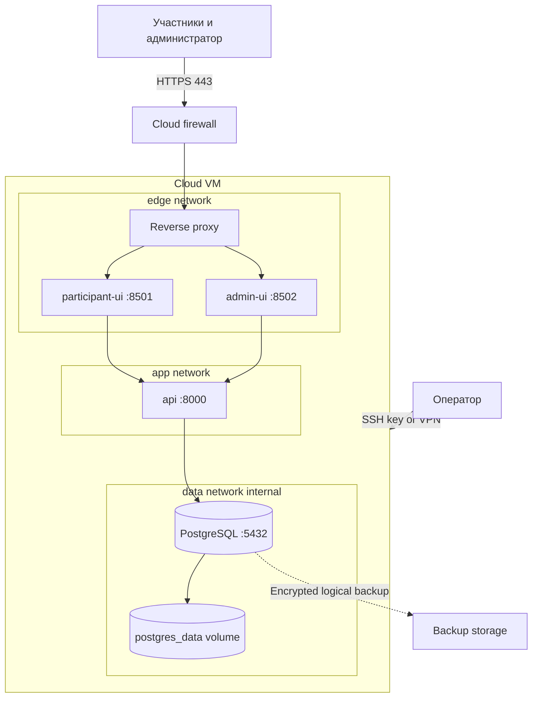
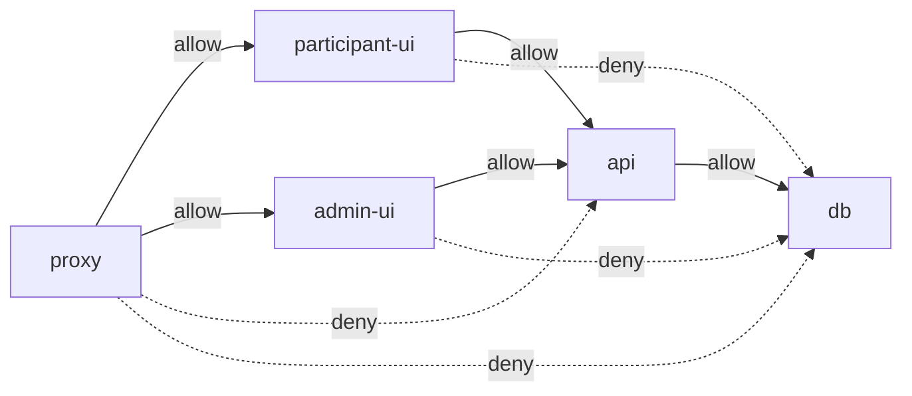
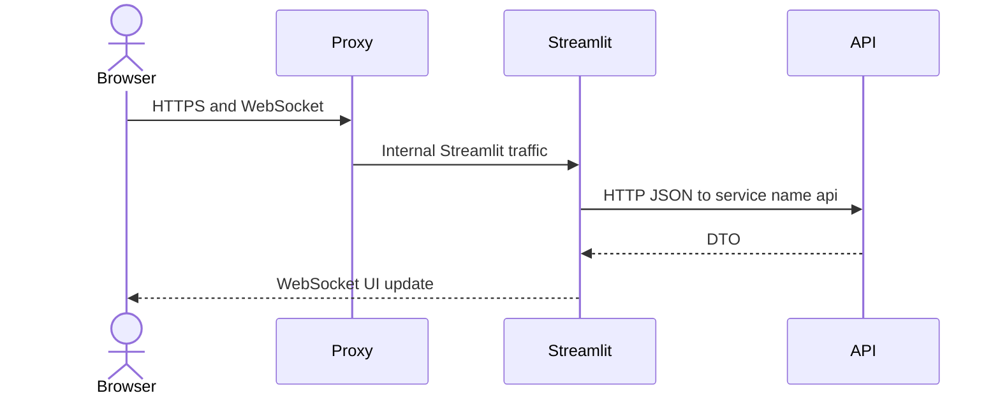
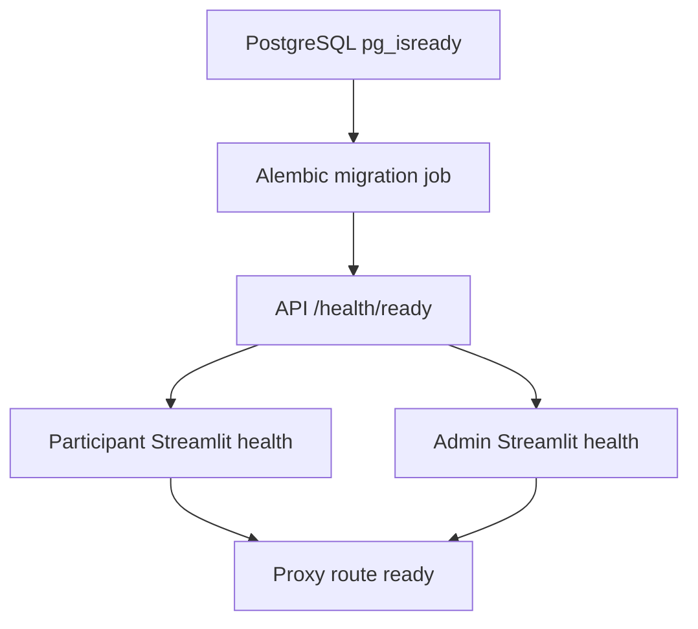
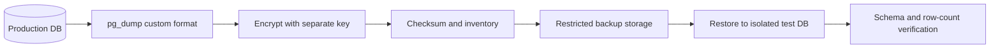
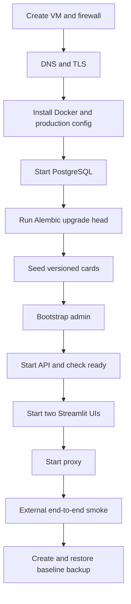
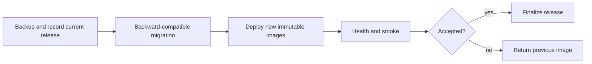
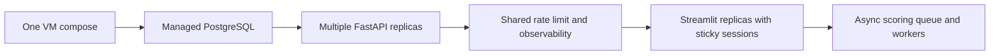

# Развертывание на одной облачной VM

## 1. Целевая топология v1



Host публикует только `80/tcp` для redirect и `443/tcp` для HTTPS. Streamlit,
FastAPI и PostgreSQL не имеют host port mappings в production compose.

## 2. Сервисы Docker Compose

| Service | Образ/процесс | Сети | Persistent state |
| --- | --- | --- | --- |
| `proxy` | Caddy/Nginx/Traefik с pinned version | `edge` | TLS state при необходимости |
| `participant-ui` | Streamlit participant command | `edge`, `app` | Нет |
| `admin-ui` | Streamlit admin command | `edge`, `app` | Нет |
| `api` | Uvicorn/FastAPI release image | `app`, `data` | Нет |
| `db` | PostgreSQL 16 pinned minor | `data` | Named volume `postgres_data` |
| `migrate` | One-shot Alembic command | `data` | Нет |

Можно использовать один application image для `participant-ui`, `admin-ui`, `api` и
`migrate`, но команды запуска и health checks различаются. Image tag неизменяемый:
commit SHA или release version; `latest` запрещен в production.

## 3. Сетевые правила



Docker network isolation не заменяет cloud firewall. На VM дополнительно закрыты все
входящие порты, кроме 80/443 и ограниченного SSH.

## 4. Внешние маршруты

| Public path | Target | Требования |
| --- | --- | --- |
| `/` или `/play` | Participant Streamlit | QR/основная ссылка |
| `/admin` | Admin Streamlit | RBAC login; желательно VPN/IP policy |
| `/healthz` proxy-only, optional | Synthetic edge check | Не раскрывает внутренние детали |
| `/api`, `/docs`, `/redoc`, `/openapi.json` | Deny/404 | Не проксируются |

Выбирается один canonical participant path. Если используется `/play`, Streamlit
запускается с `server.baseUrlPath=play`; admin — с `server.baseUrlPath=admin`.

Reverse proxy обязан поддерживать:

- WebSocket `Upgrade`/`Connection` headers;
- forwarded host/proto;
- достаточный idle timeout для Streamlit session;
- upload/body limit, соответствующий API policy;
- отдельное routing rule для static assets каждого base path;
- HTTP -> HTTPS redirect;
- denial API/DB paths до generic routing.

## 5. Внутренний вызов API

Streamlit использует только service DNS:

```text
API_BASE_URL=http://api:8000/api/v1
```

TLS внутри одной Docker host network в v1 необязателен, поскольку API не покидает VM.
Session ID передается только per request в `X-Session-ID` и не логируется. При выносе API на другой
host внутренний канал становится TLS/mTLS через отдельное решение.



## 6. Переменные окружения

### Общие

| Variable | Service | Rule |
| --- | --- | --- |
| `APP_ENV` | app | `production` |
| `APP_VERSION` | app | Immutable release identifier |
| `LOG_LEVEL` | all | `INFO` на событии |
| `PUBLIC_BASE_URL` | proxy/UI | Canonical HTTPS origin |
| `TZ` | containers | UTC предпочтительно; UI локализует |

### Streamlit

| Variable | Rule |
| --- | --- |
| `API_BASE_URL` | `http://api:8000/api/v1` |
| `API_CONNECT_TIMEOUT_SECONDS` | default 3 |
| `API_READ_TIMEOUT_SECONDS` | default 10–15 |
| `API_SCORE_TIMEOUT_SECONDS` | default 30 |
| `STREAMLIT_SERVER_BASE_URL_PATH` | `play` или `admin` |
| `STREAMLIT_SERVER_ENABLE_XSRF_PROTECTION` | `true` |
| `STREAMLIT_BROWSER_GATHER_USAGE_STATS` | `false` |
| `SESSION_COOKIE_NAME_PLAY` | `aml_play_session_id` |
| `SESSION_COOKIE_NAME_ADMIN` | `aml_admin_session_id` |
| `SESSION_COOKIE_PATH` | `/play` или `/admin` по приложению |
| `SESSION_COOKIE_SECURE` | `true` в production |
| `SESSION_COOKIE_SAME_SITE` | `strict` |

Streamlit images обязаны устанавливать закрепленную версию
`streamlit-cookies-controller`. Release gate включает browser smoke для `set/get/remove`
с `Secure` и `SameSite=Strict`; обновление компонента выполняется только через lock-файл
и regression test.

### FastAPI

| Variable | Rule |
| --- | --- |
| `DATABASE_URL` | Internal host `db`, app DB user, не superuser |
| `SESSION_TTL_MINUTES` | Default 240 |
| `SESSION_LAST_SEEN_WRITE_INTERVAL_SECONDS` | Default 300 |
| `SESSION_RETENTION_DAYS` | Default 7 для expired/revoked rows |
| `DB_POOL_SIZE` | Рассчитан на workers и max connections |
| `DB_MAX_OVERFLOW` | Малый bounded запас |
| `DB_STATEMENT_TIMEOUT_MS` | Защита от зависших SQL |
| `DB_LOCK_TIMEOUT_MS` | Быстрый conflict для score/activate |
| `MAX_REQUEST_BODY_BYTES` | Согласован с proxy |

### PostgreSQL

| Variable | Rule |
| --- | --- |
| `POSTGRES_DB` | Отдельная DB мероприятия |
| `POSTGRES_USER` | Bootstrap owner; app использует отдельную role |
| `POSTGRES_PASSWORD` | Production secret |
| `PGDATA` | Mounted volume path |

Production secrets не хранятся в Git/image/Markdown. `.env.example` содержит только
имена и placeholders. Production `.env` имеет минимальные filesystem permissions или
заменяется secret store.

## 7. Health checks и startup dependencies



| Service | Liveness | Readiness |
| --- | --- | --- |
| DB | Process/container | `pg_isready` + operator SQL when needed |
| API | `/health/live` | `/health/ready`: DB, Alembic, rulesets |
| Streamlit | Streamlit health endpoint | Health + API connectivity smoke outside container check |
| Proxy | Process/config | HTTPS + WebSocket synthetic check |

Compose `depends_on`/health order уменьшает startup races, но не является runtime
orchestrator. Failed API readiness из-за DB не должен вызывать бесконечный destructive
restart loop.

## 8. PostgreSQL volume

- Named volume или явно управляемый block storage.
- Volume не монтируется в API/UI/proxy.
- Достаточный disk reserve и monitoring.
- Filesystem snapshots не заменяют logical backup без согласованности.
- Major PostgreSQL upgrade выполняется отдельно, не перед мероприятием.
- `fsync`, WAL и durability settings не ослабляются ради benchmark.

## 9. DB connection budget

Пример расчета, который уточняется по фактической конфигурации:

```text
api_workers = 2
pool_size_per_worker = 10
max_overflow_per_worker = 5
peak_api_connections = 2 * (10 + 5) = 30
operator_and_migration_reserve = 10
required_db_capacity >= 40 plus safety margin
```

Streamlit не открывает DB connections. Увеличение Uvicorn workers без пересчета pool
может исчерпать PostgreSQL и запрещено.

## 10. Capacity profile для 500 участников

Стартовый профиль для load test:

- 4–8 vCPU;
- 8–16 GB RAM;
- SSD не менее 40 GB с запасом;
- 1 participant Streamlit process;
- 1 admin Streamlit process;
- 2 FastAPI workers, максимум 4 после измерений;
- PostgreSQL 16 на той же VM;
- до 500 Streamlit WebSocket sessions;
- 500 scenarios по max 8 steps;
- один batch score.

Ресурсы распределяются не hardcoded, а после profiling. Минимальный запас во время
rehearsal: CPU/RAM ниже 80–85%, disk ниже 80%, DB connections ниже 80% maximum.

### Нагрузочный профиль

```mermaid
gantt
    title Нагрузочная репетиция
    dateFormat  HH:mm
    axisFormat  %H:%M
    section Участники
    Login и WebSocket ramp-up :a1, 10:00, 5m
    Конструктор и PUT revisions :a2, after a1, 12m
    Submit burst :a3, after a2, 2m
    Result reads :a4, 10:21, 4m
    section Администратор
    Stats и player reads :b1, 10:05, 14m
    Scoring :b2, 10:19, 2m
    Leaderboard/detail :b3, after b2, 4m
```



Цели: ordinary p95 < 500 мс, API 5xx < 1%, score < 10 с, no duplicate/lost updates.

## 11. TLS и DNS

1. Назначить static public IP.
2. Создать DNS A/AAAA заранее с контролируемым TTL.
3. Получить certificate ACME или организатора.
4. Проверить certificate chain, hostname и expiry из внешней сети.
5. Проверить WebSocket на `/play` и `/admin`.
6. Включить HSTS после успешного smoke и понимания rollback.
7. Отключить direct IP/unknown Host routing.

## 12. Backup

Backup выполняется ежедневно в подготовке, непосредственно перед регистрацией и после
мероприятия по retention policy.



Пример команды в доверенной операторской среде:

```bash
docker compose exec -T db pg_dump -U "$POSTGRES_USER" -d "$POSTGRES_DB" -Fc > aml.dump
```

Dump шифруется до передачи. Наличие файла без проверенного restore не считается backup.

## 13. Restore

1. Остановить application writes или выбрать отдельную target DB.
2. Проверить checksum/decryption.
3. Создать clean PostgreSQL target совместимой версии.
4. Выполнить restore без вывода row data в terminal/log.
5. Проверить Alembic version, row counts, active round invariant и admin login.
6. Запустить API readiness и полный smoke round.
7. Только затем переключать application DSN при recovery.

```bash
pg_restore --clean --if-exists --no-owner --dbname "$RESTORE_DATABASE_URL" aml.dump
```

## 14. Первичное развертывание



Порядок:

1. Создать non-root service user, firewall, SSH keys и directories.
2. Разместить pinned compose и secret config.
3. Запустить DB и дождаться health.
4. Выполнить one-shot migration; API не должен мигрировать схему при каждом startup.
5. Выполнить idempotent card seed и bootstrap admin.
6. Запустить API, проверить live/ready из app network.
7. Запустить UIs и proxy.
8. Проверить внешние routes, deny API, WebSocket, light/dark UI.
9. Пройти test round.
10. Создать и восстановить baseline backup.

## 15. Обновление

- Плановые updates запрещены во время 45-минутного события.
- Перед update: DB backup, current image tags/config checksum, active-round check.
- Schema change выполняется expand/contract, совместимо с предыдущим image.
- Migration запускается отдельно до replacement application containers.
- UI/API обновляются как одна contract-compatible release unit.
- После restart: readiness, auth, draft GET/PUT, score smoke, leaderboard, admin detail.
- Старые images сохраняются до окончания observation window.



## 16. Откат

1. Остановить новые admin mutations.
2. Вернуть предыдущие image tags.
3. Не откатывать backward-compatible DB migration автоматически.
4. Проверить readiness и contract smoke.
5. Если migration повредила/удалила data, остановить writes и выполнить verified restore.
6. Зафиксировать version, time, reason и request IDs инцидента.

Предыдущий production image обязан читать текущую expand-schema. Откат на автономный
LocalStore не поддерживается.

## 17. Масштабирование после v1



Streamlit contracts не меняются при выносе DB. При нескольких UI replicas reverse
proxy обязан использовать sticky sessions, поскольку `st.session_state` связан с
WebSocket process. Очередь добавляется только при измеренной необходимости.
