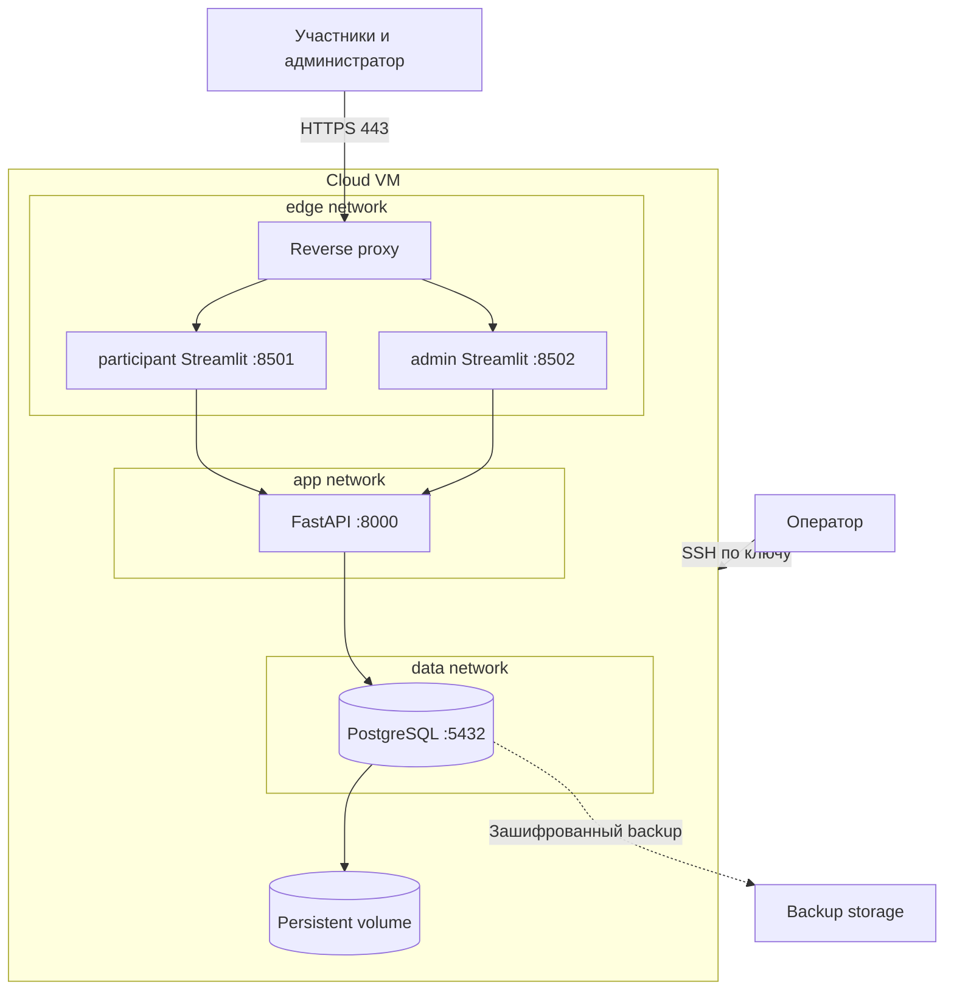

# Развертывание на одной облачной VM

## Целевая топология



Наружу публикуются только `80` для перенаправления и `443` для HTTPS. Порты Streamlit,
FastAPI и PostgreSQL привязаны только к Docker-сетям.

## Сервисы Docker Compose

| Сервис | Назначение | Сеть | Постоянные данные |
| --- | --- | --- | --- |
| `proxy` | TLS, маршрутизация, security headers | edge | Сертификаты |
| `participant-ui` | Интерфейс участников | edge + app | Нет |
| `admin-ui` | Интерфейс администратора | edge + app | Нет |
| `api` | Бизнес-правила и `/api/v1` | app + data | Нет |
| `db` | PostgreSQL 16 | data | `postgres_data` |

Для v1 рекомендуется один образ приложения с разными командами запуска для API и двух
Streamlit-сервисов. Образ собирается с фиксированными версиями зависимостей и получает
неизменяемый tag релиза, например commit SHA.

## Внешние маршруты

| URL | Получатель | Комментарий |
| --- | --- | --- |
| `/play` или `/` | participant UI | Основная ссылка и QR для участников |
| `/admin` | admin UI | Не показывается участникам; защищен приложением |
| `/api`, `/docs`, `/openapi.json` | Не публикуются | Только внутренняя сеть |

Streamlit запускается с корректным `server.baseUrlPath` для выбранного префикса, а
reverse proxy поддерживает WebSocket upgrade и длительные соединения.

## TLS и DNS

- DNS A/AAAA указывает на статический адрес VM заранее.
- Reverse proxy автоматически получает сертификат либо использует сертификат
  организатора.
- HTTP всегда перенаправляется на HTTPS.
- Проверка сертификата и WebSocket выполняется из внешней сети, не только с VM.
- HSTS включается после подтверждения корректного домена и сертификата.

## Health checks

```text
proxy -> participant-ui: Streamlit health endpoint
proxy -> admin-ui: Streamlit health endpoint
api -> /health/live: процесс отвечает
api -> /health/ready: PostgreSQL и миграции готовы
db -> pg_isready
```

Compose health dependencies не заменяют runtime monitoring. Контейнер API не считается
готовым, пока БД не принимает соединения и версия Alembic соответствует приложению.

## Переменные окружения

| Переменная | Сервис | Правило |
| --- | --- | --- |
| `DATABASE_URL` | API | Внутренний hostname `db`, отдельный пользователь приложения |
| `SECRET_KEY` | API | Случайное значение не менее 32 байт |
| `ACCESS_TOKEN_EXPIRE_MINUTES` | API | По умолчанию 240 |
| `API_BASE_URL` | Streamlit | `http://api:8000/api/v1` во внутренней сети |
| `POSTGRES_DB` | DB | Отдельная база мероприятия |
| `POSTGRES_USER` | DB | Не использовать superuser из приложения |
| `POSTGRES_PASSWORD` | DB | Уникальный production secret |
| `PUBLIC_BASE_URL` | UI/proxy | Канонический HTTPS-домен |
| `LOG_LEVEL` | API/UI | `INFO` на мероприятии |

Production `.env` находится только на VM, не входит в Git и имеет ограниченные права.
Файл `.env.example` содержит имена и безопасные placeholders, но не рабочие секреты.

## Capacity-профиль

Исходный профиль для нагрузочного теста, а не гарантия конкретного провайдера:

- 4 vCPU, 8 GB RAM, SSD от 40 GB;
- 2–4 Uvicorn worker;
- по одному процессу participant и admin Streamlit;
- PostgreSQL `max_connections` с запасом относительно суммарного pool API;
- до 500 WebSocket-сессий participant UI;
- до 500 сценариев по 8 шагов и один синхронный пакетный скоринг.

Перед мероприятием профиль принимается только после теста с 500 виртуальными
пользователями: вход, чтение карточек, сохранение черновика, одновременная отправка и
обновление доски. Цели: p95 API до 500 мс, ошибки менее 1%, scoring до 10 секунд.

## Backup и восстановление

Backup выполняется:

1. ежедневно в период подготовки;
2. непосредственно перед открытием регистрации;
3. после завершения мероприятия перед обновлением или выгрузкой.

Пример логического backup внутри доверенной операторской среды:

```bash
docker compose exec -T db pg_dump -U "$POSTGRES_USER" -d "$POSTGRES_DB" -Fc > aml.dump
```

Файл шифруется перед переносом во внешнее хранилище. Восстановление проверяется на
отдельной тестовой БД:

```bash
pg_restore --clean --if-exists --no-owner --dbname "$RESTORE_DATABASE_URL" aml.dump
```

Наличие backup без проверенного restore не считается готовностью.

## Первичное развертывание

1. Создать VM, непривилегированного сервисного пользователя, firewall и SSH-ключи.
2. Настроить DNS и каталоги для volume/backup.
3. Разместить compose-файл и production `.env`.
4. Запустить только PostgreSQL и дождаться health check.
5. Выполнить `alembic upgrade head` отдельной одноразовой командой.
6. Создать администратора bootstrap-командой без дефолтного пароля.
7. Запустить API и проверить `/health/live` и `/health/ready` из Docker-сети.
8. Запустить Streamlit и proxy.
9. Пройти полный тестовый раунд и проверить внешние маршруты.
10. Выполнить и восстановить первый backup.

## Обновление

1. Запретить изменения активного раунда или выполнять обновление до мероприятия.
2. Сделать backup и записать текущий image tag.
3. Получить новый неизменяемый образ.
4. Запустить backward-compatible миграции.
5. Перезапустить API и UI, проверить readiness.
6. Выполнить smoke flow регистрации, сценария, скоринга и доски.
7. Удалять старый образ только после завершения окна наблюдения.

Миграции, удаляющие или переименовывающие данные, выполняются по expand/contract в двух
релизах. Во время 45-минутного мероприятия плановые обновления запрещены.

## Откат

- При ошибке приложения вернуть предыдущий image tag и перезапустить сервисы.
- Если новая схема обратно совместима, БД не откатывать.
- При несовместимой или повреждающей миграции остановить запись и восстановить backup.
- После отката проверить readiness, вход администратора и сохранение тестового черновика.
- Решение об откате фиксируется с временем, версией и причиной в журнале мероприятия.

