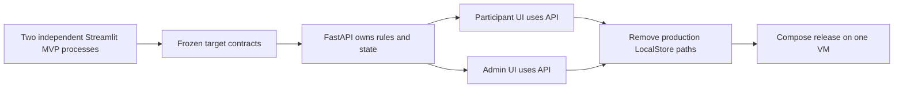
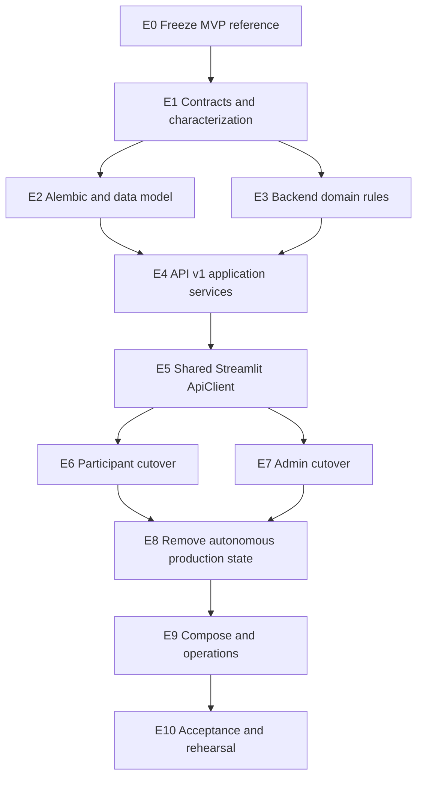
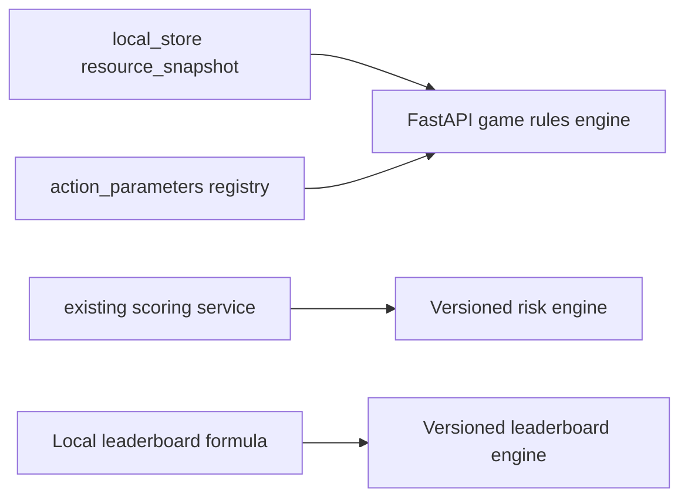
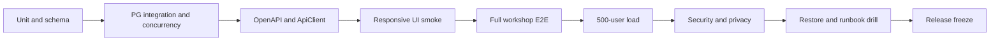

# План миграции к Streamlit–FastAPI–PostgreSQL

## 1. Исходная точка

Текущий MVP — референс UX, а не production data architecture.

| Область | Текущее состояние |
| --- | --- |
| Participant UI | `streamlit_apps/participant_app.py`, данные через `LocalStore` процесса |
| Admin UI | Отдельный process; demo players/rounds в собственной `session_state`, часть старого API |
| Синхронизация UI | Participant и admin in-memory data намеренно независимы |
| Action parameters | Динамические schema/effects в `backend/app/domain/action_parameters.py` |
| Resources | Balance, energy, time, trust, fees, quotas и leaderboard logic в `local_store.py` |
| Scoring | Объяснимый scoring service уже существует, но target persistence/versioning неполны |
| FastAPI | Auth/cards/rounds/scenarios/admin routes без полного `/api/v1` target contract |
| PostgreSQL | Базовые SQLAlchemy entities; нет полной target schema/Alembic workflow |

Миграция сохраняет поведение интерфейса, но меняет владельца состояния. Длительный dual
write между LocalStore и PostgreSQL запрещен.

## 2. Целевой результат



После миграции:

- оба Streamlit-приложения используют один `/api/v1`;
- PostgreSQL — единственный persistent source of truth;
- local preview не влияет на канонический result;
- full player chain/block/adjustment/audit работают через API;
- production build не содержит скрытого demo login/fallback;
- current MVP остается в Git history/screenshots/characterization tests как design ref.

## 3. Стратегия перехода

Используется **contract-first strangler migration**:

1. зафиксировать поведение MVP;
2. построить backend target параллельно без dual write;
3. переключить participant flow целиком на API;
4. переключить admin flow целиком на API;
5. удалить production branches LocalStore/demo;
6. пройти end-to-end/load/security/rehearsal.

На промежуточных dev-ветках допустим явный `demo` режим для визуальной разработки, но
он не выбирается автоматически при ошибке API и не входит в production config.

## 4. Карта зависимостей этапов



## 5. E0: зафиксировать MVP как UI-референс

### Работы

- Зафиксировать responsive screenshots participant/admin в light/dark theme.
- Записать основные flows: login, builder, dynamic fields, resources, result,
  leaderboard, player detail, block, adjustment.
- Зафиксировать card/action parameter catalog и русские labels.
- Создать characterization tests текущих resource/scoring formulas.
- Отделить «UX, который сохраняем» от «in-memory mechanics, которые удаляем».

### Критерий выхода

Существует проверяемая baseline-матрица экранов и доменных примеров. Миграция backend не
требует держать LocalStore ради сравнения.

## 6. E1: зафиксировать contracts

### Работы

- Утвердить документы `data-model.md`, `api.md`, `streamlit-fastapi.md`.
- Создать Pydantic DTO для каждого endpoint с `extra="forbid"`.
- Зафиксировать enum statuses и error codes.
- Зафиксировать revision/mutation/idempotency semantics.
- Зафиксировать game/scoring/leaderboard version contracts.
- Сопоставить каждый use case с endpoint и DTO.

### Критерий выхода

- OpenAPI содержит весь `/api/v1` target surface.
- JSON examples проходят schema tests.
- Participant/admin teams могут реализовывать клиент без чтения ORM.

## 7. E2: Alembic и target schema

### Работы

1. Инициализировать Alembic.
2. Снять baseline существующей dev schema без `create_all` в production startup.
3. Расширить `users`: block fields, token version, auth lockout.
4. Расширить `action_cards`: versions, resources, limits, parameter schema.
5. Добавить immutable `rounds.game_config` и config revision/timestamps.
6. Добавить scenario steps/resource snapshot/revision/mutation ID/hash.
7. Расширить scoring result на base risk/resource/game/explanation versions.
8. Добавить leaderboard adjustments и audit events.
9. Создать constraints/indexes из `data-model.md`.
10. Создать idempotent seed card versions и admin bootstrap command.

### Миграция существующих dev-данных

- Existing cards получают `version=1` и explicit defaults.
- Existing rounds, которые нельзя однозначно snapshot-ить, помечаются test-only и не
  используются для acceptance.
- Existing scenario steps преобразуются через parser, а не string manipulation.
- Необратимые данные сначала экспортируются/проверяются на dev copy.

### Критерий выхода

- Empty PostgreSQL 16: `alembic upgrade head` succeeds.
- Existing dev copy upgrades without silent data loss.
- Seed повторяется без duplicate.
- PG integration tests подтверждают unique/partial/lock behavior.

## 8. E3: перенести domain rules из MVP

### Источники



### Работы

- Перенести balance/energy/time/trust/fee/quota calculation в pure backend domain.
- Сохранить action-specific parameter schemas и effects, добавив version registry.
- Разделить validation, resource calculation, risk scoring и leaderboard formula.
- Перевести money/weights на Decimal.
- Удалить зависимости domain functions от Streamlit/session state.
- Сделать единый вход для draft preview, submit revalidation и scoring.
- Добавить deterministic explanation/tie-break rules.

### Критерий выхода

- Все characterization examples MVP проходят backend unit tests.
- FastAPI domain package не импортирует Streamlit.
- Participant UI может оставить только optional preview adapter.
- Версия ruleset однозначно воспроизводит result.

## 9. E4: реализовать application services и `/api/v1`

### Порядок

1. Request ID/error middleware и health.
2. Auth/me/token version/block checks.
3. Public round/cards endpoints.
4. Scenario GET/PUT/submit с revisions.
5. Result/public leaderboard.
6. Admin round create/update/activate/stats/score.
7. Participant list/detail/full chain.
8. Block/unblock.
9. Leaderboard adjustment/clear.
10. Audit events.

### Транзакции

- Application service владеет unit of work.
- Repository не commit-ит самовольно.
- Block/adjustment/state transition + audit event — одна transaction.
- Scoring — один atomic transaction, пока benchmark <10 с.
- Locks используют bounded timeout/NOWAIT и domain `409`.

### Критерий выхода

- API integration/concurrency suite проходит на PostgreSQL.
- Participant A не читает B.
- Score failure не публикует partial results.
- Старые unversioned endpoints помечены deprecated и не используются target UI.

## 10. E5: общий Streamlit ApiClient

### Работы

- Создать transport через `st.cache_resource` без JWT.
- Создать typed methods для всех participant/admin DTO.
- Добавить request ID, timeouts, retry policy и error mapping.
- Добавить `st.cache_data` только active round/cards.
- Реализовать command guard/pending state для rerun.
- Реализовать read-back после timeout submit/activate/score.
- Тестировать client с fake transport, не запуская Streamlit server.

### Критерий выхода

- Два simulated users не смешивают headers/cache.
- Rerun без event не делает write.
- PUT retry сохраняет mutation ID.
- API errors отображаются по stable code.

## 11. E6: переключить Participant UI

### Вертикальные slices

1. Register/login/me.
2. Active round и immutable card forms.
3. Initial scenario hydration.
4. Add/edit/delete/reorder + PUT revision.
5. Conflict/timeout/blocked UX.
6. Submit/resubmit.
7. Result/explanation.
8. Public leaderboard/current rank.

### Особенности Streamlit

- Stable widget key: `step_id + field_key`.
- Action details рендерятся по card spec.
- Формы группируют изменения; не save на каждый keystroke.
- Local preview помечен как draft и заменяется server snapshot после PUT.
- Dirty local copy не теряется при временном 503 в той же session.

### Критерий выхода

- Restart participant Streamlit + relogin восстанавливает draft.
- Все writes идут в `/api/v1`.
- UI не импортирует LocalStore/repository/scoring truth.
- Responsive light/dark baseline не регрессирует.

## 12. E7: переключить Admin UI

### Вертикальные slices

1. Admin login/me и round list.
2. Full draft config/card catalog/revisions.
3. Activate and cache invalidation.
4. Monitoring/stats.
5. Participant list/filter/detail/full chain.
6. Block/unblock with confirmation/reason.
7. Score command/read-back.
8. Base/effective leaderboard.
9. Adjustment/clear/audit trail.

### Критерий выхода

- Admin проводит полный round без terminal/DB.
- Выбирает любого participant и видит его full chain.
- Block старого JWT подтвержден интеграционным тестом.
- Adjustment не меняет base result.
- API mode не использует demo session data.

## 13. E8: удалить автономное production-состояние

### Удалить/запретить

- `LocalStore` как runtime storage;
- `@st.cache_resource` над game store;
- локальную регистрацию/пароли/scenarios/results;
- прямой вызов canonical scoring из Streamlit;
- auto/demo fallback при API error;
- production «Открыть демо-панель» без отдельного dev profile;
- old unversioned client paths после compatibility window.

Demo fixtures можно сохранить только в test/dev module, недоступном production image
или отключенном immutable production setting.

### Проверка

```powershell
rg -n "LocalStore|get_store|score_all|admin_demo" streamlit_apps backend
```

Каждое совпадение классифицируется: test fixture/dev-only или дефект. Простое наличие
слова не является автоматическим failure, но production import graph должен быть чистым.

## 14. E9: контейнеризация и эксплуатация

### Работы

- Application Dockerfile и pinned images.
- Compose: proxy, two UI, API, DB, migration job.
- Edge/app/data networks и закрытые ports.
- TLS/base paths/WebSocket.
- Health/live/ready.
- Structured logging/metrics/request correlation.
- Persistent volume, encrypted backup и restore drill.
- Production secrets/bootstrap admin.
- Runbook rehearsal.

### Критерий выхода

Чистая VM разворачивается по `deployment.md`; извне доступны только UI routes, а
operator проходит failure drills из `operations.md`.

## 15. E10: приемка и репетиция



Финальная репетиция повторяет все 45 минут с отдельными людьми в ролях speaker/admin/
operator. Технически успешный endpoint без удобного управления мероприятием не считается
приемкой.

## 16. Data cutover

Production v1 рекомендуется начать на чистой БД мероприятия:

1. применить migrations;
2. seed immutable cards;
3. bootstrap admin;
4. создать/проверить draft round;
5. сделать baseline backup;
6. открыть registration.

In-memory participant/admin MVP data не переносится: процессы независимы, данные
демонстрационные и не имеют надежных cross-process IDs. Нужные сценарии переносятся как
versioned seed fixtures без PII.

## 17. Rollback по этапам

| До точки | Допустимый rollback |
| --- | --- |
| До participant cutover | Вернуться к MVP только в dev/demo, не для production data |
| После participant API cutover | Предыдущий API-compatible image + та же PostgreSQL |
| После admin cutover | Предыдущий full app release, сохраняющий `/api/v1` contract |
| После schema expand | App rollback без schema downgrade |
| После destructive contract | Только завершенный contract phase/verified backup restore |

После production cutover LocalStore не является rollback path. Schema изменения
выполняются expand/contract минимум в два совместимых release при destructive change.

## 18. Риски миграции

| Риск | Мера |
| --- | --- |
| Preview и server rules расходятся | Shared pure rule package или contract fixtures; API всегда canonical |
| Dynamic UI fields не совпадают с Pydantic | Card spec/schema contract tests |
| Rerun создает duplicate command | Callback/form + pending command + mutation/idempotency keys |
| Два окна теряют изменения | Expected revision conflict |
| Старый admin client вызывает old paths | API client integration + remove compatibility on schedule |
| Float меняет scores | Decimal migration + golden tests/version bump |
| Block не отзывает JWT | DB state + token version per request |
| Adjustment разрушает model result | Separate overlay + audit |
| Score transaction слишком длинная | Benchmark gate; async architecture trigger |
| Demo bypass попадает в production | Build/profile test и startup assertion |

## 19. Definition of done миграции

1. Оба Streamlit UI используют только target `/api/v1`.
2. PostgreSQL переживает restart UI/API без потери state.
3. Все игровые решения принимает FastAPI.
4. Cards/action details/resources/scoring/leaderboard versioned.
5. Full admin participant workflow реализован и audited.
6. No production LocalStore/demo fallback.
7. PG concurrency/atomic scoring tests проходят.
8. 500-user load и responsive light/dark UI приняты.
9. External API/DB закрыты, log privacy проверена.
10. Backup/restore и operator runbook отрепетированы.
