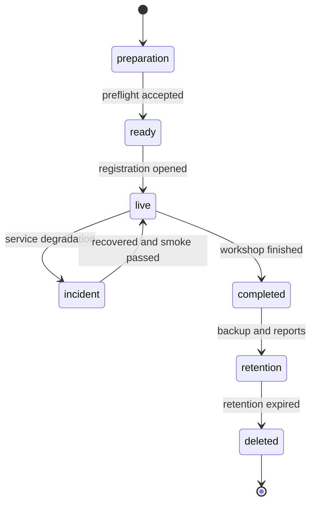
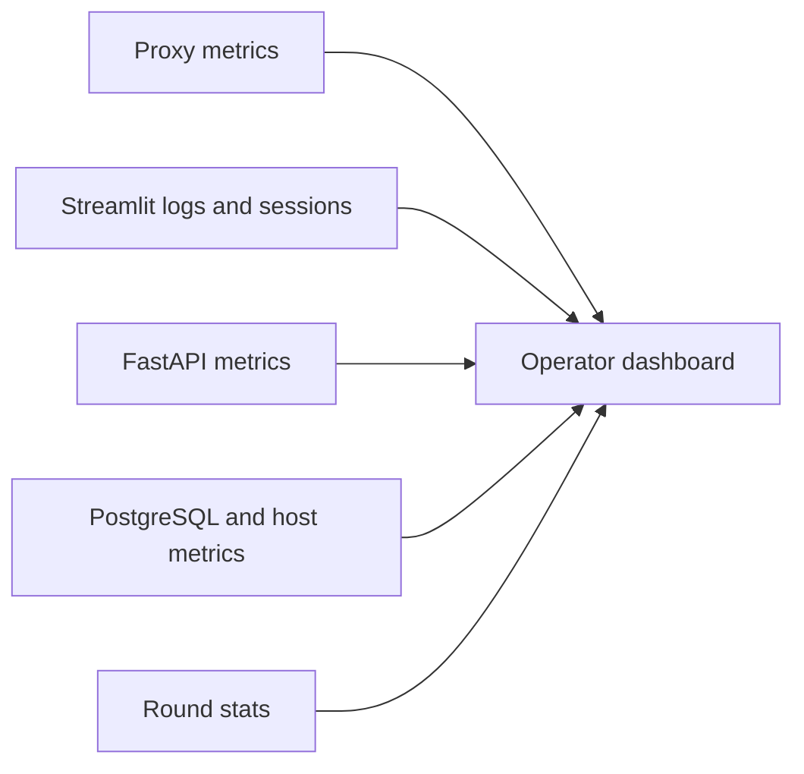
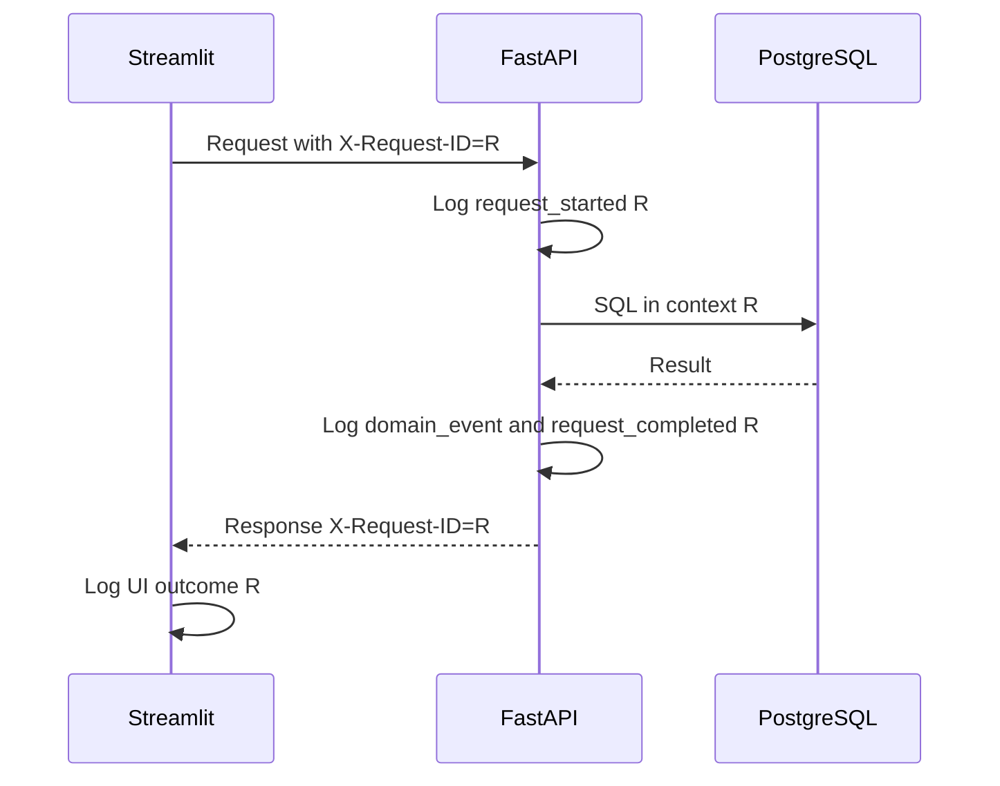
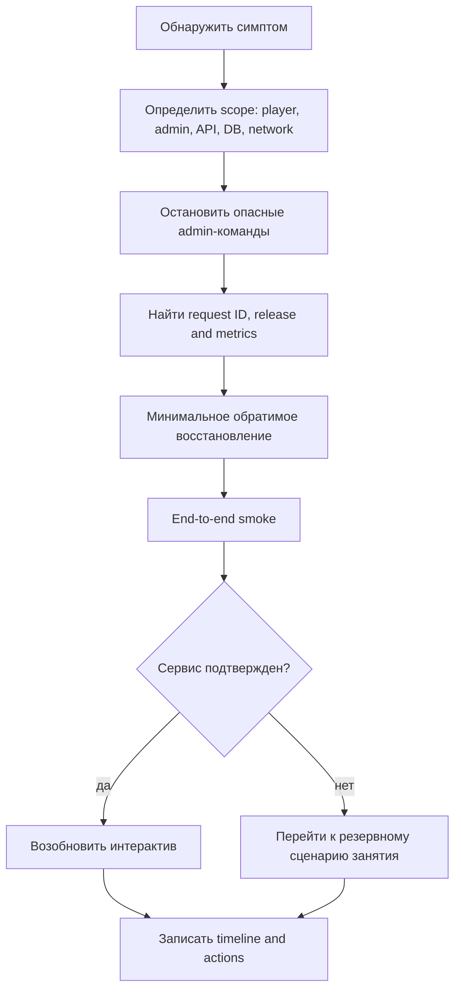

# Эксплуатация и runbook

## 1. Роли на мероприятии

| Роль | Ответственность | Не должна делать |
| --- | --- | --- |
| Оператор | VM, proxy, containers, DB, logs, backup, incident response | Менять leaderboard без admin role/process |
| Администратор | Round lifecycle, participants, score, adjustments | Работать напрямую с SQL |
| Спикер | Сценарий мастер-класса и разбор | Диагностировать production terminal на проекторе |
| Владелец данных | Retention/export/deletion decisions | Передавать PII без основания |

Контакты, доступы и escalation chain хранятся вне публичного репозитория. Назначается
заместитель оператора или явно принимается риск единственной точки поддержки.

## 2. Operational state model



## 3. Проверка за 7 дней

- Release candidate собран из immutable images.
- Все readiness gates из `testing-strategy.md` пройдены.
- Load test на 500 virtual participants выполнен на target-like VM.
- DNS/TLS/short URL/QR проверены.
- Wi-Fi площадки проверен на WebSocket и общий NAT.
- Production admin создан, доступ протестирован и передан безопасно.
- Ruleset/card snapshots проверены методистом.
- Backup restore drill выполнен.
- Retention owner/date утверждены.
- Плановая разработка заморожена либо изменения требуют нового полного rehearsal.

## 4. Проверка за 24 часа

### Infrastructure

- DNS и certificate корректны из внешней сети.
- Публичны только 80/443; 8000/5432 и OpenAPI закрыты.
- VM time sync, CPU/RAM/disk headroom достаточны.
- Все containers имеют ожидаемые image digests.
- DB volume подключен, PostgreSQL logs чисты от критичных ошибок.
- Alembic head и API release совместимы.
- Backup создан, encrypted, checksum записан.

### Application

- `/health/live` и `/health/ready` — 200.
- Participant/admin Streamlit health — healthy.
- Внешний login работает на обоих routes.
- Тестовый round прошел create -> activate -> draft -> submit -> score -> result.
- Admin видит participant chain, block/unblock и adjustment audit.
- Public leaderboard не раскрывает PII.
- Log scan не обнаруживает email/session ID/session hash/password/steps.

## 5. Проверка за 30 минут

1. Сверить системное время и свободный disk.
2. Проверить `docker compose ps`, health и image tags.
3. Проверить certificate expiry и WebSocket с устройства площадки.
4. Войти в admin UI; открыть или создать production draft round (можно из пресета) и
   проверить каждый параметр в структурном редакторе. Раунд остается в `draft`: до
   команды «Начать раунд» участники видят экран ожидания.
5. Зарегистрировать одного test participant, сохранить и submit scenario.
6. На отдельном test round или rehearsal environment проверить score/result/leaderboard.
7. Удалить test data либо не смешивать его с production ranking.
8. Сделать pre-event backup по policy.
9. Открыть logs/metrics dashboard на операторском экране.
10. Зафиксировать «change freeze» до завершения мастер-класса.

## 5.1. Управление раундом во время мероприятия

| Команда | Когда | Что происходит |
| --- | --- | --- |
| «Начать раунд» | Все на месте, конфигурация проверена | `draft -> active`, конструктор открывается участникам |
| «Остановить раунд» | Перерыв, инцидент, конец игры | `active -> stopped`; сервер отклоняет записи, ничего не удаляется |
| «Перезапустить раунд» | Нужен чистый прогон с теми же настройками | Создается новый раунд `draft` со ссылкой на прежний; история остается |
| «Запустить скоринг» | Все отправили сценарии | Показывает число отправленных и исключенных черновиков, требует подтверждения |

Остановка и перезапуск требуют явного подтверждения в интерфейсе; повторное нажатие не
создает второй раунд. Все команды попадают в audit trail, поэтому после мероприятия
видно, кто и когда останавливал игру.

Если участник сообщает, что «конструктор не открывается», сначала смотрят статус раунда:
`draft` и `stopped` — это ожидаемое поведение, а не сбой.

## 6. Dashboard мероприятия



Минимальный dashboard:

| Сигнал | Разрез | Внимание | Критично |
| --- | --- | ---: | ---: |
| API 5xx rate | 2 min | > 1% | > 5% |
| API p95 ordinary latency | 2 min | > 500 мс | > 2 с |
| API 401/429 | auth routes | Резкий рост | Массовый login failure |
| DB pool waiting | worker | > 0 устойчиво | Pool timeout |
| DB connections | total | > 70% | > 85% |
| CPU | VM, 5 min | > 80% | > 95% |
| RAM | VM | > 80% | > 90%/swap pressure |
| Disk | volume | > 75% | > 85% |
| Active Streamlit sessions | participant/admin | Отклонение от аудитории | Резкий обвал |
| Submitted count | round | Ниже ожидаемого к deadline | Не растет при активной аудитории |
| Scoring duration | round | > 10 с | > 30 с/timeout |
| Submitted vs scored | completed round | Любое различие | Любое различие |

Thresholds калибруются rehearsal. Alert без оператора и инструкции не считается
полезной наблюдаемостью.

## 7. Structured logging

### Обязательные поля

```json
{
  "timestamp": "2026-10-05T08:17:02.413Z",
  "level": "INFO",
  "service": "api",
  "event": "scenario_saved",
  "request_id": "01JAML7Q5SH2RZ8JYK6M4V3Q9T",
  "route": "/api/v1/rounds/{round_id}/scenario",
  "method": "PUT",
  "status_code": 200,
  "latency_ms": 42,
  "user_id": 57,
  "round_id": 12,
  "scenario_id": 91,
  "revision": 5
}
```

Events:

- API request completed/failed;
- auth success/failure without email;
- scenario saved/submitted/conflict;
- round created/updated/activated/scored;
- participant blocked/unblocked;
- leaderboard adjusted/cleared;
- readiness transition;
- backup/restore start/result in operator log.

Не логируются email, display name, password/hash, raw session ID/cookie/session hash/`X-Session-ID`, request body,
full scenario, action details, explanation, DSN и raw idempotency key.

Гарантия обеспечивается allowlist'ом полей в `core/logging.py`, а не дисциплиной вызывающих:
поле вне списка отбрасывается, и в строку попадает только его *имя*, в `dropped_fields`.
`route` — шаблон пути (`/api/v1/rounds/{round_id}/scenario`), не полный URL: query string
может нести значения, которых в логе быть не должно. `/health/live` и `/health/ready`
не логируются — их опрашивает healthcheck каждые десять секунд; логируются только
переходы готовности (`readiness_changed`).

Обычный поток одного запроса: `request_started` → доменное событие → `request_completed`.
Отказ, принятый сервисом осознанно (409, 403, 422), — это `request_refused` с `reason_code`;
необработанное исключение — `request_failed` с traceback.

## 8. Request correlation



Оператор ищет инцидент сначала по request ID, затем по round/scenario internal IDs. UI
показывает request ID в технической детали ошибки.

## 9. Health endpoints

```bash
curl --fail http://api:8000/health/live
curl --fail http://api:8000/health/ready
```

### Live

Проверяет только процесс. Failed live допускает restart container.

### Ready

Проверяет DB, Alembic и ruleset availability. Failed ready означает «не направлять
прикладные запросы», но автоматический restart не исправит недоступную DB и может
усугубить ситуацию.

### Synthetic UI check

Из внешней сети проверяются HTTPS status, Streamlit WebSocket/bootstrap и входная
страница под правильным base path. Простой `200` proxy недостаточен.

## 10. Общий алгоритм инцидента



Не выполнять несколько изменений одновременно без гипотезы: иначе невозможно понять,
что восстановило систему.

## 11. Runbook: participant UI недоступен

1. Проверить `/play`, certificate и WebSocket из внешнего устройства.
2. Сравнить доступность `/admin`: определить scope proxy или отдельного UI.
3. Проверить proxy route/log и health `participant-ui`.
4. Проверить CPU/RAM и active sessions.
5. Если container unhealthy, перезапустить только participant UI.
6. Проверить API ready до приглашения к повторному входу.
7. Выполнить login -> GET scenario smoke.
8. Сообщить участникам повторно войти; server draft восстанавливается из PG.

Нельзя переключать participant на LocalStore.

## 12. Runbook: admin UI недоступен

1. Убедиться, продолжает ли работать participant UI.
2. Проверить route `/admin`, WebSocket и admin container health.
3. Перезапустить только `admin-ui`, не затрагивая API/DB.
4. После входа сначала GET round/status/stats.
5. Не повторять score до чтения canonical state.
6. Проверить выбранный round/player после потери session state.

## 13. Runbook: reverse proxy/TLS

1. Проверить cloud firewall, DNS resolution и certificate expiry.
2. Проверить proxy process/config syntax/logs.
3. Проверить внутренний health обоих Streamlit containers.
4. При certificate issue использовать утвержденный renewal/rollback, не отключать HTTPS
   для публичного мероприятия.
5. После восстановления проверить WebSocket и оба base paths из внешней сети.

## 14. Runbook: FastAPI недоступен

1. Проверить `/health/live`, затем `/health/ready`.
2. Найти crash/5xx по release version и request ID.
3. Проверить DB health/pool/connections и последнюю migration.
4. При process crash перезапустить API и дождаться ready.
5. Если failure после release, вернуть предыдущий compatible image.
6. Выполнить auth -> active round -> scenario GET/PUT smoke.
7. UI local dirty copy не считается сохраненной до success response.

## 15. Runbook: PostgreSQL недоступен

1. Остановить score/activate/block/adjustment и не обещать сохранение participant PUT.
2. Проверить container, `pg_isready`, disk, volume mount, memory pressure и logs.
3. Проверить connection exhaustion/long queries отдельно от process outage.
4. Не перезапускать DB вслепую при полном disk.
5. После восстановления проверить `SELECT 1`, Alembic head и API ready.
6. Проверить active round invariant и последние scenario revisions.
7. При corruption остановить writes и восстановить verified backup.

## 16. Runbook: DB pool исчерпан

1. Проверить active/waiting pool metrics по API worker.
2. Проверить PostgreSQL sessions и long-running transaction без вывода query body с PII.
3. Найти request IDs/route templates, удерживающие connections.
4. Не повышать `max_connections` без оценки RAM и pool multiplication.
5. Завершить только точно идентифицированную зависшую backend session с approval
   оператора.
6. Устранить N+1/timeout/release issue; затем smoke и наблюдение.

## 17. Runbook: scoring timeout или ошибка

### UI timeout без подтвержденного ответа

1. Не нажимать score повторно.
2. GET round и stats.
3. Если `completed`, сверить submitted/scored и открыть leaderboard.
4. Если `active`, найти transaction/error по request ID; предыдущий run не commit.
5. Если row lock занят, дождаться bounded timeout и проверить снова.
6. Повторить команду только при подтвержденном active и устраненной причине.

### Backend exception

1. Проверить, что transaction rollback завершен.
2. Round должен быть active, scenarios submitted, новые results отсутствуют.
3. Найти failing scenario только по internal ID; не выводить chain в общий log.
4. Устранить data/ruleset issue либо исключить release с rollback.
5. Повторить один score и сверить counts/hashes.

### Действительно зависшая transaction

1. Идентифицировать PostgreSQL PID, user, transaction age и request ID.
2. Убедиться, что это scoring, а не migration/backup.
3. Завершить конкретную backend session.
4. PostgreSQL rollback должен вернуть round active.
5. Перезапустить API только если process не восстановился.

## 18. Runbook: всплеск auth/session errors

1. Сравнить 401, 429 и WebSocket reconnect rate.
2. Проверить clock synchronization, session expiry/revoke distribution и lookup latency.
3. Проверить, не попала ли аудитория под слишком жесткий common-NAT limit.
4. Не отключать password/security controls полностью.
5. Изменять proxy burst только по утвержденному диапазону и записать время.
6. Проверить generic error response и отсутствие email в logs.

## 19. Runbook: неверная блокировка/корректировка

### Block

1. Открыть participant detail и audit event.
2. Проверить actor/reason/request ID.
3. Выполнить unblock через UI; прямой SQL запрещен.
4. Participant входит повторно после revoke/expiry; проверить причину в sanitized session metrics.

### Leaderboard adjustment

1. Сравнить base/effective и adjustment revision.
2. Проверить reason/actor в audit.
3. Clear overlay через endpoint; base result восстановится.
4. Проверить пересчет public rank.
5. Не изменять `scoring_results` SQL-командой.

## 20. Резервный сценарий занятия

Автоматического offline/LocalStore fallback нет. Если end-to-end recovery не
укладывается в согласованное окно:

1. спикер продолжает теоретическую часть;
2. использует заранее подготовленные обезличенные screenshots/scenarios;
3. объясняет scoring и ограничения модели на fixed examples;
4. оператор восстанавливает штатную связку отдельно;
5. интерактив возобновляется только после smoke test;
6. несохраненные local drafts и незавершенный round не объявляются результатами.

Резервные материалы не содержат production email или chains участников.

### Очистка server-side sessions

- Ежедневно считать expired/revoked rows старше `SESSION_RETENTION_DAYS` в dry-run.
- Удалять батчами с bounded transaction и наблюдать lock/latency.
- Никогда не выводить `session_id_hash` или raw ID в отчет cleanup.
- Перед мероприятием убедиться, что число active sessions согласуется с ожидаемой
  аудиторией и отсутствуют сессии прошлых мероприятий.

## 21. После мероприятия

### Технический отчет

- release/image/config versions;
- registrations, active/blocked, drafts/submitted/scored;
- ordinary p50/p95/p99 и error rate;
- scoring duration и counts;
- peak CPU/RAM/disk/DB connections/sessions;
- incidents, request IDs, manual actions и recovery time;
- admin adjustments count без PII.

### Данные

1. Сделать final backup только если он нужен policy.
2. Выгрузить только утвержденные обезличенные aggregates.
3. Назначить deletion date и owner.
4. Удалить participant data и backup по retention.
5. Проверить отсутствие public access/active routes.
6. Зафиксировать completion без хранения лишней PII.

## 22. Короткая операторская карточка

```text
1. Protect data: stop admin mutations if state is unclear.
2. Scope: proxy, one UI, API, DB, or venue network.
3. Correlate: request_id, round_id, release, metrics.
4. Recover minimally: restart only failed stateless service when justified.
5. Never use LocalStore or direct SQL as fallback.
6. Smoke: login -> round -> scenario -> expected read/write.
7. Resume only after canonical state is confirmed.
8. Record timeline and actions.
```
