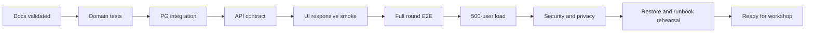

# Матрица готовности целевой архитектуры

**Актуализировано:** 2026-07-17; раздел 3.1 добавлен 2026-08-29.

Матрица отдельно показывает документацию, текущую реализацию и тестовое подтверждение.
Описание target contract не означает, что feature уже реализована.

Разделы 3–6 отражают состояние на дату в заголовке и не перепроверялись целиком при
последнем изменении. Раздел 3.1 перечисляет то, что было добавлено и проверено позже, с
указанием конкретных наборов тестов.

## 1. Обозначения

| Статус | Значение |
| --- | --- |
| `Готово` | Реализовано и имеет достаточную проверку для текущего scope |
| `MVP` | Есть только в автономном UI/demo, не соответствует target data architecture |
| `Частично` | Основа существует, target contract неполон |
| `Изменить` | Существующий код должен быть переработан |
| `Добавить` | Обязательной реализации пока нет |
| `Проверить` | Реализация может существовать, но нет достаточного evidence |

## 2. Документационный baseline

| Область | Документ | Статус описания | Проверяемый результат |
| --- | --- | --- | --- |
| System/container/components | `architecture.md` | Готово | Границы Streamlit/FastAPI/PG и NFR |
| UI/API protocol | `streamlit-fastapi.md` | Готово | Rerun, state, revision, cache, timeout, errors |
| PostgreSQL model | `data-model.md` | Готово | ER, JSONB, constraints, indexes, retention |
| HTTP contracts | `api.md` | Готово | Endpoints, DTO, examples, errors, RBAC |
| Scoring/ranking | `scoring-and-leaderboard.md` | Готово | Risk/resources/game score/explanation/overlay |
| Use cases | `workshop-flow.md` | Готово | Round/scenario states и 45-minute flow |
| Security | `security.md` | Готово | Threats, auth, PII, admin controls |
| Deployment | `deployment.md` | Готово | One VM, networks, TLS, health, backup |
| Operations | `operations.md` | Готово | Metrics, preflight, incident runbooks |
| Migration | `migration-plan.md` | Готово | Staged cutover без dual-write/fallback |
| Testing | `testing-strategy.md` | Готово | Unit -> load/security/rehearsal gates |
| Decisions | `decisions.md` | Готово | ADR-lite и review triggers |

`Готово` здесь означает полноту target specification. Синтаксис/links/Mermaid повторно
проверяются при каждом docs change.

## 3. Уже реализовано в текущем коде

| Capability | Документация | Реализация | Тесты/evidence | Ограничение target |
| --- | --- | --- | --- | --- |
| Participant Streamlit UI | Описано | MVP | Ручной UI smoke | Использует `LocalStore` процесса |
| Responsive light/dark styling | Описано | MVP | Требуется visual matrix | Нужна автоматическая responsive проверка |
| Dynamic action-specific forms | Описано | MVP/частично backend domain | `test_action_parameters.py` | Card specs еще не приходят из round API/PG |
| Balance/energy/time/trust/fees/quotas | Описано | MVP | `test_game_resources.py` | Canonical rules находятся в LocalStore |
| Risk factors/protective/sequence explanation | Описано | Частично | `test_scoring.py` | Нет snapshot/versioned persisted result |
| Composite game score/leaderboard | Описано | MVP | Resource/leaderboard unit tests | Нет API/PG/public projection |
| Admin player detail/full chain | Описано | MVP demo | `test_action_parameters.py` частично | Только admin session demo data |
| Admin block/unblock | Описано | MVP demo | Unit test demo mutations | Не отзывает server-side sessions и не пишет audit в PG |
| Admin leaderboard override | Описано | MVP demo | Unit test demo mutations | Меняет in-memory projection, нет base/overlay persistence |
| FastAPI application | Описано | Частично | Smoke/unit only | Старые unversioned routes и упрощенные contracts |
| SQLAlchemy/PostgreSQL entities | Описано | Частично | Требуется PG integration | Schema не соответствует target; нет Alembic |
| Auth bcrypt/cookie/sessions/roles | Описано | Нет | Требуется auth+browser suite | Нет `sessions`, cookie bootstrap и revoke semantics |
| Round create/activate/score/stats/board | Описано | Частично | Требуется integration | Нет snapshot/revisions/locks/atomic target guarantees |
| Basic scenario submit/read/result | Описано | Частично | Требуется integration | Нет GET/PUT draft/revision/server preview |

## 3.1. Вторая итерация: реализовано и проверено

| Capability | Реализация | Тесты/evidence |
| --- | --- | --- |
| Политика раунда: 6 операций по умолчанию, не более двух видимых параметров | `domain/round_policy.py`, `domain/catalog.py` | `tests/unit/test_round_policy.py` |
| Закрепленные значения скрытых параметров и их валидация | `services/scenario_service.py`, `domain/rules.py` | `tests/unit/test_round_policy.py`, `tests/integration/test_scenario_lifecycle.py` |
| Совместимость с legacy-конфигурацией без блока `operations` | `domain/round_policy.py` | `tests/unit/` (фикстура legacy `game_config`) |
| Мгновенный пересчет ресурсов до сохранения | `POST /scenario/preview`, `ui/participant/app.py` | `tests/integration/test_scenario_versions.py`, `tests/ui/test_selenium_flows.py` |
| Append-only история черновиков и восстановление версии | `db/models/scenario_versions.py`, `services/scenario_versions.py` | `tests/integration/test_scenario_versions.py`, `tests/ui/test_selenium_flows.py` |
| Полный жизненный цикл раунда со `stopped` и безопасным перезапуском | `api/routers/admin/rounds.py` | `tests/integration/test_round_lifecycle_and_presets.py`, `tests/e2e/test_full_round.py` |
| Пресеты настроек раунда | `api/routers/admin/presets.py`, `ui/admin/config_editor.py` | `tests/integration/test_round_lifecycle_and_presets.py`, `tests/ui/test_playwright_admin.py` |
| Структурный редактор всех параметров раунда | `ui/admin/config_editor.py` | `tests/ui/test_playwright_admin.py` |
| IP/User-Agent/Accept-Language и trusted proxies | `core/request_meta.py`, `ui/shared/browser_meta.py` | `tests/integration/test_sessions_and_privacy.py`, `tests/ui/test_selenium_auth.py` |
| Скрытые ники в лидерборде до явного раскрытия | `api/routers/rounds.py`, `ui/participant/app.py` | `tests/integration/test_sessions_and_privacy.py`, `tests/ui/test_selenium_flows.py` |
| Полный набор параметров шага в admin-панели | `domain/presentation.py`, `api/routers/admin/participants.py` | `tests/ui/test_playwright_admin.py`, `tests/ui/test_selenium_flows.py` |
| Темная и светлая тема с сохранением выбора | `ui/shared/theme.py` | `tests/ui/test_selenium_auth.py`, `tests/ui/test_selenium_flows.py` |
| Alembic-миграция `c73f5a1e9d04` | `migrations/versions/` | `tests/integration/test_migrations_and_seed.py`, апгрейд compose-базы с данными |

## 4. Требуется изменить

| Изменение | Target | Кодовые области | Обязательный test/evidence | Статус |
| --- | --- | --- | --- | --- |
| API versioning | Все app routes под `/api/v1` | FastAPI routers, ApiClient | OpenAPI/contract suite | Изменить |
| Shared DTO boundary | Pydantic/OpenAPI без ORM imports в UI | schemas/client package | Import/consumer contract tests | Изменить |
| Action card model | Immutable version + costs/limits/field spec | models/schemas/seed | Schema + card registry tests | Изменить |
| Round config | Full immutable snapshot + config revision/hash | Round model/service | Activate/update conflict tests | Изменить |
| Game rules owner | Только backend domain | LocalStore -> rules engine | Golden/characterization suite | Изменить |
| Decimal arithmetic | Money/weights/results без float drift | Domain/models/schemas | Boundary/rounding tests | Изменить |
| Scenario draft | GET/PUT/submit + revision/mutation ID | Scenario router/service/model | Retry/two-window tests | Изменить |
| Participant UI data path | Только ApiClient | participant app | Restart/relogin E2E | Изменить |
| Admin UI data path | Только ApiClient | admin app | Full admin round E2E | Изменить |
| Scoring transaction | Row lock NOWAIT + atomic batch | Round/scoring services | Mid-batch rollback test | Изменить |
| Persisted scoring | Base risk/resource/game + versions/explanation | Result model/repository | Reproducibility tests | Изменить |
| Leaderboard | Public/admin projections + stable rank | Query service/API | Privacy/tie-break tests | Изменить |
| Block | DB state, access revision, revoke sessions, audit | User/auth/admin service | Session revoke test | Изменить |
| Adjustment | Separate overlay, not base overwrite | New model/service/API | Base immutability/conflict test | Изменить |
| Streamlit cache | HTTP transport + round/cards only | ApiClient/apps | Cross-session cache tests | Изменить |
| Error handling | Unified envelope/request ID/read-back | Middleware/ApiClient | 4xx/5xx/timeout tests | Изменить |

## 5. Требуется добавить

| Компонент | Назначение | Acceptance evidence | Статус |
| --- | --- | --- | --- |
| Alembic | Управляемая schema evolution | Empty + existing DB upgrade to head | Добавить |
| Target migrations/indexes | Constraints/locks/query profile | PostgreSQL 16 integration | Добавить |
| `leaderboard_adjustments` | Auditable effective values | CRUD/revision/base immutability | Добавить |
| `audit_events` | Append-only admin/state history | Same-transaction tests | Добавить |
| Request ID middleware | UI/API/log correlation | Header/error/log assertions | Добавить |
| Unified exception handlers | Stable error envelope | Contract tests incl. 422/500 | Добавить |
| `/health/live` и `/health/ready` | Process/dependency state | DB/migration failure tests | Добавить |
| Full participant endpoints | Active/history/cards/draft/submit/result/leaderboard | Participant E2E | Добавить |
| Full admin participant API | List/detail/chain/access | Admin E2E + ID/RBAC | Добавить |
| Adjustment/audit API | Overlay management and history | Admin E2E | Добавить |
| Dockerfile/release image | Reproducible app runtime | Clean image build/smoke | Добавить |
| Production Compose | Proxy, UIs, API, DB, migration, networks | External port/path test | Добавить |
| Reverse proxy/TLS | HTTPS paths and WebSocket | External synthetic check | Добавить |
| Structured metrics/logging | Event observability without PII | Dashboard + automated log scan | Добавить |
| Backup/restore automation | RPO/RTO evidence | Encrypted restore drill | Добавить |
| UI visual tests | Responsive light/dark | Playwright screenshot matrix | Добавить |
| PG concurrency tests | Revisions/locks/atomicity | Real parallel connections | Добавить |
| 500-user load profile | Capacity acceptance | Signed load report | Добавить |
| Security test suite | RBAC/IDOR/cookie/session/logs/ports | Security gate report | Добавить |

## 6. Требования Streamlit–FastAPI

| Инвариант | Документ | Реализация | Тест |
| --- | --- | --- | --- |
| Cookie хранит только opaque ID; PG хранит session | `sessions-and-cookies.md` | Добавить | Browser + DB auth test |
| Shared cached client без session ID | `streamlit-fastapi.md` | Добавить | Two-user transport test |
| Нет write при обычном rerun | `streamlit-fastapi.md` | Добавить guard | Rerun call-count test |
| Dynamic form из card spec | `api.md` | MVP local registry | Contract/UI renderer test |
| PUT full draft с revision | `api.md` | Добавить | Conflict/retry test |
| Server preview canonical | `data-model.md` | Добавить | Tampered client preview test |
| Timeout PUT сохраняет mutation ID | `streamlit-fastapi.md` | Добавить | Simulated response loss |
| Submit read-back | `streamlit-fastapi.md` | Добавить | Timeout state recovery |
| Score read-back | `streamlit-fastapi.md` | Добавить | Timeout completed/active branches |
| No user-specific `st.cache_data` | `architecture.md` | Проверить | Static scan + cross-user test |
| No direct PG from Streamlit | `architecture.md` | Проверить | Import/dependency test |

## 7. State consistency checklist

### Round

- [x] Только `draft`, `active`, `stopped`, `scoring`, `completed` используются во всех layers.
- [x] Один partial unique active/scoring scope (`uq_rounds_single_active`).
- [x] Activate не завершает другой round скрыто.
- [x] Раунд не начинается без явной команды организатора.
- [x] `stopped` запрещает записи участников и ничего не удаляет.
- [x] Restart создает новый раунд и не теряет историю прошлого.
- [x] Config immutable после activate.
- [ ] Score failure rollback возвращает observable state `active`.
- [ ] Completed round не rescored.

### Scenario

- [ ] Только `draft`, `submitted`, `scored`.
- [x] Каждое явное сохранение добавляет версию; восстановление не удаляет более поздние.
- [x] Скоринг читает зафиксированную `submitted_version_id`.
- [ ] `UNIQUE(round_id, participant_id)`.
- [ ] New PUT submitted scenario -> draft while round active.
- [ ] Submit той же revision idempotent.
- [ ] Scoring/completed blocks mutation.
- [ ] Result только для submitted -> scored.

## 8. Data/privacy checklist

- [ ] Public leaderboard не содержит IDs/email/chain/factors других игроков.
- [ ] Admin detail PII доступен только `admin`.
- [ ] Block атомарно отзывает все active sessions.
- [ ] Adjustment не меняет scoring result.
- [ ] Audit event в одной transaction с mutation.
- [ ] Logs не содержат email/session ID/session hash/password/steps/action details.
- [ ] Retention date/owner определены.
- [ ] Backup retention не превышает primary data retention.

## 9. Reference round acceptance

Следующие значения используются только как конфигурация acceptance fixture:

```json
{
  "initial_balance": "250000.00",
  "initial_energy": 14,
  "initial_time": 18,
  "initial_trust": 100,
  "max_actions": 8,
  "target_outflow": "150000.00"
}
```

Тест обязан создать round через API с этими значениями; code не должен зависеть от них
как от global constants.

## 10. End-to-end acceptance

1. На empty PostgreSQL выполнить Alembic и seed.
2. Bootstrap admin без default password.
3. Создать draft reference round и проверить config revision conflict.
4. Активировать round; update получает `409`.
5. Зарегистрировать минимум двух participants; проверить role isolation.
6. Получить разные dynamic card forms.
7. Сохранить draft, выполнить retry mutation ID и stale-window conflict.
8. Перезапустить participant UI, войти и восстановить draft.
9. Отклонить balance/energy/time/trust/quota/prerequisite violations.
10. Submit, изменить revision и submit повторно.
11. Выбрать participant в admin и увидеть full chain.
12. Block participant и подтвердить revoke всех active sessions; затем unblock и новый login.
13. Запустить два concurrent score; publish должен быть один.
14. Сверить submitted/scored и отсутствие partial results.
15. Сверить participant result/public leaderboard/admin board.
16. Создать/очистить adjustment и проверить base/effective/audit.
17. Перезапустить services и подтвердить persistence.
18. Выполнить encrypted backup/restore.

## 11. Release gates



Все gates обязательны. Waiver содержит риск, mitigation, owner и expiry; пустая ячейка
не означает pass.

## 12. Команды проверки документации

```powershell
rg -n '^#|^##|^```mermaid' docs README.md
rg -n 'LocalStore|/api/v1|draft|active|scoring|completed' docs README.md
git diff --check
```

Дополнительно автоматизируются:

- relative link/anchor validation;
- paired code fences;
- Mermaid CLI rendering;
- JSON example parsing;
- endpoint extraction vs OpenAPI;
- check, что docs-only change не затронул non-Markdown files.

## 13. Условие готовности

Система готова к мероприятию только когда:

1. все строки «Изменить/Добавить» закрыты implementation evidence;
2. state/security/data invariants имеют automated tests;
3. E2E, 500-user load, security и restore gates пройдены на том же release image;
4. operator/admin/speaker прошли 45-minute rehearsal;
5. production secrets, retention и reserve workshop flow утверждены.
