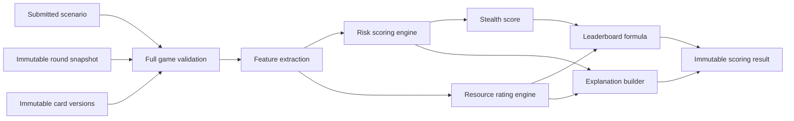
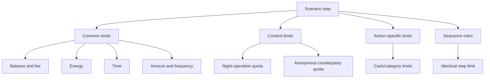
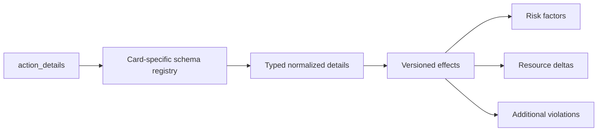
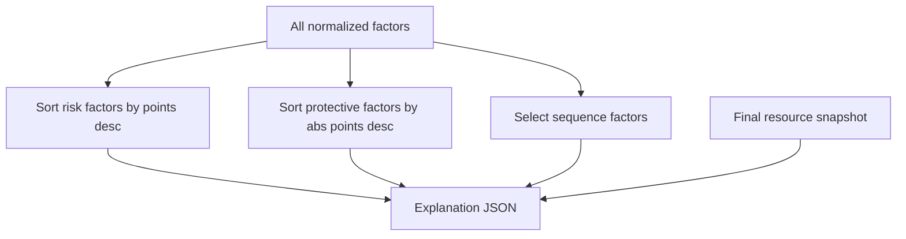
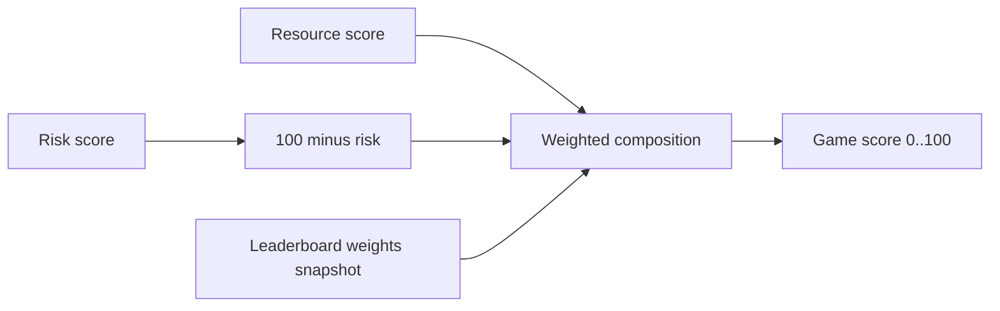
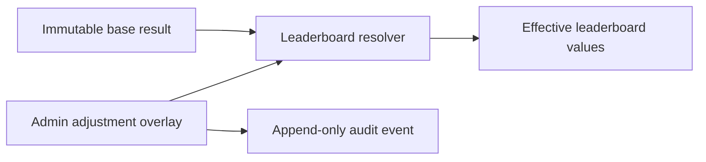
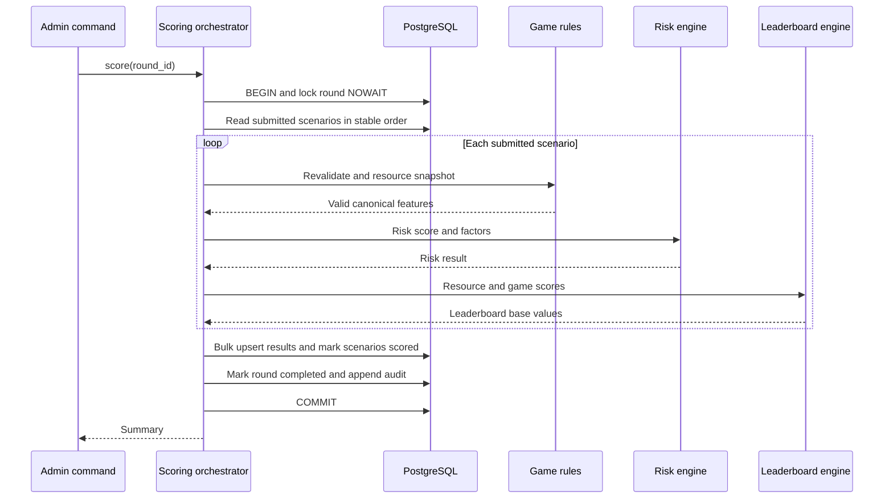

# Скоринг, ресурсы и лидерборд

## 1. Назначение

Скоринг v1 — объяснимая учебная модель, имитирующая классификатор подозрительных
операций. Она не заменяет банковский AML/антифрод, расследование или решение человека.

Система рассчитывает три независимых понятия:

1. **risk score** — насколько сценарий похож на подозрительный;
2. **resource score** — насколько эффективно игрок достиг цели;
3. **game score** — позиция в игре, объединяющая незаметность и ресурсы.

Исходные значения immutable. Ручное изменение leaderboard выполняется только отдельным
admin overlay.

## 2. Scoring pipeline



Каждый stage является чистой детерминированной функцией от `steps + round snapshot +
card versions`. Текущее время, random, порядок строк SQL и mutable catalog не влияют на
результат.

## 3. Версионирование

| Версия | Что фиксирует |
| --- | --- |
| `ruleset_version` | Ресурсные правила, зависимости, квоты, action detail effects |
| `scoring_version` | Feature extraction, risk weights, thresholds, label mapping |
| `leaderboard_version` | Нормализация ресурсов, веса stealth/resources, tie-breakers |
| `config_version` | Hash полного round snapshot и card references |

Release image обязан содержать реализацию каждой версии, используемой активным или
хранимым раундом. Один и тот же scenario snapshot при той же комбинации версий должен
давать байт-в-байт эквивалентный numeric result и семантически эквивалентное explanation.

## 4. Ресурсная модель

Референсный раунд использует:

- баланс: 250 000 ₽;
- энергию: 14;
- время: 18;
- доступные шаги: 8;
- цель расходного оборота: 150 000 ₽.

Все значения настраиваются в `rounds.game_config` и не являются constants.

### Расчет шага

Для каждого шага сервер вычисляет:

```text
gross_amount = amount * frequency
fee          = gross_amount * effective_fee_rate
energy_cost  = base_energy * frequency + detail/context effects
time_cost    = base_time * frequency + detail/context effects
```

Для `debit` баланс уменьшается на `gross_amount + fee`, для `credit` увеличивается на
`gross_amount - fee`. Округление денег выполняется по единому банковскому правилу
ruleset после каждой денежной операции либо на определенной точке расчета; выбор
фиксируется тестами версии.

### Ограничения



Проверяются минимум:

- отрицательный баланс с учетом комиссии;
- исчерпание energy/time;
- `max_actions`, `min/max_amount`, `max_frequency`;
- квоты на наличные и анонимные операции;
- количество ночных операций;
- максимальная серия одинаковых шагов;
- card-specific limits из versioned ruleset;
- достижение objective при submit.

Структурно корректный draft может сохраняться и при business violations: server snapshot
содержит `valid=false` и список проблем, поэтому работа не теряется. Submit требует
hard-valid chain без violations и достигнутую цель.

## 5. Динамические параметры действия

Общие контекстные признаки применяются только там, где они имеют смысл. Например:

| Действие | Примеры специфичных параметров |
| --- | --- |
| Получение зарплаты | Плательщик, основание дохода |
| Пополнение наличными | Источник средств, способ внесения, дробление |
| Перевод | Назначение, связь с получателем, тип получателя |
| Снятие наличных | Тип устройства, география, серия снятий |

Action details могут влиять на риск, энергию, время, комиссию и constraints.
Влияние определяется серверным `ruleset_version`; UI metadata лишь помогает построить
форму.



## 6. Risk score

V1 использует аддитивную объяснимую модель:

```text
raw_risk = base_card_factors
         + amount/frequency factors
         + context factors
         + action-detail factors
         + sequence factors
         + protective factors

risk_score = clamp(raw_risk, 0, 100)
```

Фактор может иметь положительное число points (повышает риск) или отрицательное
(защитный сигнал). Нулевые факторы обычно не сохраняются в explanation.

Примеры feature families:

- сумма и доля round objective;
- частота, скорость и дробление;
- новый/анонимный контрагент;
- время суток;
- отсутствие документов;
- канал операции;
- цепочки rapid-in-rapid-out и повторяющиеся суммы;
- защитные признаки known counterparty и documents.

### Метка

```text
normal      : risk_score < review_threshold
review      : review_threshold <= risk_score < suspicious_threshold
suspicious  : risk_score >= suspicious_threshold
```

Thresholds находятся в round snapshot. UI не должен hardcode 35/65.

## 7. Explanation contract



Каждый factor содержит:

| Поле | Назначение |
| --- | --- |
| `step_id` | Стабильная связь с шагом; null для chain-level factor |
| `code` | Стабильный машинный код |
| `category` | `amount`, `frequency`, `context`, `action_detail`, `sequence`, `protective` |
| `points` | Decimal contribution |
| `description` | Короткое локализованное объяснение |
| `evidence` | Только безопасные агрегаты, без PII |

Правила объяснения:

1. Сумма factor points должна согласовываться с raw score до clamp/rounding.
2. Top factors выбираются детерминированно с явным tie-breaker по code/step order.
3. Защитные факторы показываются отдельно, а не маскируются среди рисковых.
4. UI не утверждает причинность; формулировка — «повлияло на учебный score».
5. Нельзя раскрывать скрытые production AML rules: v1 использует только учебный ruleset.
6. Explanation содержит disclaimer на participant и admin страницах.

## 8. Resource score

Resource score рассчитывается только для hard-valid scenario, достигшего objective.

Нормализованные компоненты:

```text
balance_ratio = clamp(balance_after / initial_balance, 0, 1)
energy_ratio  = clamp(energy_after / initial_energy, 0, 1)
time_ratio    = clamp(time_after / initial_time, 0, 1)
available_steps_ratio = clamp(available_steps / max_actions, 0, 1)
fee_ratio     = 1 - clamp(total_fees / max(gross_outflow, 1), 0, 1)
```

Референсная формула `leaderboard-v2`:

```text
resource_score = 100 * (
    0.27 * balance_ratio         +
    0.20 * energy_ratio          +
    0.20 * time_ratio            +
    0.20 * fee_ratio             +
    0.13 * available_steps_ratio
)
```

Weights находятся в round snapshot, сумма равна 1. Если initial resource равен 0,
версия ruleset обязана явно определить компонент, а не делить на ноль.

В схеме 4 оставшиеся веса нормализованы пропорционально и округлены до 0.01
с сохранением суммы 1. Исторические опубликованные результаты не пересчитываются
при обновлении; новые расчёты используют `leaderboard-v2`.

Сохраненный `resource_score` округляется до одного или двух знаков согласно
`leaderboard_version`; все промежуточные вычисления остаются Decimal.

## 9. Game score

```text
stealth_score = clamp(100 - risk_score, 0, 100)

game_score = 0.60 * stealth_score + 0.40 * resource_score
```

Веса `0.60/0.40` являются default референсного round config. Admin может выбрать другой
валидный preset в draft, но после activate формула неизменяема.



## 10. Ranking и tie-breakers

Публичный leaderboard строится после completed round. Blocked participants исключаются
из public projection, но остаются в admin board.

Сортировка:

1. `effective_game_score DESC`;
2. `base risk_score ASC` — не ручной risk override, чтобы tie-break не был скрытым;
3. `base resource_score DESC`;
4. `submitted_at ASC` только если методически допустимо;
5. `scenario_id ASC` как окончательный стабильный tie-break.

Для школьного мероприятия рекомендуется **dense rank**: одинаковые effective metrics
получают одинаковое место, следующее место увеличивается на 1. Конкретная стратегия
фиксируется `leaderboard_version` и contract tests.

`submitted_at` не должно давать существенного преимущества скорости над качеством; его
можно исключить из версии v1 и использовать только scenario ID для стабильности.

### Скрытые ники

Публичная проекция по умолчанию обезличена: строка содержит `display_name = "Игрок #N"`
и `masked: true`, где `N` — место в текущей выдаче. Настоящего ника нет ни в ответе, ни
в отрендеренной странице, пока ведущий не нажмет «Показать все ники»; тогда UI
запрашивает `?reveal=true`, и та же проекция возвращается с настоящими именами и
`masked: false`.

Порядок, баллы, метки риска и `is_current_user` в обоих режимах одинаковы, поэтому
участник находит свою строку, не раскрывая ник. После перезагрузки страницы состояние
снова безопасное. Admin board (`/admin/rounds/{id}/leaderboard`) всегда показывает
настоящие данные: маскирование защищает проектор, а не администратора.

## 11. Ручная корректировка



Требования:

- доступ только `admin`;
- result должен существовать;
- хотя бы одно override value;
- диапазон `0..100`;
- обязательное основание;
- optimistic `adjustment.revision`;
- base result и explanation не меняются;
- public UI помечает строку как скорректированную;
- admin UI показывает base/effective, actor, time и reason;
- clear overlay восстанавливает base projection и создает audit event.

Корректировка предназначена для технических ошибок демонстрации, а не для скрытого
изменения результатов. Организационная политика должна определить, разрешена ли она
после публичного объявления мест.

## 12. Пакетный scoring раунда



Сценарии обрабатываются в стабильном порядке `scenario_id ASC`. Ошибка одного scenario
откатывает весь batch: частичный leaderboard не публикуется. Неотправленные drafts не
получают result.

## 13. Сложность и capacity

При 500 participants, 8 steps и небольшом card registry расчет имеет порядок
`O(participants * steps)`. Feature extraction не выполняет запрос БД на каждый шаг:
round, cards и scenarios загружаются batch/eager, результаты записываются bulk.

N+1 запросы считаются дефектом. Scoring benchmark измеряет отдельно:

- DB load;
- feature/risk/resource CPU;
- serialization explanation;
- bulk write;
- полный transaction duration.

Если p95 batch превышает 10 секунд или transaction удерживается более установленного
предела, пересматривается решение о синхронном scoring.

## 14. Замена rules engine на ML-модель

Target interface должен позволять заменить risk engine без изменения Streamlit API:

```text
RiskEngine.score(feature_vector, model_version)
    -> risk_score, risk_label, explanation
```

При переходе к реальной ML-модели потребуются:

- model registry и immutable artifact hash;
- feature schema/version;
- контроль train/serve skew;
- latency/memory benchmark;
- calibrated thresholds;
- explainability method и ограничения интерпретации;
- monitoring drift/bias;
- асинхронный worker, если модель тяжелая.

Result contract может сохраниться, если `scoring_version` однозначно указывает model
artifact и feature pipeline.

## 15. Тестовые инварианты

1. Одинаковый input/snapshot/version дает одинаковый result.
2. Перестановка независимых шагов меняет результат только если есть sequence factor.
3. Неизвестный action detail отклоняется до scoring.
4. Сумма explanation factors согласуется с raw risk.
5. Risk/resource/game score всегда `0..100`.
6. Веса round config суммируются в 1.
7. Более экономный сценарий при одинаковом risk получает не меньший game score.
8. Более низкий risk при одинаковых ресурсах получает не меньший game score.
9. Block исключает строку только из public projection.
10. Adjustment меняет effective, но не base result или explanation.
11. Повторный score completed round не изменяет results/timestamps.
12. Исключение в середине batch не публикует ни одной новой строки.
