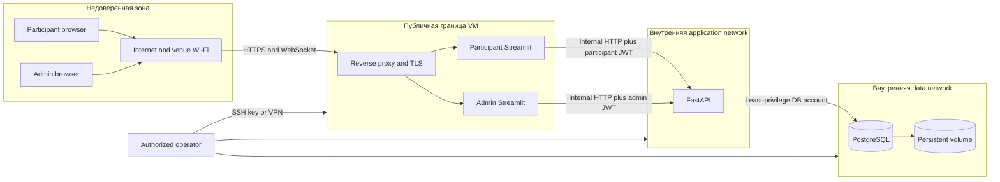
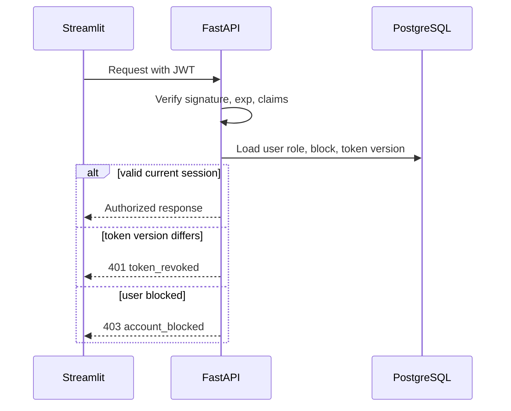
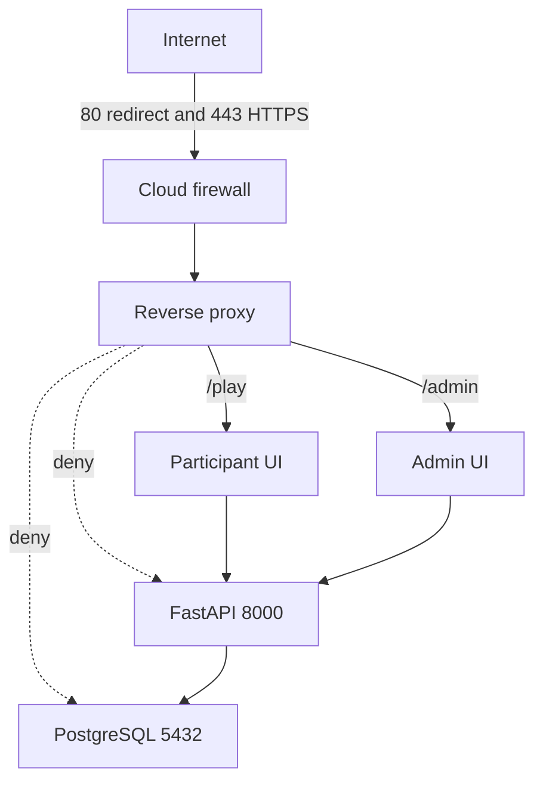
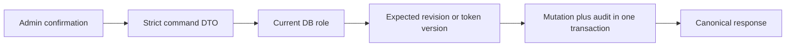
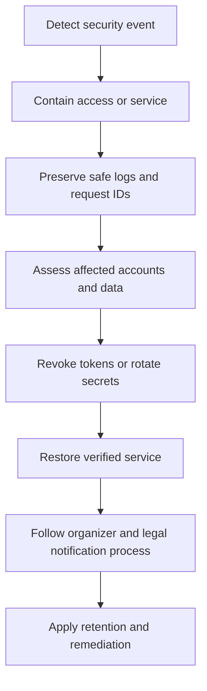

# Безопасность

## 1. Контекст

Система учебная, но обрабатывает учетные данные и поведение школьников. Упрощенный
scoring не уменьшает требования к защите email, пароля, JWT, admin-команд и базы.

Основные активы:

- учетные записи и email;
- participant JWT и admin JWT;
- scenario chains и explanations;
- immutable round/scoring configuration;
- base results, leaderboard overlays и audit events;
- PostgreSQL volume, backup и production secrets;
- доступность интерфейса в течение 45 минут.

## 2. Доверительные границы

### Ключевое следствие

JWT хранится в server-side `st.session_state`. Browser получает Streamlit session
cookie/WebSocket, но не Bearer token и не имеет route к FastAPI. Это уменьшает риск
утечки через localStorage, но не отменяет защиту Streamlit session, TLS и admin UI.

## 3. Threat matrix

| Угроза | Актив | Мера v1 | Проверка |
| --- | --- | --- | --- |
| Подбор пароля | Accounts | Password policy, bcrypt, lockout, auth rate limit | Auth security tests |
| Кража UI session | JWT/admin access | HTTPS, secure cookies, XSRF protection, short event lifetime | Browser/proxy tests |
| Participant вызывает admin API | Results/config | JWT + DB role check on every request | RBAC matrix |
| IDOR | чужой scenario/profile | Ownership derived from JWT; admin routes isolated | IDOR tests |
| Подмена active config | Reproducibility | Immutable snapshot/hash and state transition lock | Integration tests |
| Lost update | Scenario/admin overlay | Revisions, mutation IDs, row locks | Concurrency tests |
| Повтор score | Round/result | Idempotency key, `FOR UPDATE NOWAIT`, completed summary | Concurrency tests |
| Утечка через logs | Email/JWT/steps | Structured allowlist logging and redaction | Automated log scan |
| Публикация DB/API | All data | No host ports, firewall, internal networks | External port scan |
| XSS через display name/details | Admin/public UI | Output escaping, no unsafe HTML with user input | UI security tests |
| SQL injection | DB | SQLAlchemy bound parameters, strict DTO | Fuzz/security tests |
| DoS с общего NAT | Availability | Body/connection limits, NAT-aware burst, capacity test | Venue load test |
| Компрометация dependency/image | Runtime | Pinned lock, image scan, minimal image, provenance | CI release gate |
| Утечка backup | Historical PII | Encryption, restricted storage, retention/restore process | Backup audit |

## 4. Пароли и аутентификация

- Password: 10–128 символов; пробелы не обрезаются без явно описанного правила.
- В v1 используется bcrypt с cost, измеренным на production VM: проверка должна быть
  достаточно дорогой, но не создавать auth DoS для 500 участников.
- Hash и salt управляются библиотекой; собственная криптография запрещена.
- Пароль существует в Streamlit только во время form submit и не сохраняется в
  `session_state`, cache, URL или log.
- Login response для неизвестного email и неверного password одинаков.
- После пяти неудачных попыток account временно блокируется на пять минут; значения
  являются настраиваемой security policy.
- Успешный login сбрасывает failed counter в транзакции.
- Admin account создается bootstrap-командой; публичная регистрация всегда participant.
- Default admin credentials запрещены вне локальной demo-среды.

Argon2id может заменить bcrypt отдельным решением с постепенным rehash при login; формат
`hashed_password` не должен связывать API contract с конкретным алгоритмом.

## 5. JWT и жизненный цикл сессии

JWT v1:

- asymmetric signing предпочтителен при нескольких независимых verifiers, но для одной
  VM допустим сильный HMAC secret;
- claims: `sub`, `role`, `token_version`, `iat`, `exp`, `jti`;
- lifetime покрывает мероприятие, default 4 часа;
- refresh token отсутствует;
- clock skew ограничен 30–60 секундами;
- secret/key имеет `kid` при поддержке ротации.

FastAPI не доверяет role/block только из token:

Block/unblock/security reset увеличивает `token_version`; старый JWT становится
недействительным на следующем request. Logout participant очищает JWT из Streamlit
session. Глобальный revoke при logout не нужен, иначе одно окно завершит все сессии.

## 6. Streamlit session security

- `server.enableXsrfProtection=true` в production.
- Cookie settings соответствуют HTTPS; proxy не понижает scheme в forwarded headers.
- `st.session_state` не используется как shared process storage.
- JWT не помещается в `st.cache_data`, `st.cache_resource`, query params или widget key.
- Cached HTTP transport не содержит mutable default Authorization header.
- User-controlled text экранируется перед `unsafe_allow_html=True`; предпочтителен
  native Streamlit rendering.
- Admin destructive actions требуют explicit confirmation и reason.
- После logout очищаются auth, local draft, selected participant и pending command.
- WebSocket origin/CORS settings ограничены каноническим доменом.

## 7. Авторизация

### Participant

- Current participant определяется только `JWT.sub`.
- Token-free active-round/cards reads разрешены только во внутренней app network,
  содержат несекретный catalog snapshot и не проксируются browser.
- Endpoint scenario/result не принимает participant ID.
- Round ID проверяется на доступность и lifecycle.
- Public leaderboard возвращает только pseudonym и безопасные метрики.
- Blocked participant не может читать/изменять даже собственный scenario до unblock.

### Admin

- Все `/api/v1/admin/*` требуют current DB role `admin`.
- Admin не может заблокировать самого себя через UI/API.
- Block, adjustment, activate и score требуют reason/confirmation там, где определено.
- Изменение создает audit event в той же транзакции.
- Full email/chain читается только detail endpoint выбранного player.
- Admin UI рекомендуется дополнительно ограничить VPN/IP allowlist, если площадка это
  позволяет; URL secrecy не является защитой.

## 8. Сетевая защита

- Публичны только 80/443; HTTP перенаправляется на HTTPS.
- TLS 1.2+; слабые suites отключены.
- HSTS включается после проверки домена и rollback plan.
- API/DB не имеют host port mappings.
- OpenAPI/Swagger не проксируются; внутри VM доступ ограничен оператором.
- SSH по ключу, без password login, с allowlist/VPN при возможности.
- DB user приложения не superuser и не владеет infrastructure DB.
- Backup channel отделен от public route.

Security headers: `Strict-Transport-Security`, `X-Content-Type-Options: nosniff`,
`Referrer-Policy`, `Permissions-Policy` и CSP, протестированная с Streamlit WebSocket и
static assets. `X-Frame-Options`/`frame-ancestors` запрещает embedding, если iframe не
нужен платформе мероприятия.

## 9. Rate limiting и DoS

500 участников могут находиться за одним NAT, поэтому жесткий per-IP limit опасен.

| Уровень | Ограничение |
| --- | --- |
| Proxy | Max body, header size, connection timeout, WebSocket limits, broad IP burst |
| Auth API | Account-based lockout, route-wide rate, separate strict admin policy |
| Application | Max steps, string lengths, nested JSON depth, pagination limit |
| Database | Pool bounds, statement timeout, lock timeout |
| Scoring | Один batch, row lock NOWAIT, max scenarios/steps, 30 s request timeout |

Точные значения выбираются после теста через Wi-Fi площадки. Redis-less limiter v1
может быть process-local только как дополнительная защита; критическая защита основана
на proxy limits и DB/account state. При нескольких API replicas нужен общий limiter.

## 10. Валидация и целостность

- Pydantic input models используют `extra="forbid"`.
- Reverse proxy и API ограничивают body до размера, достаточного для max scenario.
- Decimal используется для всех денежных/score расчетов.
- Card ID/code/version сверяются с immutable round snapshot.
- Action details валидируются server registry, а не доверяются UI metadata.
- `step_id` UUID и array length проверяются.
- Server игнорирует клиентский resource preview.
- State transitions защищены row locks и DB constraints.
- SQLAlchemy использует bound parameters.
- URL IDs не считаются секретными; RBAC/ownership проверяется всегда.

## 11. Защита admin-команд

- `Idempotency-Key` обязателен для activate/score; хранится только его hash.
- Причина обязательна для block и leaderboard adjustment.
- Base scoring result immutable.
- UI показывает base/effective рядом, чтобы admin видел последствия.
- Audit event содержит numeric before/after, но не полную chain/PII.
- Опционально применяется dual control для финальных мероприятий; в v1 не требуется.

## 12. Секреты

Production secrets не входят в Git, Docker image, Markdown examples или application
logs.

| Secret | Потребитель | Ротация |
| --- | --- | --- |
| `DATABASE_URL`/password | FastAPI | До мероприятия или при инциденте |
| JWT signing key | FastAPI | Между мероприятиями; emergency revoke sessions |
| `POSTGRES_PASSWORD` | DB bootstrap/operator | По infrastructure policy |
| TLS private key | Reverse proxy | ACME/организатор |
| Backup credentials/key | Operator job | Отдельно от application secrets |
| Observability HMAC key | Logging pipeline | При компрометации |

`.env` на VM доступен только сервисному пользователю. Предпочтительны Docker secrets или
cloud secret store, если они доступны без существенного усложнения v1. Ошибка config не
должна печатать значение secret.

## 13. Logging и observability privacy

Логирование строится по allowlist.

**Разрешено:** service, event, route template, method, status, latency, request ID,
round ID, scenario ID, internal user ID, role, revisions, counts.

**Запрещено:**

- password/password hash;
- JWT, cookie, Authorization header;
- email и display name в техническом log;
- request/response body auth/scenario;
- full steps/action details/explanation;
- DSN и secret values;
- raw idempotency key.

При необходимости поиска account используется HMAC(normalized email) с отдельным
observability key. Raw email остается доступен только через admin detail/API по RBAC.

## 14. Минимизация данных школьников

1. Собирать только email, pseudonym/display name и игровое состояние.
2. До регистрации показать цель, владельца, срок и способ удаления.
3. Рекомендовать pseudonym, не ФИО, для public leaderboard.
4. Не показывать email на проекторе/общей доске.
5. Не экспортировать chains без явной необходимости.
6. Установить retention до события; рекомендуемый максимум — 30 дней.
7. Удалить primary DB и backups по расписанию.
8. Хранить только действительно обезличенные агрегаты после проверки re-identification.

## 15. Backup security

- Dump шифруется до передачи во внешнее хранилище.
- Encryption key не хранится рядом с dump.
- Access ограничен назначенными операторами.
- Restore выполняется в изолированной test DB.
- Restore logs не содержат row data.
- Retention backup не превышает retention исходной PII.
- Удаление подтверждается inventory/checksum records.

## 16. Supply chain и runtime

- Python dependencies pin/lock с hashes, где возможно.
- Base image фиксируется digest/tag release.
- Image запускается непривилегированным user.
- Read-only filesystem для stateless containers при совместимости Streamlit temp paths.
- Linux capabilities минимизированы; Docker socket не монтируется в app containers.
- Dependency/image scan выполняется до release freeze.
- Critical vulnerability оценивается до мероприятия; исключение документируется.
- Debug/reload отключены в production.

## 17. Security checklist перед событием

1. Production secrets отличаются от dev и не найдены secret scan.
2. Default admin отсутствует; admin password проверен.
3. Снаружи закрыты 8000/5432 и OpenAPI endpoints.
4. TLS/WebSocket работают из внешней сети; certificate не истекает.
5. Participant token получает `403` на все admin routes.
6. Participant A не читает data B.
7. Blocked user получает `403` со старым JWT.
8. Stale revisions дают `409`, а не overwrite.
9. Logs не содержат email/JWT/password/steps.
10. Public leaderboard не содержит IDs, email или chain.
11. Rate limits проверены через общий NAT площадки.
12. Backup зашифрован и restore проверен.
13. Data notice и retention owner утверждены.
14. Admin block/adjustment/score создают audit events.
15. Streamlit light/dark error states остаются читаемыми и не раскрывают tracebacks.

## 18. Реакция на инцидент

При компрометации admin session блокируются admin-команды, повышается token version,
ротируется signing key при необходимости и проверяется audit trail. Продолжение
мастер-класса не важнее защиты данных.
