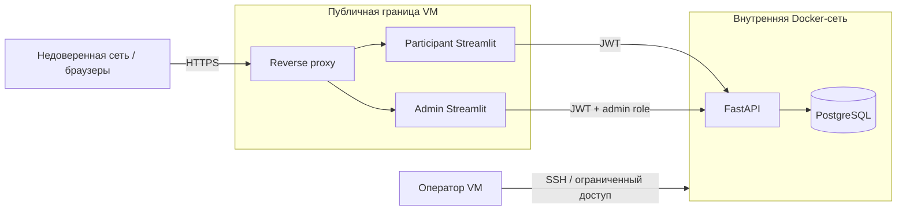

# Безопасность

## Модель угроз и доверительные границы

Система является учебной, но обрабатывает учетные данные и действия школьников.
Основные риски: подбор паролей, кража JWT, доступ участника к admin API, утечка email,
публикация PostgreSQL в интернет, подмена конфигурации активного раунда и отказ в
обслуживании во время мероприятия.

## Аутентификация

- Пароли длиной 10–128 символов хешируются bcrypt с актуальной стоимостью.
- Пароль, его хеш и JWT никогда не пишутся в логи и не возвращаются после создания.
- JWT подписывается отдельным случайным production secret, содержит `sub`, `role`,
  `iat`, `exp` и `jti` и действует четыре часа по умолчанию.
- JWT хранится в `st.session_state`; он не помещается в URL, query string, общий кэш
  или кэшированный HTTP-клиент.
- Refresh token отсутствует. Logout удаляет JWT из сессии Streamlit.
- Учетная запись администратора создается отдельной bootstrap-командой, а не
  публичным endpoint. Дефолтные `admin@example.com/admin123` запрещены вне разработки.

После пяти неудачных входов существующая учетная запись блокируется на пять минут.
Для этого `users` хранит `failed_login_count` и `locked_until`; успешный вход сбрасывает
счетчик. Ответ не сообщает, существует ли введенный email.

## Авторизация

FastAPI проверяет JWT и загружает текущего пользователя для каждого защищенного
запроса. Роль из БД имеет приоритет над устаревшим claim токена.

- Participant routes никогда не принимают `participant_id` от клиента.
- Доступ к сценарию определяется текущим `user.id` и `round_id`.
- Все `/api/v1/admin/*` требуют роль `admin`.
- Изменение конфигурации разрешено только для `draft`.
- Результаты общего раунда доступны только admin UI; participant получает только свой.

## Сетевая защита

- Reverse proxy завершает TLS 1.2+ и перенаправляет HTTP на HTTPS.
- Публичны только `/play` и `/admin`; порт FastAPI и порт PostgreSQL не публикуются.
- Docker-сеть приложений отделена от сети БД; к PostgreSQL подключается только API.
- Swagger/OpenAPI не проксируются наружу.
- SSH разрешен только операторским адресам или через VPN, вход по ключу.
- Security headers включают HSTS после проверки домена, `X-Content-Type-Options`,
  `Referrer-Policy` и подходящую Content Security Policy без нарушения Streamlit.

## Rate limiting

Защита не должна блокировать 500 участников за общим NAT площадки:

- reverse proxy ограничивает общее число новых соединений и запросов с большим burst,
  настроенным по результатам нагрузочного теста;
- FastAPI применяет account lockout для существующего email;
- регистрация защищена уникальностью email, ограничением размера тела и общим лимитом
  запросов на auth routes;
- admin login имеет отдельный более строгий лимит и может быть дополнительно ограничен
  операторской сетью;
- значения лимитов проверяются с реального Wi-Fi площадки, а не выбираются вслепую.

Redis в v1 отсутствует, поэтому распределенный token bucket не проектируется. Если API
будет разнесен по нескольким VM, rate limiter выносится во внешний общий сервис.

## Валидация и целостность

- Pydantic ограничивает типы, длины, enum и размер сценария до бизнес-валидации.
- FastAPI игнорирует клиентский расчет ресурсов и вычисляет его заново.
- Карточка шага должна входить в snapshot раунда; code/version должны совпадать с ID.
- Денежные расчеты используют `Decimal`, а не binary float.
- Строка раунда блокируется при активации и скоринге.
- SQL строится SQLAlchemy без конкатенации пользовательских строк.
- Размер JSON request body ограничивается reverse proxy.

## Секреты

Production secrets не находятся в Git, образах или примерах с рабочими значениями.
Минимальный набор:

- `DATABASE_URL` с отдельным паролем пользователя приложения;
- `SECRET_KEY` для JWT;
- `POSTGRES_PASSWORD` для инициализации;
- параметры домена и TLS;
- учетные данные backup-хранилища, если оно используется.

Файл `.env` на VM имеет права только у сервисного пользователя. Ротация JWT secret
завершает существующие сессии и проводится до или после мероприятия, но не во время
активного раунда без необходимости.

## Логи и персональные данные

Разрешены: `request_id`, route template, status code, latency, `round_id`, `scenario_id`,
роль и внутренний `user_id`. Запрещены:

- пароль, password hash и полный JWT;
- email и display name в технических логах;
- заголовок `Authorization`;
- полное тело сценария и explanation;
- строка подключения к PostgreSQL.

При необходимости корреляции email логируется только стабильный HMAC, вычисленный
отдельным observability secret.

## Данные школьников

- Собираются только email, отображаемое имя и игровой сценарий.
- В интерфейсе должно быть краткое уведомление о цели и сроке хранения данных.
- Доска использует только display name; участникам рекомендуется псевдоним.
- Доступ к выгрузке имеют только назначенные операторы.
- Рекомендуемый срок удаления — не более 30 дней после мероприятия, если организатор
  письменно не установил иной срок.
- Удаление включает основную БД и backup после истечения его установленного срока.

## Проверки безопасности перед публикацией

1. Заменены все development secrets и удален дефолтный пароль администратора.
2. Снаружи недоступны порты 8000 и 5432, `/docs`, `/redoc`, `/openapi.json`.
3. Participant JWT получает `403` на admin endpoint.
4. Один участник не может прочитать сценарий другого.
5. Истекший и измененный JWT дают `401`.
6. Логи не содержат email, паролей, токенов и request body.
7. Backup зашифрован и успешно восстановлен на тестовой среде.
8. Rate limits проверены через сеть с общим NAT.

