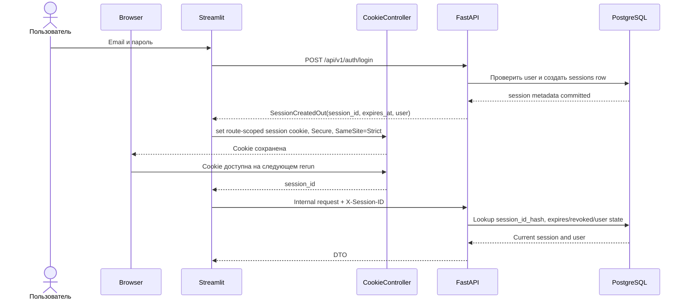

# Browser cookie и серверные сессии

## 1. Решение

Целевая аутентификация v1 использует непрозрачный идентификатор сессии вместо JWT.
После успешного входа FastAPI создает строку в PostgreSQL, возвращает Streamlit только
сырой `session_id`, а Participant/Admin Streamlit сохраняет его в browser cookie через
[`streamlit-cookies-controller`](https://github.com/NathanChen198/streamlit-cookies-controller).

Cookie не содержит user ID, роль, email, срок действия или иные claims. Единственный
источник истины для аутентификации и отзыва доступа — таблица `sessions` в PostgreSQL.

## 2. Ограничение компонента

`streamlit-cookies-controller` является клиентским Streamlit-компонентом. Он читает,
устанавливает и удаляет cookie в браузере и поддерживает `path`, `expires`, `max_age`,
`domain`, `secure`, `same_site` и `partitioned`.

Поскольку cookie создается и читается JavaScript-компонентом, флаг `HttpOnly` установить
нельзя. Это осознанное ограничение выбранной библиотеки. Поэтому обязательны HTTPS,
`Secure`, `SameSite=Strict`, строгая защита от XSS, короткий срок сессии, ротация ID при
login и отсутствие любых других секретов в cookie. Если потребуется `HttpOnly`, cookie
должен выставлять reverse proxy/BFF HTTP response без этого компонента; это отдельное
архитектурное решение.

## 3. Формат и параметры cookie

| Параметр | Значение v1 |
| --- | --- |
| Имя | `aml_play_session_id` для `/play`; `aml_admin_session_id` для `/admin` |
| Значение | 32 случайных байта из CSPRNG, base64url без padding |
| Path | `/play` для participant; `/admin` для admin |
| Domain | Не задавать: host-only cookie |
| Secure | `true` в production |
| SameSite | `strict` |
| Max-Age / Expires | Не позже server-side `expires_at`, default 4 часа |
| HttpOnly | Недоступен для выбранного JS-компонента |

В БД хранится только `SHA-256(session_id)` в `session_id_hash`; строка также фиксирует `audience=play|admin`. Сырой ID не пишется в БД,
логи, audit, traces или метрики. Сравнение выполняется по digest и затем constant-time
проверкой при необходимости.

## 4. Сквозной поток



Браузер по-прежнему не вызывает FastAPI напрямую. Streamlit получает cookie через
компонент и передает ID FastAPI в заголовке `X-Session-ID` каждого защищенного
внутреннего запроса. Этот заголовок считается секретом и редактируется в логах так же,
как cookie.

## 5. Rerun-safe bootstrap

1. Один `CookieController` создается со стабильным `key` до auth-routing; participant
   и admin используют разные keys.
2. На первом рендере компонент может еще не вернуть browser state. UI показывает
   нейтральный loading state и не считает `None` подтвержденным logout.
3. После получения cookie Streamlit один раз за rerun вызывает `GET /auth/session`.
4. Успешный ответ гидратирует только display snapshot в `st.session_state`; права всегда
   определяются FastAPI по БД.
5. `401 session_invalid|session_expired|session_revoked` удаляет cookie с теми же
   `path/domain/secure/same_site`, очищает локальное auth/UI-state и показывает login.
6. Adapter всегда передает `expires`/`max_age` явно: библиотечный default в один день
   не используется.
7. `remove` вызывается только после `get != None` через идемпотентный wrapper и с теми
   же scope options.
8. Обычный rerun не продлевает сессию автоматически. Sliding expiration в v1 не
   используется; если будет добавлен, продление выполняет отдельный endpoint с rate
   limit и ротацией ID.

## 6. Жизненный цикл

- Login всегда создает новую сессию и новый ID; session fixation запрещен.
- Повторный login в другом браузере создает независимую строку.
- Logout вызывает `DELETE /api/v1/auth/session`, фиксирует `revoked_at`, после `2xx`
  удаляет cookie и очищает `st.session_state`.
- Если logout API недоступен, UI все равно удаляет локальную cookie, но сообщает, что
  server-side revoke не подтвержден; короткий expiry ограничивает остаточный риск.
- Block пользователя в одной транзакции отзывает все его активные сессии.
- Password/security reset отзывает все активные сессии.
- Admin может завершить конкретную сессию или все сессии пользователя через
  аудитируемую команду; raw session ID никогда не показывается.
- Cleanup job удаляет expired/revoked sessions после retention window.

## 7. Авторизация FastAPI

Auth dependency:

1. требует `X-Session-ID` на защищенном endpoint и ожидаемую audience route;
2. проверяет формат и вычисляет SHA-256;
3. загружает `sessions` вместе с `users`;
4. отклоняет отсутствующую, истекшую или отозванную сессию;
5. проверяет `users.is_blocked`, текущую роль и `sessions.audience`;
6. обновляет `last_seen_at` не чаще одного раза в 5 минут, чтобы не создавать write на
   каждый GET;
7. возвращает `CurrentPrincipal(user_id, role, session_row_id, audience)` application
   layer; raw ID дальше auth dependency не передается.

`audience=admin` создается только для DB-role `admin`; `audience=play` — только для
participant UI. Несовпадение audience и route возвращает `403 forbidden`.

Participant ID никогда не принимается из UI для собственных ресурсов. Он выводится из
серверной сессии. Общий HTTP transport не содержит default `X-Session-ID`; заголовок
формируется для каждого запроса.

## 8. Ошибки

| HTTP | Code | Поведение Streamlit |
| ---: | --- | --- |
| 401 | `session_missing` | Дождаться cookie bootstrap или показать login |
| 401 | `session_invalid` | Удалить cookie, показать login |
| 401 | `session_expired` | Удалить cookie, сообщить об истечении |
| 401 | `session_revoked` | Удалить cookie, сообщить о завершении сессии |
| 403 | `account_blocked` | Удалить cookie после подтвержденного revoke, показать экран блокировки |
| 403 | `forbidden` | Оставить сессию, показать недостаток прав |

## 9. Наблюдаемость и очистка

Разрешены метрики: количество активных/созданных/отозванных/истекших сессий, login
success/failure, session lookup latency и cleanup count. Запрещены raw cookie,
`X-Session-ID`, `session_id_hash`, email и полный user-agent.

Плановая очистка:

```sql
DELETE FROM sessions
WHERE expires_at < now() - interval '7 days'
   OR revoked_at < now() - interval '7 days';
```

Конкретный retention согласуется с политикой мероприятия. Cleanup выполняется батчами,
не блокирует login и имеет dry-run count в операционном runbook.

## 9.1. Технические данные сессии

Вместе со строкой сессии сохраняются `ip_address`, `user_agent` и `accept_language` —
ровно те три значения, которые показывает admin-панель. Адресу из `X-Forwarded-For`
API верит только при настроенных `TRUSTED_PROXY_IPS`; иначе берется адрес сокета.
Streamlit пересылает браузерные заголовки, потому что для API он сам является клиентом.

`users.first_login_at` заполняется один раз, `last_login_at` — при каждом входе; вместе
с числом активных и всех сессий это дает организатору картину «когда и с чего заходил
участник» без хранения дополнительных данных.

## 9.2. Тема не использует cookie приложения

Выбор System/Light/Dark хранит сам Streamlit на стороне браузера. Приложение не
создаёт `aml_theme`; cookie-controller используется только для аутентификационных session ID.

## 10. Проверяемые инварианты

1. Cookie содержит только непрозрачный session ID.
2. В БД и логах отсутствует raw session ID.
3. Один session ID соответствует не более чем одной строке по unique `session_id_hash`.
4. Session audience совпадает с UI/API scope; `play` credential не авторизует admin route.
5. Истекшая/отозванная сессия не авторизует ни один защищенный endpoint.
6. Block и password reset отзывают все активные сессии атомарно.
7. Logout отзывает только текущую сессию, если явно не выбрано «выйти везде».
8. Два браузера имеют независимые сессии.
9. Cookie удаляется с теми же scope-параметрами, с которыми была создана.
10. Rerun не создает новую сессию и не вызывает login повторно.
11. Dependency/version библиотеки закреплена lock-файлом и проходит browser smoke test.
