# Взаимодействие Streamlit и FastAPI

## 1. Назначение

Этот документ является основной спецификацией границы между двумя Streamlit-
приложениями и FastAPI. Он отвечает на четыре вопроса:

1. где хранится состояние пользователя и раунда;
2. когда Streamlit имеет право выполнять HTTP-команду;
3. как UI переживает rerun, retry, timeout и два открытых окна;
4. какие данные можно кэшировать без смешивания пользовательских сессий.

Целевой принцип: **Streamlit управляет взаимодействием, FastAPI управляет
состоянием и правилами**.

## 2. Сетевая модель

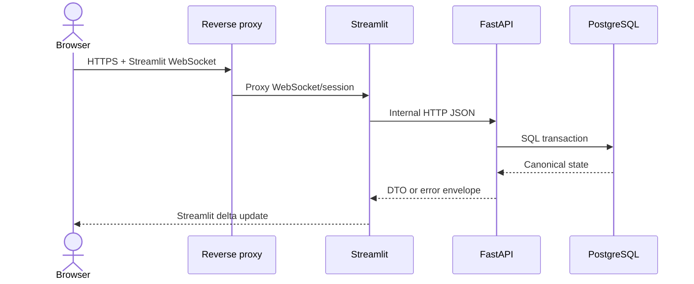

Браузер не знает `API_BASE_URL`, не получает Bearer token и не вызывает API. JWT
находится в памяти Python-процесса Streamlit в контексте конкретной WebSocket-сессии.

## 3. Владение состоянием

| Состояние | Где хранится | Срок жизни | Источник истины |
| --- | --- | --- | --- |
| Текущая страница | `st.session_state` | UI-сессия | Streamlit |
| Значения widget | `st.session_state` | UI-сессия | Streamlit до submit формы |
| JWT | `st.session_state` | До logout/expiry/rerun process loss | FastAPI выдает; Streamlit хранит копию |
| User ID/role/display name | Session snapshot | До повторной проверки | PostgreSQL через FastAPI |
| Local draft | `st.session_state` | UI-сессия | Только рабочая копия |
| Server revision | `st.session_state` | До следующего ответа | PostgreSQL |
| Active round/cards | Короткий process cache | TTL | PostgreSQL через FastAPI |
| Scenario/status/result | Не в shared cache | Постоянно в PG | PostgreSQL |
| Admin filters/selected player | `st.session_state` | UI-сессия | Streamlit |
| Block/adjustment/audit | Не в shared cache | Постоянно в PG | PostgreSQL |

Streamlit не хранит пароль после завершения login/register request.

## 4. Компоненты UI-интеграции

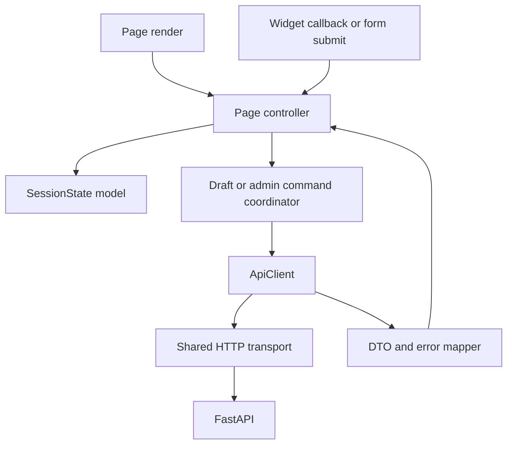

### `ApiClient`

`ApiClient` — тонкий адаптер, а не бизнес-сервис. Он:

- строит URL только относительно `API_BASE_URL`;
- передает JWT аргументом каждого защищенного вызова;
- добавляет `X-Request-ID` и при необходимости `Idempotency-Key`;
- применяет connect/read/write/pool timeouts;
- повторяет только явно безопасные операции;
- проверяет status/content type и разбирает error envelope;
- возвращает типизированный DTO или поднимает `ApiError`;
- не вызывает `st.*`, чтобы оставаться тестируемым.

### HTTP transport

Один `httpx.Client` или `requests.Session` на процесс создается через
`st.cache_resource`. Он содержит connection pool и базовые transport-настройки, но не
содержит JWT, user ID, round ID и mutable headers конкретного пользователя.

```python
@st.cache_resource
def get_http_transport() -> httpx.Client:
    return httpx.Client(base_url=API_BASE_URL, timeout=DEFAULT_TIMEOUT)

def api_get(path: str, token: str, request_id: str) -> dict:
    client = get_http_transport()
    return client.get(
        path,
        headers={
            "Authorization": f"Bearer {token}",
            "X-Request-ID": request_id,
        },
    ).json()
```

Пример иллюстрирует разделение transport и пользовательских headers. Production-
клиент дополнительно проверяет ответ и не возвращает сырой `.json()` без валидации.

## 5. Модель `st.session_state`

Рекомендуемая логическая структура participant UI:

```text
auth:
  access_token
  expires_at
  user_id
  role
  display_name
navigation:
  current_page
round:
  active_round_id
  config_version
draft:
  steps
  server_revision
  server_updated_at
  dirty
  sync_state        # clean | saving | conflict | failed
  mutation_id
  last_error_code
ui:
  selected_card_code
  expanded_step_id
  pending_command
  flash_message
```

Admin UI дополнительно хранит только UI-выбор:

```text
admin_view:
  selected_round_id
  selected_player_id
  player_filter
  leaderboard_sort
  confirmation_target
  pending_command
```

Списки игроков, профиль, stats и leaderboard читаются из API при рендере/явном refresh
и не помещаются в общий `st.cache_data`.

## 6. Rerun-safe lifecycle страницы

Streamlit повторно выполняет файл при большинстве UI-событий. Поэтому рендер должен
быть **чистым относительно серверных команд**.

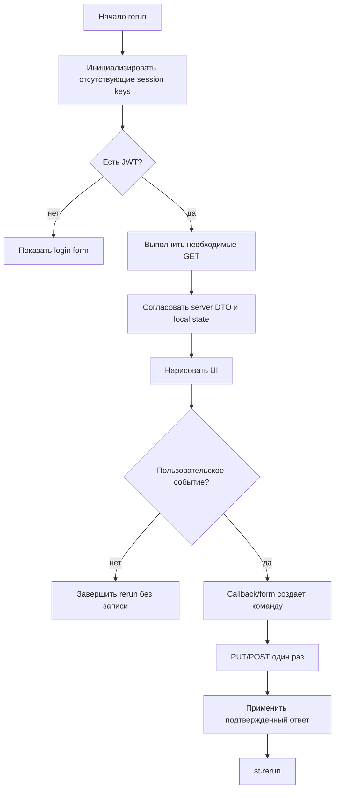

Запрещенный шаблон:

```python
# Нельзя: будет выполняться при каждом rerun.
if draft_changed:
    api.put_scenario(draft)
```

Допустимые триггеры записи:

- `on_click` добавления, удаления или перестановки шага;
- submit формы настройки шага;
- явная кнопка «Сохранить» после нескольких текстовых изменений;
- submit сценария;
- подтвержденная admin-команда.

Не следует отправлять HTTP-запрос на каждую введенную цифру. Для Streamlit v1
изменения параметров шага группируются в `st.form`, а структурные изменения
сохраняются сразу после callback.

## 7. Начальная гидратация participant UI

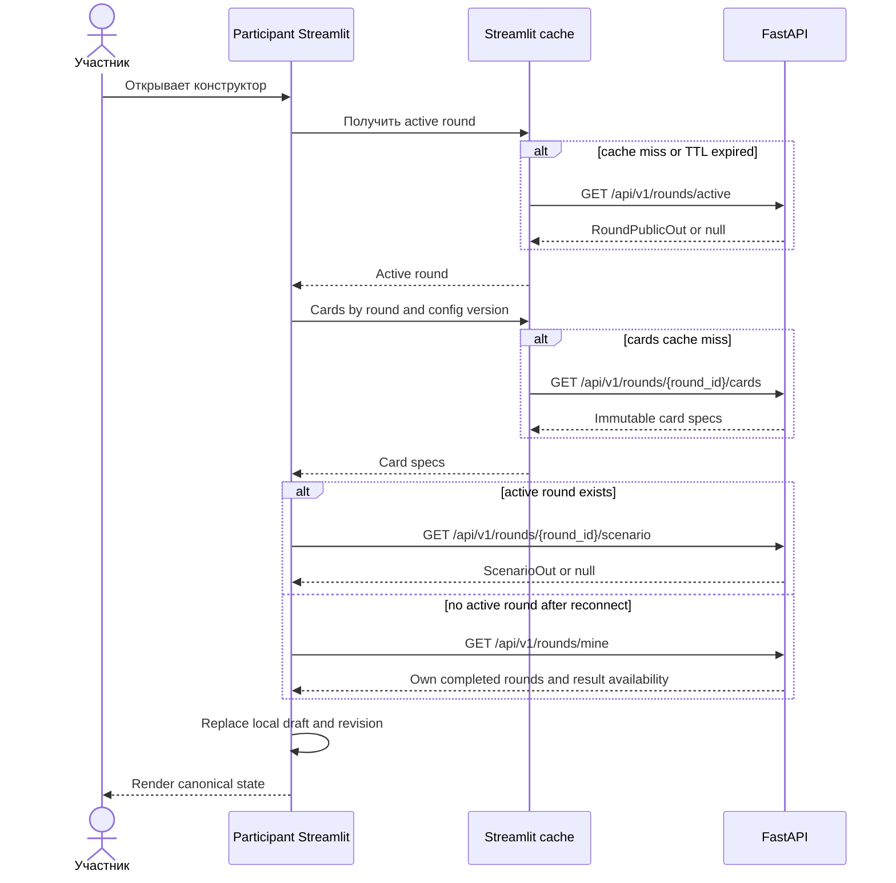

Если local draft уже dirty, обычный GET не должен молча его заменить. Такой GET
выполняется только при начальной гидратации, успешном save, явном refresh или обработке
conflict.

## 8. Динамические параметры действий

Карточки разных типов имеют разные наборы полей. FastAPI возвращает для каждой
зафиксированной версии карточки declarative form specification:

```json
{
  "code": "crypto_exchange",
  "version": 2,
  "fields": [
    {
      "key": "exchange_type",
      "label": "Тип площадки",
      "kind": "select",
      "required": true,
      "options": [
        {"value": "regulated", "label": "Регулируемая"},
        {"value": "p2p", "label": "P2P"}
      ]
    },
    {
      "key": "wallet_owner",
      "label": "Владелец кошелька",
      "kind": "select",
      "required": true,
      "options": []
    }
  ]
}
```

Streamlit использует specification для выбора widget, label, options и help text.
Стабильный ключ widget строится как `step:{step_id}:{field_key}`. `step_id` является
UUID шага и не меняется при перестановке, поэтому widget state не «переезжает» на
другую операцию.

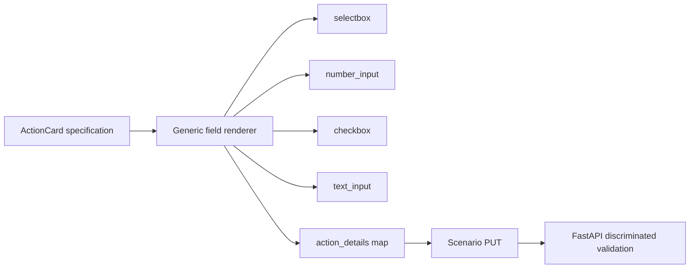

UI metadata не является механизмом безопасности. FastAPI выбирает строгую Pydantic-
схему по `card_code + card_version`, запрещает неизвестные поля и повторно применяет
правила. Нельзя передавать из карточки исполняемый Python/выражение для eval.

## 9. Синхронизация черновика

### Состояния локальной копии

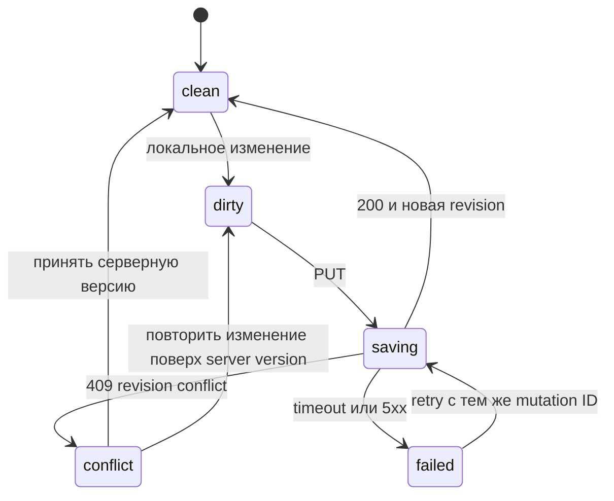

### Контракт сохранения

Каждый `PUT /rounds/{round_id}/scenario` содержит:

- `expected_revision`: последняя подтвержденная серверная revision, `0` для создания;
- `client_mutation_id`: UUID одной логической UI-команды;
- полный массив `steps`, а не patch;
- только значения, разрешенные card specification.

FastAPI:

1. блокирует строку сценария, если она существует;
2. проверяет round status и ownership;
3. сравнивает revision;
4. распознает повтор уже примененного `client_mutation_id`;
5. строго валидирует schema и рассчитывает игровые ресурсы;
6. сохраняет структурно корректный draft даже при business violations, возвращая
   `resources.valid=false`; schema-invalid payload не сохраняет;
7. увеличивает revision только при новом материальном payload;
8. возвращает полный канонический scenario DTO.

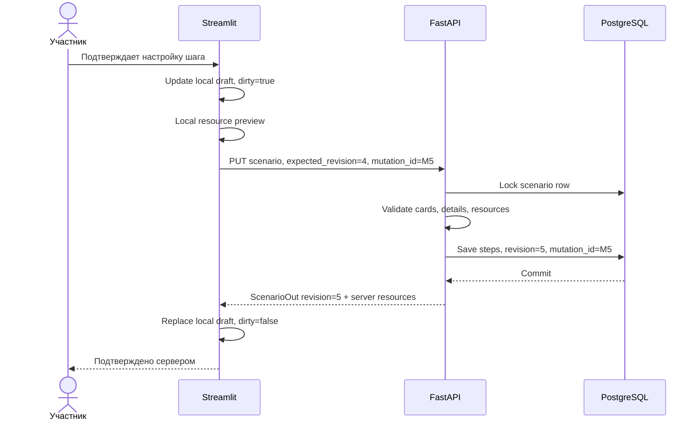

### Конфликт двух окон

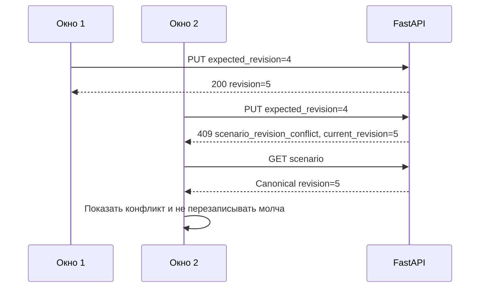

UI предлагает два безопасных действия: «Использовать серверную версию» или «Повторить
мои изменения» после явного rebase на revision 5. Автоматическая стратегия
last-write-wins запрещена.

### Timeout PUT

Если клиент не получил ответ, он повторяет **то же тело и тот же
`client_mutation_id`**. Если первая команда успела примениться, API возвращает revision,
не увеличивая ее второй раз.

## 10. Submit и повторная отправка

Submit принимает `expected_revision`. Сервер никогда не принимает steps непосредственно
в submit: сначала черновик должен быть сохранен.

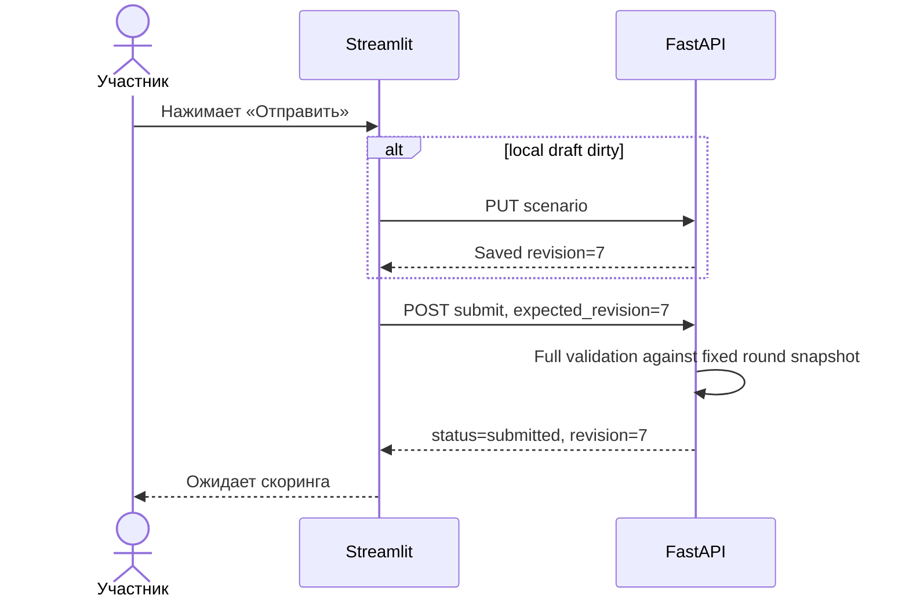

Повторный submit той же revision возвращает тот же `submitted`. Изменение до начала
scoring выполняет новый PUT, повышает revision и возвращает status в `draft`; затем
требуется новый явный submit.

## 11. Кэширование Streamlit

### Разрешенная матрица

| Функция | Cache | Ключ | TTL | Причина |
| --- | --- | --- | --- | --- |
| Создание HTTP transport | `st.cache_resource` | Process config | Без TTL | Connection pooling |
| Active round | `st.cache_data` | API URL + deployment version | 1–5 с | Снижает частые poll reads |
| Round cards | `st.cache_data` | round ID + config version | До 300 с | Snapshot неизменяем после activate |
| Справочник UI | `st.cache_data` | locale + UI version | До deploy | Не содержит доменных/user данных |

### Запрещено кэшировать между пользователями

- JWT и Authorization headers;
- current user/profile/email;
- scenario, local draft и server revision;
- result и explanation;
- participant leaderboard;
- admin stats, player list/detail и audit events;
- leaderboard adjustments;
- SQLAlchemy sessions или прямые DB connections.

`st.cache_data` формирует общий process cache. Даже если token попадает в ключ, хранение
user response в нем увеличивает риск утечки и усложняет инвалидирование, поэтому в v1
это запрещено.

Active round и cards читаются token-free по внутренним несекретным endpoints. Поэтому
cached function не принимает JWT даже как исключенный из hash аргумент и не обходит
проверку user-specific данных. Streamlit отдельно требует login перед gameplay.

### Инвалидация

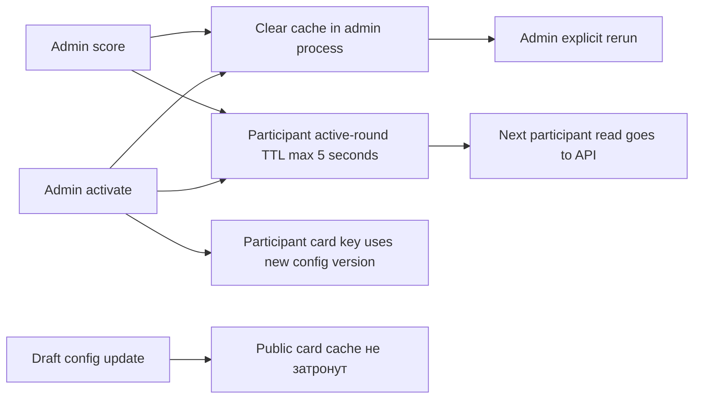

Административная команда очищает локальный cache admin-процесса только после `2xx`.
Она не может очистить cache отдельного participant-процесса: тот обновляется по TTL и
`config_version`. Кэш не используется для подтверждения успешной команды.

## 12. Аутентификация и блокировка

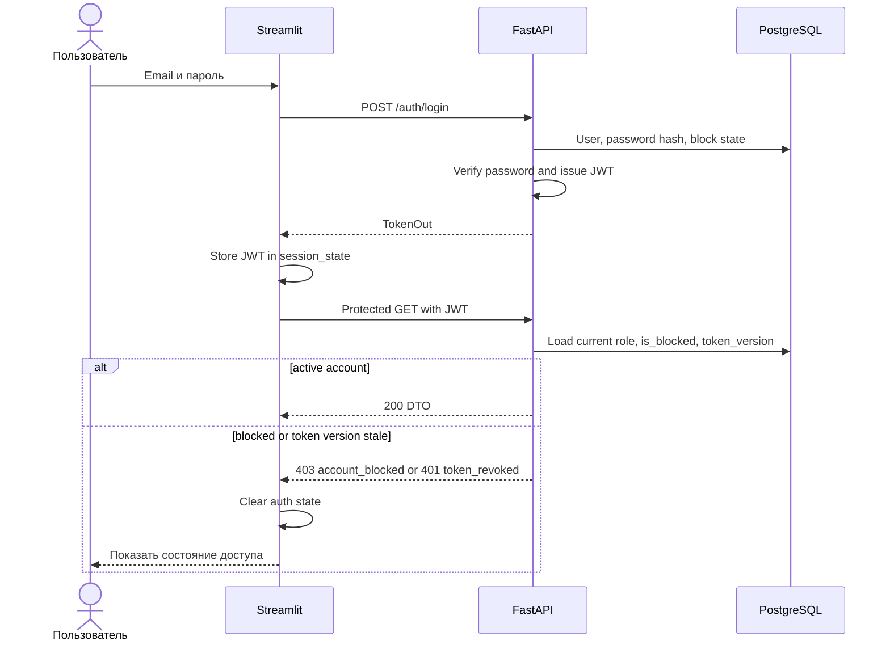

Блокировка должна действовать на уже выпущенный JWT. Для этого FastAPI на каждом
защищенном запросе проверяет DB user state; `token_version` позволяет принудительно
инвалидировать сессии при block/unblock/security action.

При `401` UI очищает token и открывает login, но не удаляет серверный черновик. При
`403 account_blocked` UI показывает отдельный экран и не выполняет автоматические retry.

## 13. Ошибки и отображение

| Категория API | Поведение Streamlit |
| --- | --- |
| `401 token_expired/token_revoked` | Очистить auth state, перейти на login |
| `403 account_blocked` | Экран блокировки; без retry |
| `403 forbidden` | Сообщение о недостаточных правах; логировать request ID |
| `200 null` от active-round endpoint | Экран ожидания или переход к `rounds/mine` |
| `404 round_not_found` | Сбросить stale selection и обновить доступные раунды |
| `409 scenario_revision_conflict` | Conflict state и GET canonical scenario |
| `409 round_locked` | Отключить редактирование и обновить round status |
| `422 validation_error` | Привязать field violations к step/widget |
| `429 rate_limited` | Показать retry-after, не делать tight loop |
| `5xx/503` | Сохранить local dirty copy, показать retry, не заявлять об успехе |
| Network timeout | Следовать retry policy конкретного метода |

Пользователю показывается понятный русский текст, а `request_id` — в раскрываемых
технических деталях для оператора. Сырой traceback и внутренние SQL-ошибки не выводятся.

## 14. Таймауты и retry policy

| Операция | Connect | Read | Автоповтор |
| --- | ---: | ---: | --- |
| GET active/cards/scenario/result | 3 с | 10 с | До 2 раз, exponential backoff + jitter |
| PUT scenario | 3 с | 15 с | Один раз с тем же mutation ID |
| POST login/register | 3 с | 10 с | Нет |
| POST submit | 3 с | 15 с | Нет; затем GET scenario |
| Admin PUT access/adjustment | 3 с | 15 с | Только с тем же idempotency key |
| POST activate | 3 с | 15 с | Нет; затем GET round |
| POST score | 3 с | 30 с | Нет; затем GET round/stats |

Все повторы используют тот же `X-Request-ID` для одной попытки пользователя и тот же
idempotency/mutation key для одной логической команды. Каждая транспортная попытка может
дополнительно иметь `X-Attempt` для диагностики.

## 15. Admin-команды

### Блокировка игрока

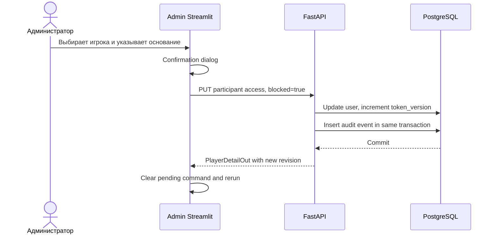

### Ручная корректировка лидерборда

Корректировка не изменяет `scoring_results`. Admin UI отправляет отображаемые overrides,
обязательное основание и `expected_revision`; FastAPI сохраняет overlay и audit event.
Leaderboard response содержит `is_adjusted`, base/effective values и reason для admin.
Participant leaderboard показывает маркер «скорректировано», но не внутреннюю причину.

## 16. Неопределенный результат score

```mermaid
sequenceDiagram
    actor A as Администратор
    participant S as Admin Streamlit
    participant F as FastAPI

    A->>S: Запустить скоринг
    S->>F: POST score, Idempotency-Key=K
    F--xS: Read timeout or connection lost
    S->>S: Не показывать успех и не повторять POST
    S->>F: GET round
    F-->>S: active or completed
    alt completed
        S->>F: GET stats and board
        F-->>S: Published results
    else active
        S-->>A: Скоринг не зафиксирован; разрешить осознанный retry
    end
```

Если API вернул `409 scoring_in_progress`, UI ожидает короткий интервал и читает статус,
но не создает параллельную команду.

## 17. Контракт логирования между UI и API

Streamlit генерирует `request_id` на логическое действие и пишет только:

```json
{
  "service": "participant-ui",
  "event": "api_call_completed",
  "request_id": "01J...",
  "route": "/api/v1/rounds/{round_id}/scenario",
  "method": "PUT",
  "status_code": 200,
  "latency_ms": 84,
  "round_id": 12,
  "scenario_id": 91
}
```

Не логируются token, email, display name, headers, request/response body и steps.
FastAPI продолжает тот же request ID, поэтому оператор может связать UI-event,
application service и SQL latency.

## 18. Проверяемые правила реализации

1. Повторный rerun без события не создает PUT/POST.
2. Два пользователя, вызывающие cached transport, передают разные JWT только в локальных
   headers запроса.
3. Restart Streamlit и повторный login восстанавливают серверный draft.
4. Timeout PUT и retry с тем же mutation ID дают одну новую revision.
5. Два окна с одной revision приводят к одному `200` и одному `409`.
6. Изменение submitted draft требует повторного submit.
7. Block немедленно запрещает следующий запрос со старым JWT.
8. Admin adjustment не меняет base scoring result.
9. Timeout score разрешается GET-проверкой, а не слепым повтором.
10. Ни одна Streamlit-функция с user data не использует `st.cache_data`.

## 19. Антипаттерны

- `@st.cache_resource` над `LocalStore`, repository или SQLAlchemy session.
- Глобальная mutable переменная с текущим пользователем/JWT.
- `headers.update({"Authorization": ...})` на общем cached HTTP client.
- PUT/POST в top-level ветке страницы, которая выполняется на каждом rerun.
- Сохранение при каждом символе `text_input`.
- Last-write-wins без revision conflict.
- Локальное изменение admin table до ответа API.
- Использование client preview как аргумента канонического scoring.
- Retry score после timeout без чтения состояния.
- Общий cache leaderboard/profile «для ускорения».
