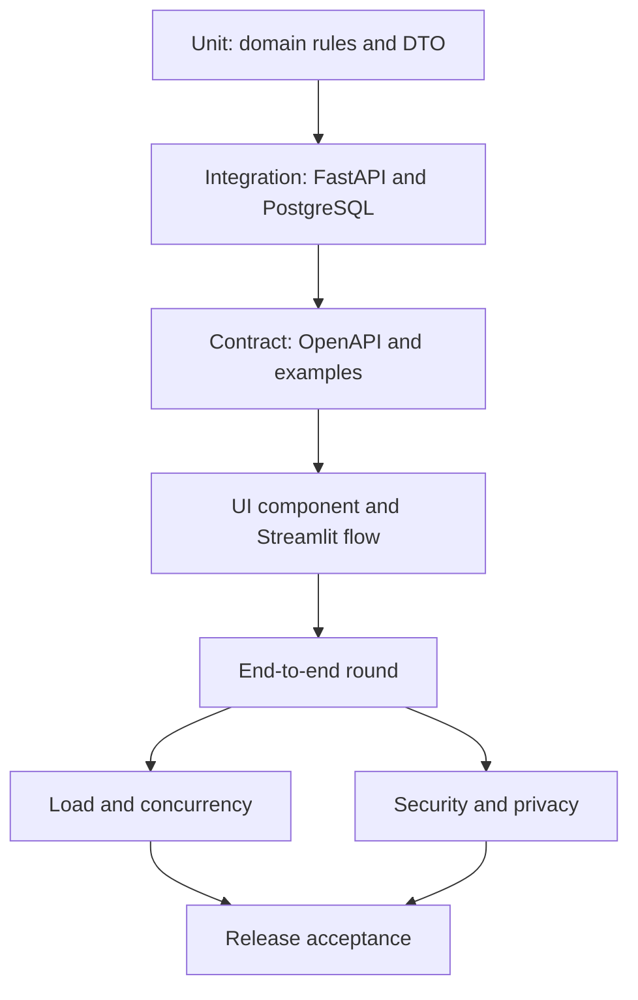
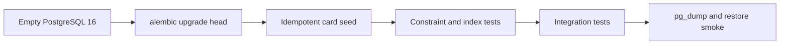
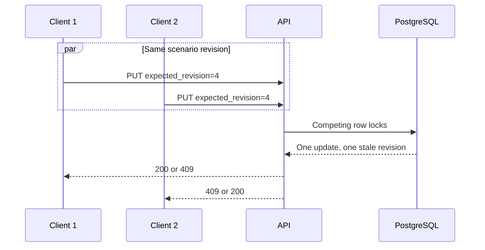

# Стратегия тестирования

## 1. Цель

Тесты должны доказать не только корректность формул, но и архитектурные инварианты:
Streamlit не создает повторные команды при rerun, FastAPI остается владельцем правил,
PostgreSQL предотвращает гонки, а scoring публикуется атомарно.

## 2. Среды

| Среда | Назначение | Данные |
| --- | --- | --- |
| Unit | Чистые Python-функции | Fixtures, без БД/сети |
| Integration | FastAPI + PostgreSQL той же major version | Изолированная test DB |
| UI | Streamlit + fake/contract stub API | Синтетические users/scenarios |
| E2E | Полный Docker Compose | Seed мероприятия без PII |
| Load | Release image на target-like VM | Синтетические 500 participants |
| Staging rehearsal | Полный workshop flow и Wi-Fi profile | Удаляемые test accounts |

SQLite не заменяет PostgreSQL в тестах транзакций, partial indexes, JSONB, row locks и
numeric rounding.

## 3. Unit tests домена

### Game rules

- debit/credit/neutral flow и комиссии;
- Decimal rounding;
- energy/time/trust consumption;
- min/max amount и max frequency;
- max actions/identical/night/anonymous constraints;
- cash/crypto/high-risk category quotas;
- prerequisite и purchase-refund relation;
- card-specific parameter schema и effects;
- objective reached/not reached;
- stable per-step resource snapshots.

Для каждой версии ruleset используются golden fixtures. Изменение ожидаемого результата
требует новой версии, а не безусловного обновления snapshot test.

### Risk/scoring

- каждый factor family отдельно;
- protective factors с отрицательным contribution;
- sequence factors;
- clamp 0..100 и threshold boundaries;
- детерминированная сортировка top factors;
- сумма factors согласуется с raw score;
- unknown scoring version отклоняется.

### Leaderboard

- resource normalization;
- weights суммируются в 1;
- monotonicity risk/resources;
- game score и rounding;
- stable tie-break/dense rank;
- blocked player исключается только из public projection;
- adjustment меняет effective, не base.

## 4. Pydantic/schema tests

Проверяются request и stored JSONB models:

- `extra="forbid"` для всех input DTO;
- money как decimal string, не float special values;
- max lengths, array sizes и nested depth;
- unique `step_id`;
- card reference code/version/id consistency;
- action details discriminated by card version;
- game config versions и суммы weights;
- error envelope для native FastAPI `422`.

Каждый JSON example из `api.md` должен проходить соответствующую Pydantic-модель либо
быть явно помечен как сокращенный response.

## 5. Repository и migration tests

Обязательные проверки:

- чистая БД достигает Alembic head;
- upgrade из последней поддерживаемой dev schema сохраняет данные;
- seed повторяется без дубликатов;
- `UNIQUE(round_id, participant_id)`;
- partial unique active/scoring round;
- numeric precision;
- FK delete policies;
- audit event append-only на application level;
- query plans используют round/status indexes на 500+ rows.

Downgrade проверяется только для обратимых migration. Destructive rollback выполняется
restore, а не фиктивным downgrade.

## 6. FastAPI integration tests

### Auth/RBAC

- register/login/session/logout happy path;
- duplicate normalized email;
- password policy и generic invalid credentials;
- account lockout;
- session expiry/revoke;
- participant получает `403` на каждый admin endpoint;
- participant A не читает scenario/result B;
- blocked user: все sessions отозваны, следующий request запрещен.

### Round lifecycle

- draft create/update с config revision;
- invalid card/ruleset/weights;
- activate immutable snapshot;
- второй active round -> `409`;
- update active -> `409`;
- zero submissions -> `no_submissions`;
- completed score returns existing summary.

### Scenario lifecycle

- GET null, initial PUT, repeated PUT;
- same mutation ID/same payload;
- same mutation ID/different payload;
- stale revision conflict;
- submitted -> new draft -> resubmit;
- round locks submit/edit;
- server resource preview ignores client calculations.

### Admin features

- pagination/filter participant list;
- detail contains full selected chain only;
- block/unblock + revoke active sessions + audit in one transaction;
- adjustment create/update/conflict/clear;
- base result immutable;
- public/admin leaderboard privacy projections.

## 7. Concurrency tests PostgreSQL

Набор гонок:

1. два PUT одной revision;
2. PUT retry после simulated response loss;
3. submit против PUT;
4. submit против score;
5. два activate;
6. два score с разными idempotency keys;
7. block против participant request;
8. две adjustment revisions.

Тесты используют реальные параллельные connections и barriers, а не последовательную
имитацию.

## 8. Scoring atomicity tests

В scoring engine внедряется controlled failure после N-го scenario.

Ожидания:

- endpoint возвращает controlled 500/error envelope;
- round остается `active`;
- scenarios остаются `submitted`;
- новых scoring results нет;
- audit `round_scored` не создан;
- повтор после снятия failure дает ровно один result на scenario;
- completed repeat не меняет hashes/timestamps.

## 9. Contract tests Streamlit–FastAPI

ApiClient тестируется независимо от Streamlit:

- URL/prefix и headers;
- session ID передается per request в `X-Session-ID`, не остается в shared transport;
- request ID сохраняется на retry;
- timeout profile по method;
- error envelope mapping;
- malformed/non-JSON 5xx;
- `Retry-After` handling;
- GET/PUT retry policy;
- score timeout вызывает read-back flow.

Consumer contract фиксирует только поля, которые реально читает UI. Добавление поля
backward-compatible; удаление/переименование требует новой API version или совместимого
перехода.

## 10. Streamlit UI tests

### Cookie/server-side session

- `CookieController` возвращает pending/ready без ложного logout на первом render;
- set/get/remove используют одинаковые path/domain/secure/same-site параметры;
- production cookie имеет `Secure=true`, `SameSite=Strict`, host-only scope;
- login создает новый случайный ID и хранит в БД только SHA-256;
- session fixation и повторное использование revoked/expired ID отклоняются;
- logout отзывает только current session; «выйти везде», block и password reset отзывают все;
- два браузера одного пользователя остаются независимыми до global revoke;
- `last_seen_at` write throttled и не выполняется на каждый GET;
- XSS-focused test подтверждает escaping user values, поскольку `HttpOnly` недоступен;
- версия `streamlit-cookies-controller` закреплена и browser component проходит smoke.

### Session/rerun

- initial state создается один раз;
- rerun без event не выполняет write call;
- form submit выполняет один PUT;
- successful response заменяет local draft и revision;
- timeout сохраняет dirty draft;
- conflict не перезаписывает server state молча;
- logout отзывает session row, удаляет cookie и очищает widget-sensitive state;
- blocked response открывает access screen.

### Draft history and lifecycle

- участник до старта раунда видит экран ожидания, а сервер отвечает `409` на запись;
- ресурсы, квоты и прогресс цели пересчитываются на добавление, удаление, правку и
  перестановку шага — до ручного сохранения;
- каждое сохранение добавляет версию; восстановление старой версии создает новую и не
  удаляет более поздние;
- отправка фиксирует одну версию, и именно она уходит в скоринг;
- остановка раунда блокирует запись на сервере, перезапуск создает новый раунд и
  сохраняет историю прошлого;
- организатор видит все версии всех участников и полный набор параметров каждого шага.

### Dynamic forms

- в раунде доступны ровно те операции, которые включены его конфигурацией;
- у операции не больше двух настраиваемых параметров, включая канал; поле частоты
  показывается только там, где это предусмотрено;
- скрытые параметры не имеют виджетов, но приходят в снимке со стабильными значениями;
- черновик со старым, полным payload открывается и сохраняется без потери полей;
- разные card codes отображают разные fields;
- widget keys стабильны по `step_id` при reorder;
- option labels не подменяют machine values;
- field errors привязаны к нужному step;
- длинные labels/values помещаются на mobile/desktop;
- light/dark theme сохраняет контраст и видимость focus/error states.

### Appearance

- тёмная тема — стартовая, светлая включается кнопкой в обеих панелях;
- выбор переживает навигацию между страницами и перезагрузку вкладки;
- на каждой контрольной ширине нет горизонтального скролла и обрезанного текста в обеих
  темах.

### Admin UI

- поиск/фильтр и выбор participant;
- full chain каждого выбранного игрока;
- confirmation/reason для block/adjustment/score;
- base/effective значения видимы рядом;
- pending command защищает от double click/rerun;
- API mode не смешивается с demo session state.

## 11. Visual regression matrix

| UI | Viewports | Themes | Состояния |
| --- | --- | --- | --- |
| Participant | 360x800, 768x1024, 1366x768, 1920x1080 | light/dark | login, empty, chain, violations, submitted, result, leaderboard |
| Admin | 768x1024, 1366x768, 1920x1080 | light/dark | monitoring, players, chain, blocked, adjustment, scoring |

Playwright screenshots проверяются вместе с DOM assertions:

- нет horizontal overflow;
- кнопки/labels не обрезаны;
- текст не перекрывает controls;
- focus order и keyboard interaction;
- color не является единственным признаком status;
- Streamlit WebSocket и assets загружаются под `/play` и `/admin`.

## 12. End-to-end сценарий

E2E проходит на release image и PostgreSQL 16, без LocalStore fallback.

## 13. Load profile на 500 участников

### Нагрузочные фазы

| Фаза | Виртуальные действия | Цель |
| --- | --- | --- |
| Ramp-up | 500 login/session opens за 5 мин | WebSocket/connection capacity |
| Read burst | Active round + cards | Cache/API read profile |
| Editing | 2–5 PUT на participant с think time | Revision/write throughput |
| Submit burst | 400–500 submit за 60 с | Lock/pool/latency |
| Admin reads | Stats/participant list параллельно | No starvation |
| Scoring | Один score на 500x8 steps | <10 с target |
| Result burst | 500 result/leaderboard reads | Publication consistency |

### Acceptance

- API 5xx < 1%;
- p95 ordinary request < 500 мс;
- no DB pool timeout;
- PostgreSQL connections < 80% configured maximum;
- scoring < 10 с и transaction < hard threshold;
- no duplicate scenarios/results;
- submitted count equals expected;
- CPU/RAM/disk retain operational headroom.

Load generator должен моделировать Streamlit/API pattern. Прямой bombardment FastAPI
не подтверждает capacity WebSocket UI и используется только как отдельный backend test.

## 14. Security и privacy tests

- наружу доступны только 80/443 и UI paths;
- `/api`, `/docs`, `/redoc`, `/openapi.json`, 8000 и 5432 закрыты;
- IDOR на round/participant/scenario IDs;
- session ID format/randomness/hash lookup/expiry/revocation;
- auth body/rate limits;
- SQL/XSS strings остаются данными;
- admin self-protection и required reason;
- log scan на email, raw session ID, session hash, `X-Session-ID`, password, steps;
- public leaderboard не содержит IDs/email/chain;
- backup encrypted и удаляется по retention;
- participant deletion/anonymization verification.

## 15. Resilience tests

| Fault injection | Ожидаемое поведение |
| --- | --- |
| Kill participant Streamlit | Server draft сохраняется; повторный login восстанавливает |
| Kill admin Streamlit during score wait | API transaction либо commit, либо rollback; read-back определяет итог |
| Kill API during PUT | Retry mutation ID не создает лишнюю revision |
| Kill API during score | PostgreSQL rollback; round active |
| Stop PostgreSQL | API readiness 503; UI не пишет в LocalStore |
| Fill connection pool | Bounded timeout/503, без process hang |
| Proxy WebSocket interruption | UI reconnect/relogin, PG state сохраняется |

## 16. Проверка документации

Автоматическая docs-проверка должна:

1. найти все Markdown-файлы из `docs/README.md`;
2. проверить относительные links и anchors;
3. проверить парность fenced blocks;
4. отрендерить Mermaid blocks поддерживаемой Mermaid CLI;
5. проверить отсутствие старых unversioned target endpoints;
6. сопоставить endpoint matrix с OpenAPI operation IDs;
7. проверить enum round/scenario statuses во всех docs;
8. проверить JSON examples parser-ом;
9. подтвердить, что 250000/14/18/100/8/150000 описаны как config;
10. подтвердить, что изменены только ожидаемые Markdown-файлы при docs-only задаче.

## 17. Release gates

| Gate | Обязательное подтверждение |
| --- | --- |
| G1 Domain | Unit + golden rules/scoring/leaderboard tests |
| G2 Data | Alembic clean upgrade, constraints, PG integration |
| G3 Contract | OpenAPI/schema examples и ApiClient tests |
| G4 UI | Participant/admin smoke + responsive light/dark screenshots |
| G5 E2E | Полный round без терминала/LocalStore |
| G6 Load | 500-user profile принят |
| G7 Security | RBAC/IDOR/log/closed ports checklist |
| G8 Operations | Backup restore, runbook rehearsal, release image freeze |

Мероприятие разрешено только после G1–G8. Исключение документируется владельцем риска с
временным mitigation и ответственным; отсутствие теста не считается успешным тестом.
