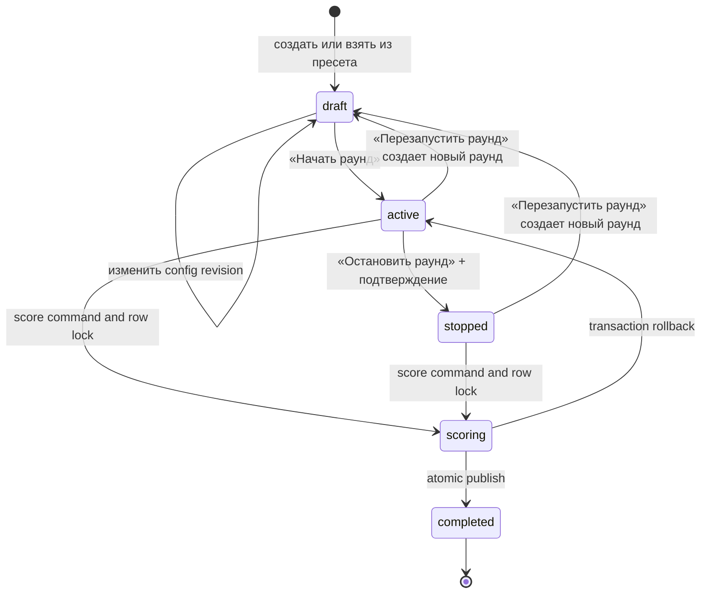
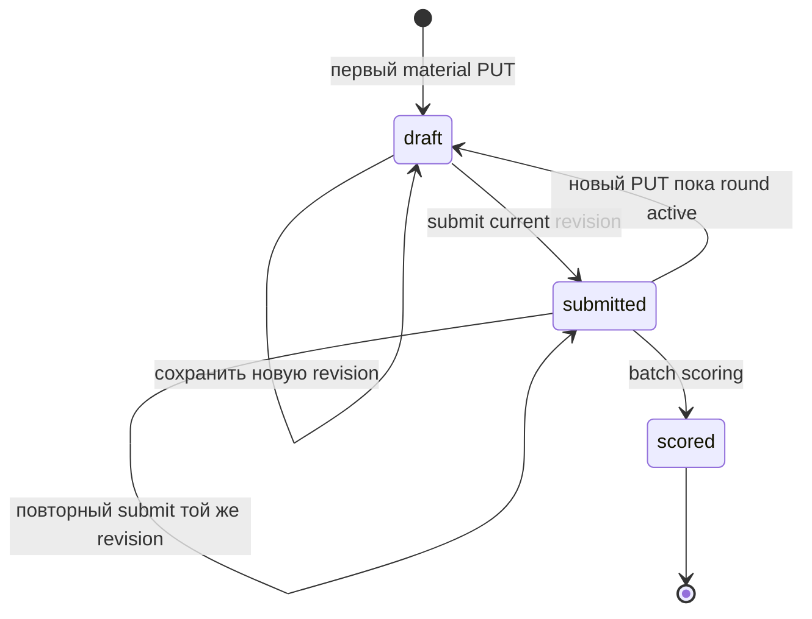
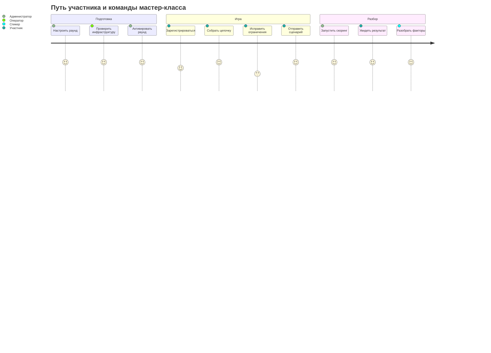
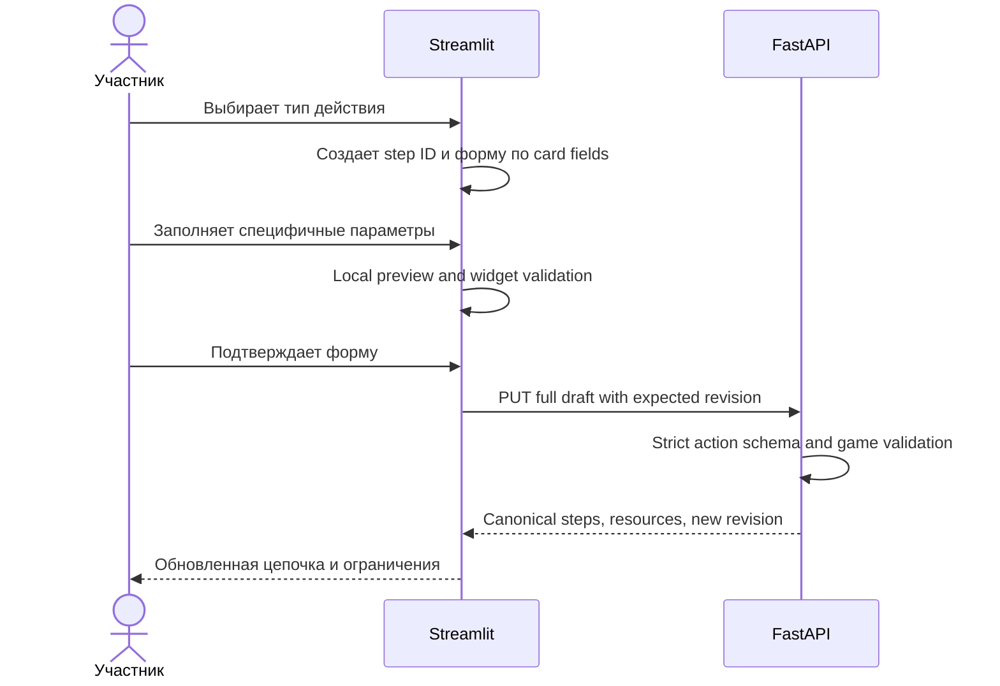
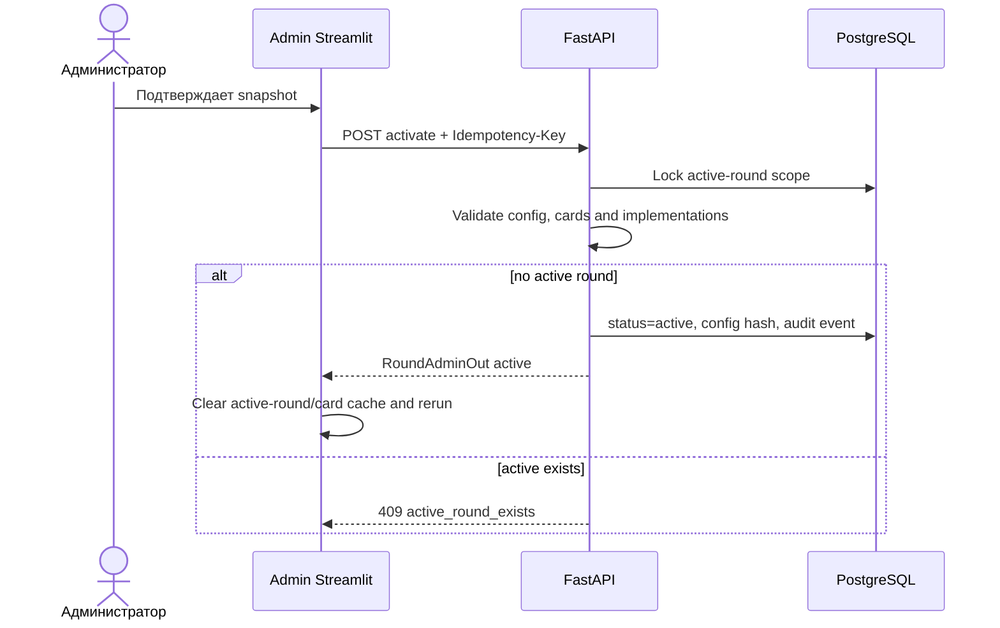
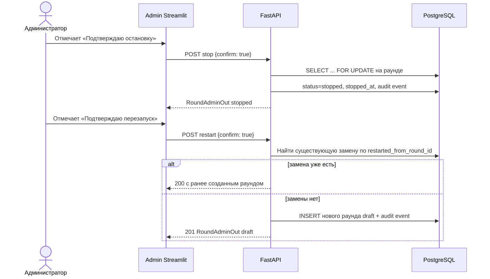
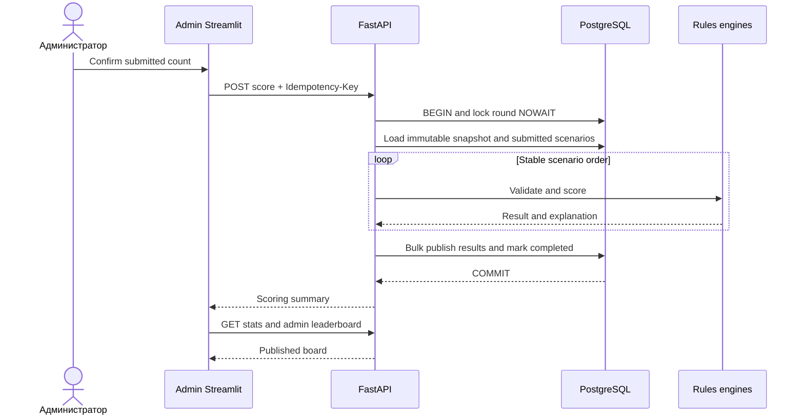

# Поток мастер-класса и use cases

## 1. Роли

| Роль | Цель | Технический доступ |
| --- | --- | --- |
| Участник | Собрать валидный сценарий, выполнить цель и получить высокий game score | `participant` |
| Администратор | Подготовить раунд, контролировать доступ, запустить scoring, управлять leaderboard | `admin` |
| Спикер | Объяснить цепочки, факторы и ограничения модели | `admin`, read-oriented use cases |
| Оператор | Поддерживать VM, сеть, backup и monitoring | SSH/infra, не прикладная роль |

## 2. Жизненный цикл раунда

| Статус | Разрешено | Запрещено |
| --- | --- | --- |
| `draft` | Редактировать config/card versions | Participant gameplay, score |
| `active` | GET/PUT/submit scenario, stats, block | Изменять round config |
| `stopped` | Read, stats, scoring, restart | Любая запись участника |
| `scoring` | Только read/ожидание | Draft/submit/config/второй score |
| `completed` | Result, leaderboard, admin detail/adjustment | Scenario/config mutation, rescore |

Раунд не начинается сам: пока организатор не нажал «Начать раунд», зарегистрированный
участник видит экран ожидания, а сервер отвечает `409 round_locked` на любую попытку
сохранить или отправить сценарий. Это одно и то же правило в двух местах, а не только
скрытая кнопка в интерфейсе.

Активация нового round не завершает существующий active автоматически. При конфликте
администратор получает `409 active_round_exists`; инвариант «не более одного идущего
раунда» гарантирует частичный уникальный индекс в PostgreSQL.

Остановка и перезапуск требуют явного подтверждения в интерфейсе и `confirm: true` в
запросе. Перезапуск ничего не удаляет: он создает **новый** раунд с той же
конфигурацией и ссылкой на предыдущий, прежний раунд переводит в `stopped`, а повторное
нажатие возвращает уже созданную замену. Все три команды попадают в audit trail.

## 3. Жизненный цикл сценария

`revision` относится к содержимому steps. Повторная отправка до scoring разрешена, но
после любого изменения пользователь обязан submit новую revision.

Каждое явное сохранение добавляет строку в `scenario_versions`: участник видит список
своих версий (номер, название, время, число шагов, ресурсы) и может открыть любую
старую. «Продолжить с этой версии» создает новую версию с содержимым выбранной, а более
поздние версии остаются в истории. Отправка фиксирует ровно одну версию, и именно её
читает скоринг.

## 4. Сквозной поток мероприятия

## 5. UC-P1: регистрация и вход

**Актор:** участник.

**Предусловия:** participant UI доступен по HTTPS; регистрация открыта.

**Основной поток:**

1. Участник вводит email, псевдоним/display name и пароль.
2. Streamlit отправляет `POST /auth/register` без сохранения пароля.
3. FastAPI нормализует email, создает participant и возвращает user DTO.
4. Участник выполняет login.
5. FastAPI создает server-side session; Streamlit устанавливает route-scoped session cookie и вызывает `GET /auth/session`.
6. UI открывает active round либо экран ожидания.

**Альтернативы:** существующий participant сразу входит; после restart Streamlit
повторный login восстанавливает server draft.

**Ошибки:** duplicate email, weak password, auth rate limit, blocked account, API
unavailable. UI не создает локальную учетную запись как fallback.

## 6. UC-P2: открыть конструктор

**Предусловия:** server-side session активна, существует active round.

1. Streamlit загружает active round, card snapshot и собственный scenario.
2. Для отсутствующего scenario создается пустая local draft с server revision 0.
3. Для существующего scenario server copy полностью гидратирует UI.
4. UI показывает ресурсы, objective, constraints и status сохранения.
5. Рендер не выполняет write request.

**Альтернативы:** active round отсутствует — показывается ожидание; round completed — UI
перенаправляет на result/leaderboard.

## 7. UC-P3: добавить и настроить действие

Поля зависят от карточки. Например, внесение наличных показывает источник средств,
перевод — тип получателя, а снятие наличных — время операции.

**Допустимые действия:** add, edit, delete, reorder, duplicate при сохранении нового
`step_id` и повторной валидации.

**Ошибки:** неизвестное поле, недопустимая option, amount/frequency limit, недостаток
balance/energy/time и category quota. UI привязывает violation
к step/widget по `step_id + field`.

## 8. UC-P4: синхронизация и конфликт

**Основной поток:** callback создает mutation ID, PUT succeeds, local draft заменяется
server response.

**Timeout:** local state остается dirty; retry выполняется с тем же mutation ID.

**Два окна:** stale expected revision получает `409`; UI загружает canonical state и
предлагает осознанно повторить изменение. Silent last-write-wins запрещен.

## 9. UC-P5: отправить сценарий

**Предусловия:** round active, local draft синхронизирован, hard constraints выполнены,
objective достигнута.

1. При dirty state UI сначала сохраняет draft.
2. Streamlit отправляет submit с current revision.
3. FastAPI блокирует round/scenario и полностью пересчитывает правила.
4. Scenario переходит в `submitted`.
5. UI показывает revision и состояние «Ожидает скоринга».

**Повторная отправка:** до scoring пользователь может изменить scenario. Новый PUT
возвращает status `draft`, после чего нужен новый submit.

**Ошибки:** round успел перейти в scoring, objective не достигнута, hard constraint
нарушен, revision stale, user blocked.

## 10. UC-P6: результат и лидерборд

1. Пока round не completed, result endpoint возвращает `null`.
2. После повторного входа UI находит completed round через `GET /rounds/mine`, даже если
   прежняя Streamlit session потеряна.
3. После публикации participant получает base model result, explanation, resource score,
   game score и rank.
4. Public leaderboard показывает псевдонимы и игровые метрики без ID/email/chain.
5. Если leaderboard overlay применен, UI явно показывает маркер корректировки.
6. Blocked participants не входят в public ranking.

Участник не может запросить чужой scenario/result по ID.

## 11. UC-A1: подготовить draft-round

1. Admin входит под bootstrap-account.
2. Выбирает версии карточек из catalog.
3. Задает initial balance/energy/time, max actions, objective и quotas.
4. Выбирает поддерживаемые ruleset/scoring/leaderboard versions и weights.
5. UI выполняет локальные range checks и отправляет full config с expected revision.
6. API возвращает canonical draft и computed warnings.
7. Admin preview показывает, что будет зафиксировано.

**Ошибка concurrency:** stale config revision -> `409 round_config_conflict`.

## 12. UC-A2: активировать раунд

После activate любое изменение config возвращает `409 round_config_locked`: снимок
конфигурации становится неизменяемым. Чтобы играть с другими настройками, организатор
либо создает новый draft-раунд, либо перезапускает текущий и правит конфигурацию новой
копии до старта.

### Остановка и перезапуск

Данные прошлого раунда — сценарии, все версии черновиков, результаты и журнал — остаются
на месте; новый раунд стартует отдельной командой.

### Пресеты настроек

Организатор готовит наборы параметров заранее: создать, назвать, сохранить, загрузить в
редактор, обновить или сохранить как новый, удалить с подтверждением, создать раунд из
пресета. Загрузка пресета **не** запускает игру: она создает черновик раунда, который
организатор проверяет и запускает отдельно. Раунд хранит собственный снимок, поэтому
поздние правки пресета не меняют уже созданные раунды.

## 13. UC-A3: контролировать готовность

Admin monitoring показывает:

- registered/active/blocked participants;
- without scenario/draft/submitted/scored;
- последнее обновление сценария;
- технический статус API/DB;
- готовность кнопки scoring.

Stats не кэшируется между users. Refresh — явная кнопка или контролируемый interval,
который прекращается при уходе со страницы.

Неотправленные drafts не попадают в scoring. Перед запуском UI требует подтверждение с
числом submitted/excluded drafts.

## 14. UC-A4: найти игрока и посмотреть всю цепочку

1. Admin выбирает active/completed round.
2. Фильтрует participants по display name, exact email, access и scenario status.
3. Выбирает игрока.
4. API возвращает account state, timestamps, full chain, resource snapshots, base/effective
   scores, explanation и recent admin activity.
5. UI показывает шаги в исходном порядке с action-specific details и factor links.

Список не загружает chains всех игроков. Full payload читается только для выбранного
participant, что сохраняет интерфейс и API масштабируемыми.

## 15. UC-A5: блокировать или разблокировать игрока

**Предусловия:** admin выбрал participant и указал reason.

1. UI показывает confirmation и текущее access state.
2. Admin подтверждает desired state.
3. API сравнивает access revision, меняет state, отзывает active sessions и пишет audit event.
4. Все уже выданные participant session ID перестают работать на следующем запросе.
5. Scenario/result сохраняются; public leaderboard исключает blocked player.

**Ошибки:** self-block, stale access revision, participant not found, reason too short.

## 16. UC-A6: запустить скоринг

**Ошибка в середине:** transaction rollback; round снова виден как active; partial board
отсутствует.

**Timeout UI:** admin не нажимает повторно. UI читает round/status/stats и только после
подтвержденного active разрешает новую команду.

## 17. UC-A7: скорректировать leaderboard

1. Admin выбирает scored participant.
2. UI показывает рядом base и effective values.
3. Admin задает только необходимые overrides и обязательное основание.
4. API проверяет range/revision, сохраняет overlay и audit event.
5. Admin/public leaderboard пересчитывает rank; строка помечается adjusted.
6. Clear adjustment возвращает base values и создает новый audit event.

Корректировка не меняет risk explanation и не запускает scoring повторно.

## 18. UC-S1: общий разбор

Спикер использует admin leaderboard и participant detail:

1. выбирает несколько характерных сценариев;
2. сопоставляет шаги с top risk/protective/sequence factors;
3. сравнивает похожие цепочки с разным context/action details;
4. показывает trade-off между низким risk и сохранением ресурсов;
5. объясняет false positive/false negative и роль человека;
6. напоминает, что это учебная модель.

Email и технические security fields не выводятся на общий экран. Для демонстрации
используется pseudonym/display name.

## 19. Сценарий 45 минут

| Время | Этап | Действия людей | Поведение системы |
| --- | --- | --- | --- |
| 0–3 | Вход | Спикер задает цель, admin показывает QR | Active round уже проверен |
| 3–8 | AML/антифрод | Краткое введение и ограничения автоматизации | Participant registration открыта |
| 8–12 | Интерфейс | Показ карточек, ресурсов и objective | Cards загружаются из snapshot |
| 12–24 | Конструктор | Участники собирают цепочки | PUT revisions, server preview, violations |
| 24–28 | Итерация | Участники меняют параметры и сравнивают эффекты | Explanation preview без раскрытия финального score при выбранной методике |
| 28–30 | Submit | Финальная отправка | Admin видит submitted count |
| 30–32 | Скоринг | Admin подтверждает batch | Round lock, atomic result publication |
| 32–39 | Разбор | Спикер открывает leaderboard и цепочки | Base/effective scores и factors |
| 39–43 | Ограничения ИИ | False positives, drift, human review | Disclaimer виден в result |
| 43–45 | Вопросы | Ответы участников | Система остается в completed/read-only |

## 20. Ошибочные и резервные потоки

| Ситуация | UX | Каноническое состояние |
| --- | --- | --- |
| Нет active round | Экран ожидания, редкий refresh | Без изменений |
| Server-side session истекла | Cookie удаляется, login; draft восстановится | Scenario в PG |
| User blocked | Отдельный access screen | Scenario/result сохранены |
| API временно недоступен | Local dirty copy + retry action | Success не заявляется |
| DB недоступна | Service unavailable | Нет LocalStore fallback |
| Draft revision conflict | Выбор server/reapply | Server revision побеждает по умолчанию |
| Score lock занят | Pending/refresh | Второй batch не запускается |
| Нет submissions | Admin получает `no_submissions` | Round active |
| Streamlit restart | Повторный login | PG данные не потеряны |
| Полный outage | Теоретическая часть и заранее подготовленные обезличенные примеры | Нельзя объявлять несохраненные результаты |

## 21. Матрица use case — state

| Use case | draft round | active round | scoring round | completed round |
| --- | ---: | ---: | ---: | ---: |
| Update round config | Да | Нет | Нет | Нет |
| Participant PUT/submit | Нет | Да | Нет | Нет |
| View own scenario | Нет | Да | Да | Да |
| Block/unblock participant | Да | Да | Да, с осторожностью | Да |
| Score | Нет | Да | Нет | Возврат existing summary |
| Public leaderboard | Нет | Нет | Нет | Да |
| Admin player detail | Ограниченно | Да | Да | Да |
| Leaderboard adjustment | Нет | Нет | Нет | Да |
