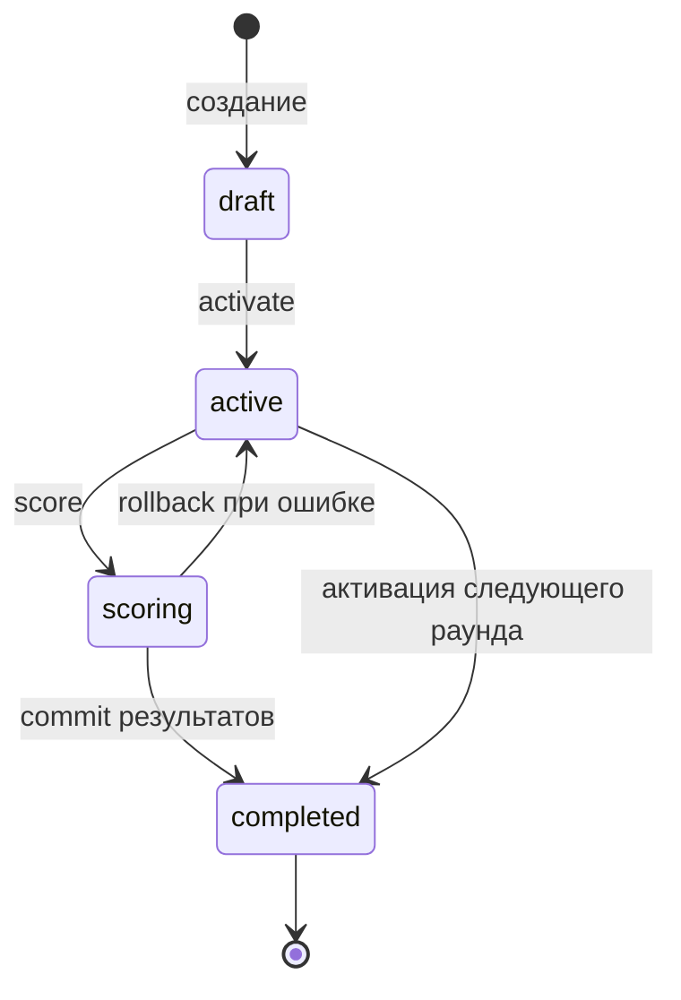
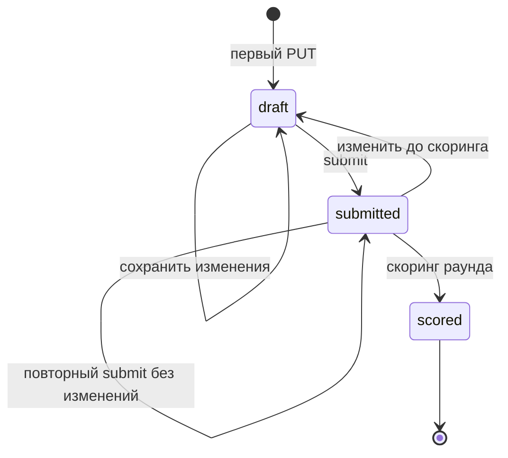
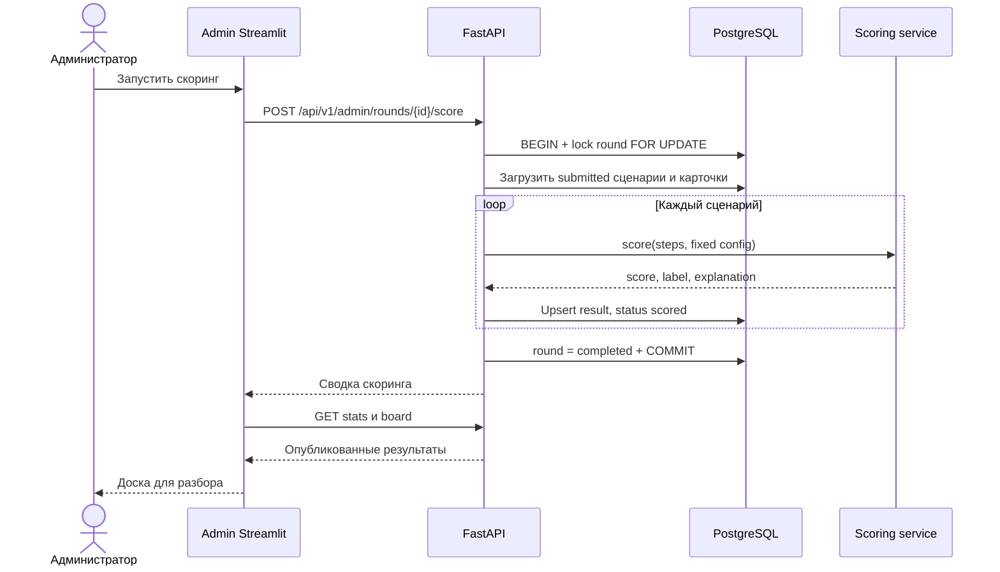

# Поток мастер-класса и use cases

## Роли

- **Участник** регистрируется, собирает сценарий и видит только свой результат.
- **Администратор** создает и активирует раунд, следит за готовностью и запускает скоринг.
- **Спикер** использует admin board для общего разбора факторов. В v1 это та же роль
  доступа `admin`, но отдельная организационная ответственность.

## Состояния раунда

- В `draft` разрешено менять название, правила и набор карточек.
- В `active` участники сохраняют и отправляют сценарии; конфигурация заблокирована.
- В `scoring` любые изменения сценариев запрещены.
- В `completed` доступны результаты и доска, но данные неизменяемы.
- Обратный переход из `completed` не поддерживается.

## Состояния сценария

Повторная отправка разрешена только пока раунд `active`. Изменение отправленного
сценария сначала создает новую `draft`-ревизию, чтобы участник явно подтвердил ее
повторным submit.

## UC-P1: регистрация и вход

**Предусловия:** participant UI доступен по HTTPS.

**Основной поток:**

1. Участник вводит email, отображаемое имя и пароль.
2. Streamlit вызывает регистрацию и затем предлагает вход.
3. FastAPI нормализует email, хеширует пароль и создает роль `participant`.
4. При входе Streamlit получает JWT и хранит его в `st.session_state`.
5. UI загружает активный раунд.

**Альтернативы:** зарегистрированный пользователь сразу входит; при потерянной
Streamlit-сессии повторно вводит пароль. Email уже существует — регистрация не раскрывает
дополнительные сведения и предлагает вход.

**Ошибки:** после серии неверных паролей учетная запись временно блокируется; при
недоступности API UI не создает локальную учетную запись.

## UC-P2: сборка и отправка сценария

**Предусловия:** пользователь вошел, существует активный раунд.

1. UI загружает конфигурацию и карточки раунда.
2. Участник добавляет, удаляет, настраивает или переставляет шаг.
3. Streamlit немедленно показывает preview денег, энергии, комиссий, свободных действий
   и выполнения цели.
4. После структурного изменения UI выполняет `PUT` черновика.
5. FastAPI пересчитывает правила и возвращает каноническую версию и нарушения.
6. Кнопка отправки доступна только при локально корректном preview, но API все равно
   повторяет проверку.
7. Участник отправляет сценарий и видит статус «Ожидает скоринга».

**Альтернативы:** участник возвращается позднее, входит и восстанавливает черновик из
API; до запуска скоринга он может изменить и повторно отправить сценарий.

**Ошибки:** недостаточно денег или энергии, превышен лимит шага, не достигнута цель,
возврат больше предшествующих покупок, карточка не принадлежит раунду. Сервер возвращает
конкретные нарушения, UI подсвечивает соответствующие шаги.

## UC-P3: просмотр результата

1. До завершения раунда endpoint результата возвращает `null`, UI показывает ожидание.
2. После скоринга участник обновляет страницу или нажимает «Проверить результат».
3. UI показывает score, метку, остатки ресурсов и top factors.
4. Полный набор факторов доступен в раскрываемом учебном разборе.

Участник не получает сценарии, email или результаты других участников.

## UC-A1: подготовка и активация раунда

1. Администратор входит под заранее созданной учетной записью.
2. Создает `draft`, задает баланс, энергию, число действий, цель, scoring config и
   версии карточек.
3. API валидирует конфигурацию при каждом сохранении.
4. Перед активацией UI показывает итоговый снимок правил.
5. Активация блокирует конфигурацию и завершает ранее активный раунд.
6. Participant UI видит новый раунд не позднее чем через TTL кэша активного раунда.

## UC-A2: контроль готовности

Admin UI показывает число зарегистрированных участников, черновиков, отправленных и
просчитанных сценариев. Обновление выполняется явной кнопкой или контролируемым rerun,
без межпользовательского `st.cache_data`.

Администратор запускает скоринг, когда количество отправленных сценариев соответствует
ожиданиям аудитории. Неотправленные черновики в скоринг не включаются.

## UC-A3: скоринг и публикация

При исключении транзакция откатывается целиком. Раунд возвращается в `active`, частичная
доска не публикуется, оператор получает `request_id` для поиска ошибки.

## UC-S1: общий разбор

Спикер сортирует доску по риску, выбирает несколько характерных сценариев и обсуждает:

- какие признаки дали наибольший вклад;
- почему похожие сценарии получили разные результаты;
- где модель дает ложные срабатывания или пропуски;
- почему демонстрационные правила не заменяют расследование и человеческое решение.

Доска показывает display name, score, label и top factors, но не email и пароль.

## Сценарий 45 минут

| Время | Этап | Действие системы |
| --- | --- | --- |
| 0–5 мин | Введение | Admin UI открыт, раунд подготовлен, участникам показана ссылка/QR |
| 5–10 мин | AML и антифрод | Participant UI принимает регистрацию; скоринг еще не раскрывается |
| 10–25 мин | Конструктор | Черновики сохраняются, UI показывает ресурсы и ограничения |
| 25–30 мин | Финальная отправка | Администратор контролирует счетчики submitted |
| 30–33 мин | Скоринг | Раунд блокируется, результаты рассчитываются и публикуются |
| 33–41 мин | Разбор | Спикер показывает доску и объяснимые факторы |
| 41–45 мин | Ограничения и вопросы | Обсуждаются ошибки моделей, безопасность и роль человека |

## Пограничные ситуации

- **Нет активного раунда:** participant UI показывает ожидание и периодически обновляет
  только короткоживущий кэш активного раунда.
- **JWT истек:** UI очищает сессию и переводит на вход без потери серверного черновика.
- **Два окна одного участника:** последнее успешное сохранение становится каноническим;
  `revision` позволяет UI предупредить о более новой версии.
- **Раунд заблокирован во время отправки:** API возвращает `409 round_locked`, UI не
  показывает ложное подтверждение.
- **Повторный клик скоринга:** блокировка строки и статус предотвращают параллельный запуск.
- **Нет отправленных сценариев:** скоринг завершается с нулевым счетчиком только после
  явного подтверждения администратора либо возвращает `409 no_submissions` согласно UI-политике;
  для v1 выбирается `409 no_submissions`, чтобы избежать случайного закрытия раунда.
