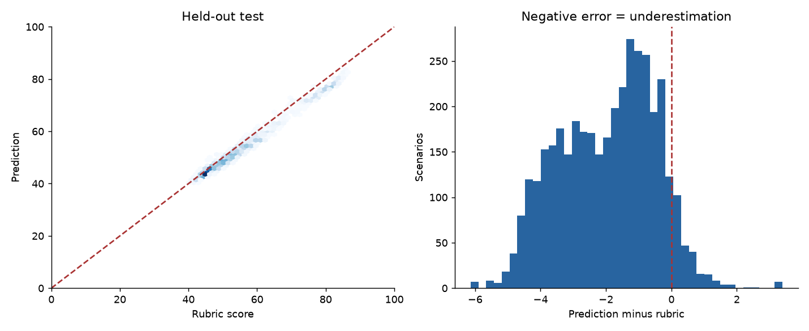
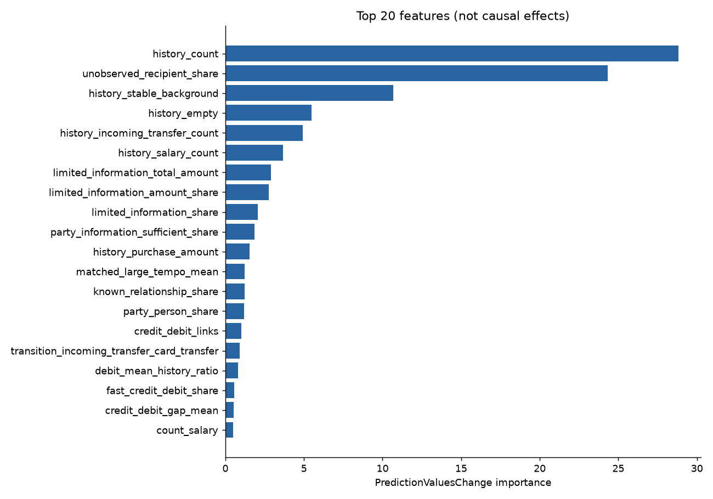

# Первая модель учебного AML-риска

Статус: **готова к отдельному этапу интеграции**.

Модель не подключена к игре. Цель — воспроизведение синтетической рубрики, не вероятность банковского обнаружения.

## Протокол

Release v2-1; extractor aml-observable-v2.6; CatBoost 1.2.10, CPU, Python 3.13. Seed 20260914.
Выбрана candidate-02: `{'iterations': 2000, 'learning_rate': 0.05, 'depth': 4, 'l2_leaf_reg': 3, 'loss_function': 'Quantile:alpha=0.65', 'eval_metric': 'MAE', 'random_seed': 20260914, 'thread_count': 4, 'task_type': 'CPU', 'allow_writing_files': False}`; деревьев 136.

12 конфигураций сравнивались только на validation. Test открыт после фиксации selection.json; переобучение на train+validation не выполнялось.

## Метрики после ограничения 0–100

| Часть | N | MAE | RMSE | P90 ошибки | Высокий риск | Занижение >15 | Высокий риск → <50 | MAE медианы | MAE прежнего скоринга |
|---|---:|---:|---:|---:|---:|---:|---:|---:|---:|
| train | 13195 | 0.816 | 1.692 | 1.806 | 1641 | 0 (0.00%) | 0 | 8.972 | 25.793 |
| validation | 2934 | 0.956 | 1.209 | 1.868 | 402 | 0 (0.00%) | 0 | 8.825 | 26.220 |
| test | 3871 | 2.039 | 2.456 | 4.015 | 533 | 0 (0.00%) | 0 | 8.433 | 26.533 |

Полные метрики до/после ограничения, медиана ошибки и смещение: [metrics.json](metrics.json). Разрезы с числом примеров: [slices.csv](slices.csv).

## Проверки и ограничения

Проверка сохранения, перестановки колонок и повторного обучения: `{'repeat_max_abs_diff': 0.0, 'reload_max_abs_diff': 0.0, 'reorder_max_abs_diff': 0.0, 'missing_feature_rejected': True, 'tolerance': 1e-08, 'passed': True}`.

Два дополнительных seed оценены только на validation; они не заменяют основную модель. Результаты и критерии:

- Seed 20260915: MAE 1.292, критерии пройдены.
- Seed 20260916: MAE 0.932, критерии пройдены.

Парные проверки — известные диагностические примеры, не независимый test. Допуск направления/равенства — 1 балл; отклонения не скрываются.

| Изменение | Ожидание | Δ рубрики | Δ модели | В допуске |
|---|---|---:|---:|---|
| party | increase | 32.843 | 20.211 | True |
| interval | decrease | -6.750 | -3.969 | True |
| order | equal | 0.000 | 0.403 | True |
| purchase | decrease | -0.050 | -0.561 | True |
| purchase_background | decrease | -0.900 | -0.601 | True |
| salary | decrease | -11.250 | -0.939 | True |
| source | equal | 0.000 | 0.000 | True |

Крупнейшие ошибки с исходными цепочками и объяснениями: [largest-errors.json](largest-errors.json).

Только три группы шаблонов: пять исходящих переводов в train, шесть в validation и восемь в test. Это проверка переноса на другую структуру, а не множество независимых семейств. Целевой оборот постоянен. Отдельные разрезы могут содержать мало примеров.

12 согласованных пользователем примеров пилота и делегированные правки — не независимая оценка модели. Датасет и рубрика не менялись. Результаты не подтверждают эффективность реального банковского AML.

При провале критериев эта модель остаётся диагностическим артефактом. Следующий эксперимент требует отдельной версии и явной фиксации, что нынешний test уже просмотрен.
