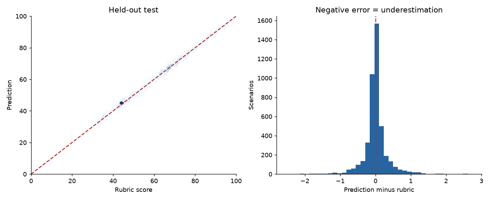
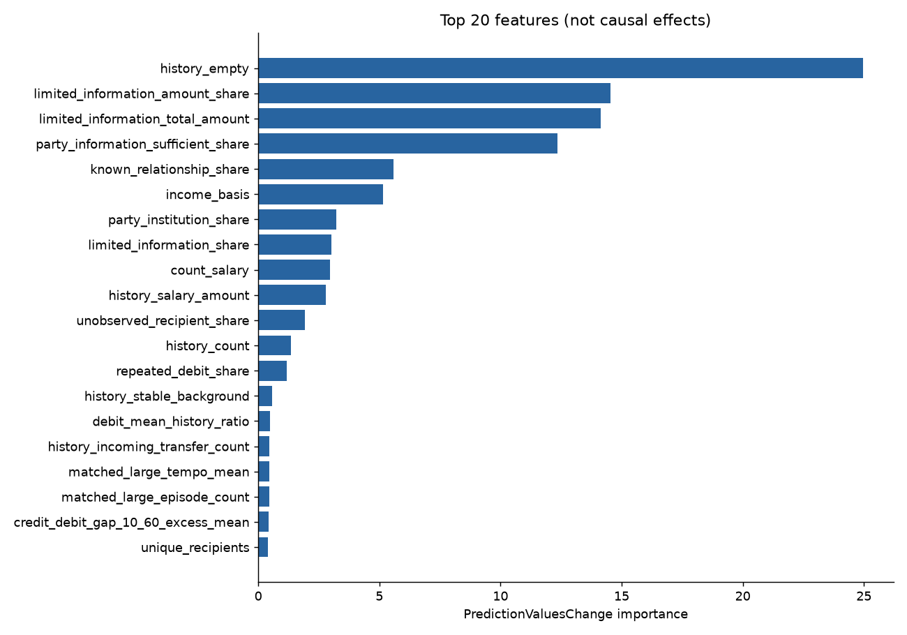

# Итоговая модель поведения v2

Готовность к интеграции по протоколу: **True**. В API игры не подключена.

Модель ablation-old-unweighted, деревьев 3000. Рубрика educational-risk-v2-final-1 не менялась.

| Часть | N | MAE | RMSE | P90 | Высокий риск | Сильное занижение | Высокий риск ниже 50 |
|---|---:|---:|---:|---:|---:|---:|---:|
| train | 17521 | 0.116 | 0.177 | 0.269 | 1897 | 0 | 0 |
| validation | 4381 | 0.211 | 0.373 | 0.557 | 528 | 0 | 0 |
| test | 4413 | 0.203 | 0.356 | 0.517 | 517 | 0 | 0 |

## Проверка зарплаты и наличных

| Часть | Подгруппа | N | MAE |
|---|---|---:|---:|
| validation | income: absent | 3613 | 0.188 |
| validation | income: payroll_registry | 256 | 0.292 |
| validation | income: service_contract | 256 | 0.303 |
| validation | income: no_reference | 256 | 0.366 |
| validation | cash: False | 461 | 0.390 |
| validation | cash: True | 3920 | 0.191 |
| test | income: absent | 3645 | 0.183 |
| test | income: payroll_registry | 256 | 0.277 |
| test | income: service_contract | 256 | 0.286 |
| test | income: no_reference | 256 | 0.334 |
| test | cash: False | 372 | 0.368 |
| test | cash: True | 4041 | 0.188 |

## Парные эффекты на новых test-группах

| Изменение | N пар | MAE изменения | P90 ошибки изменения | Доля верных направлений для эффекта >3 |
|---|---:|---:|---:|---:|
| interval | 142 | 0.088 | 0.225 | 1.0 |
| no_reference | 256 | 0.215 | 0.484 | 1.0 |
| order | 161 | 0.093 | 0.318 | 1.0 |
| party | 1536 | 0.268 | 0.680 | 1.0 |
| payroll_registry | 256 | 0.288 | 0.649 | 1.0 |
| purchase | 139 | 0.043 | 0.094 | None |
| service_contract | 256 | 0.278 | 0.604 | 1.0 |
| source | 131 | 0.022 | 0.031 | None |

## Известные диагностические пары

Не независимый test: использовались при разработке и выборе на validation.

| Эффект | Рубрика | Модель | Ошибка изменения |
|---|---:|---:|---:|
| party | 32.843 | 33.092 | 0.249 |
| interval | -6.750 | -5.724 | 1.026 |
| order | 0.000 | -0.199 | -0.199 |
| purchase | -0.050 | -0.051 | -0.001 |
| purchase_background | -0.900 | -0.883 | 0.017 |
| salary | -11.250 | -11.758 | -0.508 |
| source | 0.000 | 0.044 | 0.044 |

## Протокол и ограничения

Разделение по независимо построенным C/D-структурам: варианты суммы, сторон, зарплаты, покупок, наличных и времени внутри одной структуры не пересекают части. Проверочные структуры отличаются от ранее просмотренных v1; старый test теперь только материал разработки. Новая проверка всё равно синтетическая, а не внешняя банковская валидация.

Сравнены прежние признаки без весов, прежние признаки с балансировкой и расширенные наблюдаемые агрегаты. Ни одна фича не содержит рубрику или целевую оценку. Подбор и остановка используют только validation; test открыт после selection.json. Дополнительные seed не заменяют основную модель.

Все основные цепочки достигают цели и проходят игровой движок. Разрезы, ошибки с объяснениями и пары доступны в CSV/JSON рядом. Низкие риски, недопустимые цепочки, незавершённые сценарии и изменённый баланс игры не являются подтверждённой областью применения. Риск — учебная оценка, не вероятность обнаружения банком.
